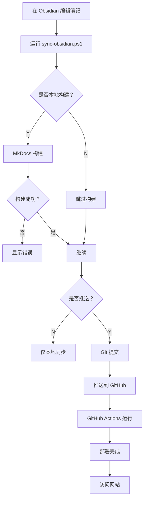

# 🔄 Obsidian 同步与部署脚本

## 📌 项目简介

这是一个自动化的 PowerShell 脚本，用于将你在 **Obsidian** 中编写的笔记同步到 GitHub Pages 项目，并自动部署到网站。

### ✨ 主要特性

- 🚀 **一键同步** - 自动复制 Obsidian 笔记到项目目录
- 🔍 **智能检测** - 自动检测 Git 状态和配置
- 🏗️ **可选构建** - 支持本地 MkDocs 构建或跳过由 GitHub Actions 构建
- 📤 **自动推送** - 提交并推送到 GitHub，触发自动部署
- 🛡️ **安全可靠** - 使用镜像同步，排除不必要的文件

---

## 🎯 快速开始

### 1. 编辑笔记

在 Obsidian 中编写或修改你的笔记：
- `D:\Obsidian\个人网站\技术笔记`
- `D:\Obsidian\个人网站\商业笔记`
- `D:\Obsidian\个人网站\文艺笔记`

### 2. 运行脚本

在项目根目录打开 PowerShell：

```powershell
.\sync-obsidian.ps1
```

### 3. 按提示操作

回答三个问题（推荐选择）：
```
❓ 是否本地构建 MkDocs？ [N]     ← 直接回车
❓ 是否推送到 GitHub？ [Y]       ← 直接回车
❓ 是否强制覆盖远程分支？ [N]    ← 直接回车
```

### 4. 等待完成

⏱️ 1-2 分钟后访问 https://ladygege2494.github.io

---

## 📖 文档

详细使用说明请查看：[SYNC_GUIDE.md](./SYNC_GUIDE.md)

---

## ⚙️ 配置选项

编辑 `sync-obsidian.ps1` 文件中的配置区域：

```powershell
# Obsidian 路径
$OBSIDIAN_TECH_PATH = "D:\Obsidian\个人网站\技术笔记"
$OBSIDIAN_BUSINESS_PATH = "D:\Obsidian\个人网站\商业笔记"
$OBSIDIAN_ART_PATH = "D:\Obsidian\个人网站\文艺笔记"

# Git 配置
$GIT_BRANCH = "main"
$COMMIT_MESSAGE_PREFIX = "docs: sync from Obsidian"
```

---

## 🔧 依赖要求

### 必需
- ✅ Windows PowerShell 5.1+
- ✅ Git（已安装并配置）
- ✅ GitHub 仓库访问权限

### 可选（本地构建时）
- 🐍 Python 3.x
- 📦 MkDocs 和 mkdocs-material 主题

```powershell
pip install mkdocs mkdocs-material
```

---

## ❓ 常见问题

### 没有安装 MkDocs 怎么办？

在脚本询问"是否本地构建 MkDocs"时选择 **N**，GitHub Actions 会帮你构建。

### 如何查看详细帮助？

```powershell
.\sync-obsidian.ps1 -Help
```

### 同步失败怎么办？

1. 检查 Obsidian 路径是否正确
2. 确认 Git 配置完整
3. 查看错误信息并修复

详细说明请查看 [SYNC_GUIDE.md](./SYNC_GUIDE.md) 的"常见问题"部分。

---

## 🎨 工作流程



---

## 📝 版本历史

- **v1.0.0** (2026-03-04)
  - ✨ 初始版本发布
  - 🔄 支持技术、商业、文艺三类笔记同步
  - 🏗️ 集成 MkDocs 构建选项
  - 📤 自动化 Git 提交和推送

---

## 🆘 获取帮助

### 查看帮助信息
```powershell
.\sync-obsidian.ps1 -Help
```

### 测试脚本（不实际执行）
```powershell
# 添加 -WhatIf 参数（如果支持）
.\sync-obsidian.ps1 -WhatIf
```

### 查看详细日志
编辑脚本，在 `Sync-Directory` 函数中移除 Robocopy 的静默参数。

---

## 💡 最佳实践

1. **频繁同步** - 每次编辑后及时同步
2. **本地预览** - 重大修改先本地构建验证
3. **谨慎强推** - 除非必要，不要选择强制推送
4. **备份重要** - 定期备份 Obsidian 原始笔记

---

## 📞 技术支持

遇到问题请检查：
- ✅ PowerShell 版本：`$PSVersionTable.PSVersion`
- ✅ Git 状态：`git --version`
- ✅ Python 环境：`python --version`（如需本地构建）

---

## 🌟 祝你使用愉快！

Happy blogging with Obsidian! 📝✨
