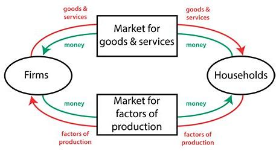

# 10basic economic principles
### How people make decisions
1. people face tradeoffs
>there is no such thing as a free lunch
2. opportunity cost is what you give up to get 
>often ignored,moeny-unrelated==compare with the others==
3. rational people think at the margin
4. people respond to incentives
>choose when the alternative's marginal benefit exceed its marginal cost
### How people interact
5. trade can make every one better off
6. markets are usually good way to organize economic activity
7. governments can sometimes improve market outcomes
### How the economy as a whole works
8. standard of living depend on production
9. price rise when too much money is printed
10. society face a short-run tradeoff between inflation and unemployment
# The scientific method
1. methodology likes physics
>  理论 theoretical analysis:explain how real world operates->logic
>  经验/实证empirical analysis:analyse data to test->evidence
2. It's a social science
>compexity
>limited controlled experiment
3. be aware of two extremes
>mathmatics is useless
>mathmatic is everything
### the role of assumptions
1. in order to make the world easy to understand
2. the art in scientific thinking is deciding which assumption to make
3. make defferent assumptions to answer diffferent questions
### the meaning of empirical test of a theory
- disapproved-> falsify证伪
- consistent->not proved
## Economic models
#### 1.definition
1. simplify the world
2. omit details to see the important
3. built with assumptions
#### 2.classification
1. words
2. diagram:intuitive
3. mathmatical equation:rigorous
### the circular-flow diagram

企业，家庭，产品和服务市场，生产要素市场
### Two variables in the coordinate system
- correlation相关性
- causality因果（cause/parameter/外生变量--effect/solution/内生变量）
   - omitted variables（打火机和癌症
   - reverse causality（警察增多犯罪率上升，献血利于健康
   - expectation（夫妻买车先于小孩出生
- time lag时间先后（闪电在打雷前

