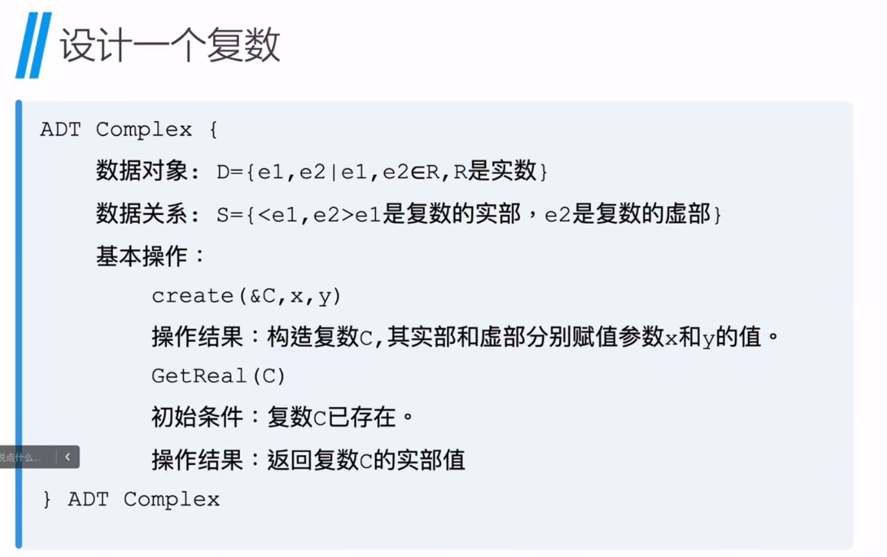
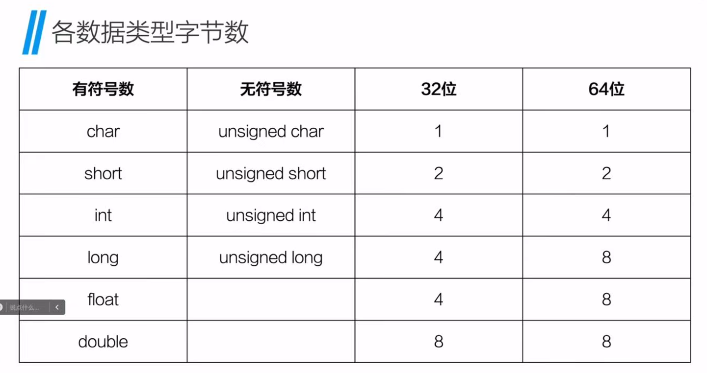
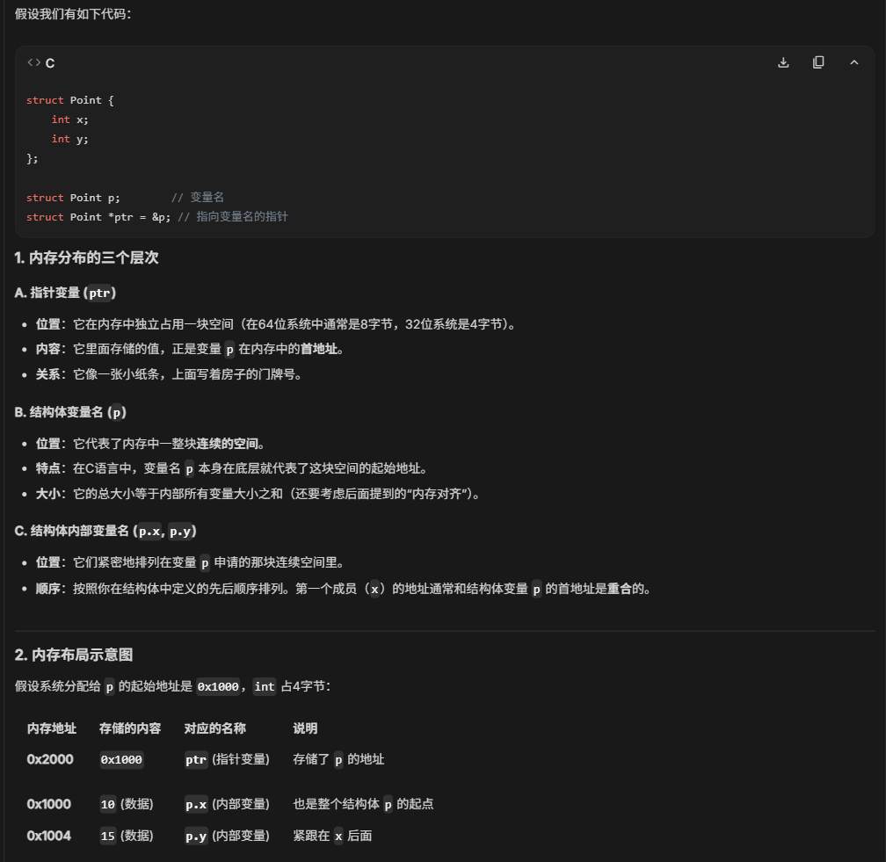
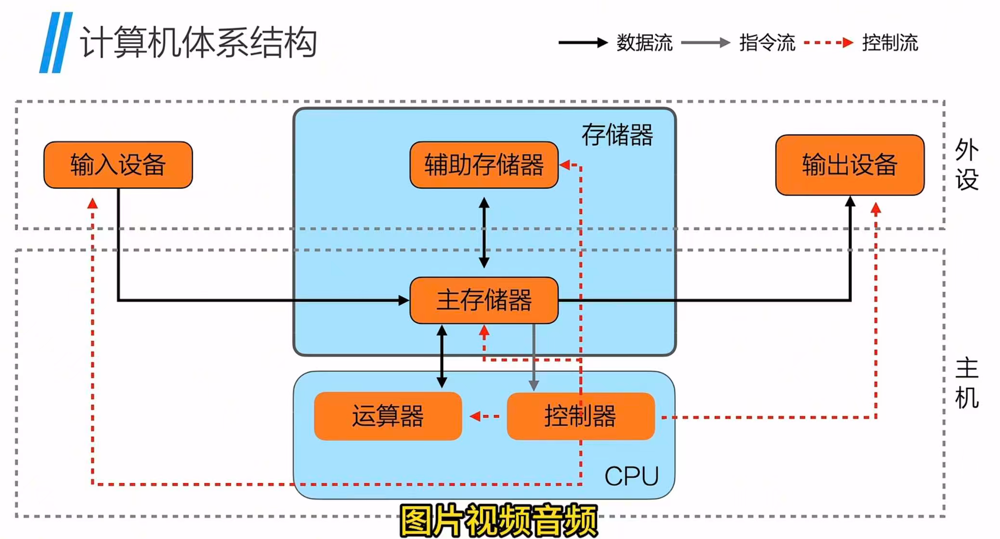
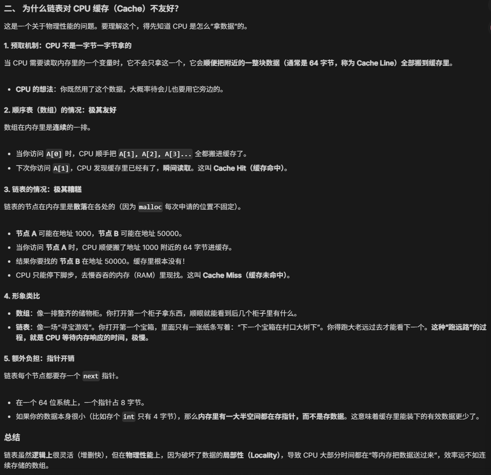
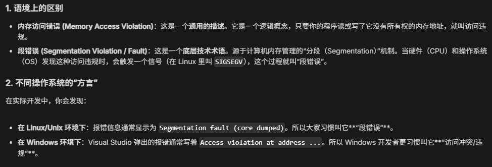

# 课程导言
### 数据结构
数据结构：从需求出发，设计的一套新的数据组织形式，来解决问题
本课程需要重点学习掌握的数据结构有：
- 线性表
- 栈
- 队列
- 数组
- 树与二叉树
- 图
### 算法
算法：一个有穷规则的集合，规定了解决某一类型问题的运算序列（或问题求解、任务执行步骤）
本课程需要重点学习掌握的算法有：
- 查找
- 排序

> [!tip] 算法 Algorithm+数据结构 Data Structure =程序 Program

### 算法分析
算法分析：
- 时间复杂度
- 空间复杂度
- 抽象数据类型 ADT（Abstract Data Type）
数据结构与算法之间存在着本质联系。在研究某一类型的数据结构时，总要涉及其上施加的运算。只有通过对所定义运算的研究，才能真正理解数据结构的定义和作用。

### ADT
ADT 是一种编程概念，用于定义数据的类型及其操作，而不涉及具体实现细节。它提供了一种将数据的逻辑表示与物理实现分离的方法，从而使程序更具可维护性和可扩展性。在 C 语言中，ADT 通常通过结构体和函数的结合来实现。结构体用于定义数据的类型，而函数用于操作这些数据。通过这种方式，程序员可以**隐藏数据的内部结构，仅暴露出操作数据的接口**。


# C 语言复习
## 函数
四种形式：
- 无参数，无返回值
- 无参数，有返回值
- 有参数，无返回值
- 有参数，有返回值

## 数组
```C
//打印不同长度的数组
#include <stdio.h>
int main(int argc,char const *argv[]){
	int a={1,23,4,5};
	for(int i=0;i<sizeof(a)/sizeof(a[0]);i++){
		printf("%d\n",a[i]);	
	}
}
```

## 字符串
C 语言中的字符串实际上只是一个字符数组, 最后一位为 `\0`
### 字符串初始化
```C
#include <stdio.h>
#include <string.h>
int main(){
	char str[11];
	strcpy(str2,"Hello World");
}
```

## 指针（一个地址）
> [!tip] C 程序员新手和老手的其中之一差别在于是否对指针有深刻的理解、高效的使用指针。理解指针的关键在于理解 C 程序如何管理内存。

在 C 语言中，指针与数组的关系十分密切。通过数组下标能完成的操作都可以通过指针完成。一般来说，用指针编写的程序比用数组下标编写的程序执行速度快。
### 声明
```C
//*两边的空格无关紧要，以下声明等价
int* p;
int * p;
int *p;
int*p;
```
### 解引用指针
间接引用操作符 * 返回指针变量的指向地址的值
```C
int a=6;
int* p=&a;
printf("%d\n",*p);
```


## 结构体
### 声明
一个或多个（不同）类型变量的集合
```C
struct 结构体名 变量名
变量名.结构体内部变量名=值
```

### 类型定义
```C
typedef struct 结构体名
{
	数据类型 变量名；
	...
}别名;
```

### 结构体内存分布


## 内存解析
### 冯诺依曼架构

### 虚拟内存地址
内存条、显卡、各种适配卡都有其各自的存储地址空间。
操作系统将这些设备的存储地址空间抽象成一个巨大的**一维数组空间**。
对于内存的每一个字节会分配一个 32 位或 64 位的编号，这个编号称为**内存地址**。
```C
#include <stdio.h>
int main(int argc,char const *argv[]){
	int a=5;
	printf("%p\n",&a);
	return 0;
}
```

### 内存分类
C 程序编译后，会以三种形式使用内存：
- 静态/全局内存
	静态声明的变量和全局变量使用这部分内存，这些变量在程序开始运行时分配，直到程序终才消失。
- 自动内存（栈内存)
	函数内部声明的变量使用这部分内存，在函数被调用时才创建。
- 动态内存（堆内存)
	根据需求编写代码动态分配内存，可以编写代码释放，内存中的内容直到释放才消失。
### 动态内存分配
在 C 语言中，动态分配内存的基本步骤： 
1. 使用 `malloc (memory allocate)` 函数分配内存 ` void* malloc (size_t) `
	如果成功，会返回从堆内存上分配的内存指针
	如果失败，会返回空指针
 2. 使用分配的内存
 3. 使用 free 函数释放内存
#### 基本数据类型
```C
#include <stdio.h>
#include <stdlib.h>
int mian(int argc,char const *argv[]){
	p=(int*)malloc(sizeof(int));
	*p=15;
	printf("%d\n",*p);
	free(p);
	return 0;
}
```
#### 字符串
```C
#include <stdio.h>
#include <stdlib.h>
#include <string.h>
int mian(int argc,char const *argv[]){
	s=(char*)malloc(10);
	strcpy(s,"Hello");
	printf("%s\n",s);
	free(s);
	return 0;
}
```
#### 数组
```C
#include <stdio.h>
#include <stdlib.h>
int mian(int argc,char const *argv[]){
	int* arr=(int*)malloc(5*sizeof(int));
	for(int i=0;i<5;i++){
		arr[i]=0;
	}
	for(int i=0;i<5;i++){
		printf("%s",arr[i]);
	}
	return 0;
}
```
#### 结构体
```C
#include <stdio.h>
#include <stdlib.h>
typedef struct{
	int x;
	int y;
}po;
int mian(int argc,char const *argv[]){
	po* p;
	p=(po*)malloc(sizeof(po));
	p->x=5;
	p->y=10;
	printf("%d\n",p->x);
	printf("%d\n",p->y);
	return 0;
}
```

> 注意结构体补位：把 x 的数据类型改为 char，po 的内存 size 还是 8 bit


## 链表
### 核心本质
- **物理上：** 内存里乱七八糟，哪里有空位呆哪里。
- **逻辑上：** 靠“指针”强行连在一起。
- **节点结构：** [ 数据 | 下一个人的地址 ]
    - node->data: 存货 
    - node->next: 导盲犬（指路）
### 四大基本功
#### ① 查找：$O(n)$
- **逻辑：** 没索引，只能从 head 开始数：“你是第一个吗？”、“你是第二个吗？”
- **代码：** p = p->next; (往前挪一步)
#### ② 插入：$O(1)$
如果你要在 A 和 B 之间插入新节点 S：
1. **先接后面：** S->next = A->next; (S 先拉住 B 的手)
2. **再接前面：** A->next = S; (A 松开 B，拉住 S)
- **避坑：** 顺序不能反！如果先执行 A->next = S，B 的地址就丢了，链表断成两截。
#### ③ 删除：$O(1)$
如果要删掉 A 后面的 B：
1. **越级上报：** A->next = A->next->next; (让 A 直接指向 B 的儿子)
2. **收尾：** free(B); (把 B 踢出内存，防止内存泄漏)
#### ④ 判空/判尾
- **头为空：** head == NULL (整个链表是空的)
- **尾巴：** p->next == NULL (到了最后一个节点，后面没路了)
### 两个逆天技巧
#### 技巧 A：虚拟头结点（Dummy Head / 哨兵）
- **痛点：** 每次删除或插入，都要判断“是不是在表头操作”，因为表头没有“前驱节点”，逻辑很麻烦。
- **解药：** 在 head 前面人工制造一个不存数据的 dummy 节点。
- **效果：** 所有的节点都有前驱了，代码从 20 行缩减到 5 行，且不会报空指针错误。
    
#### 技巧 B：快慢指针（解决 90% 的中等题）
- **找中点：** 快指针走两步，慢指针走一步。快指针到头时，慢指针正好在中点。
- **判断环：** 快指针在后面追，如果追上了慢指针，说明链表有环。
- **找倒数第 K 个：** 快指针先走 K 步，然后慢指针和它一起走。快到头时，慢就在倒数第 K。
### 与顺序表的终极对比

|           |                      |                      |
| --------- | -------------------- | -------------------- |
| 特性        | **顺序表 (Array)**      | **链表 (Linked List)** |
| **存储空间**  | 连续（一次性申请大块）          | 分散（动态申请，灵活）          |
| **随机访问**  | 支持 ($O(1)$)          | 不支持 ($O(n)$)         |
| **插入删除**  | 慢 (要大搬家 $O(n)$)(非末尾) | 快($O(1)$)            |
| **CPU缓存** | 友好（缓存命中率高）           | 不友好（跳来跳去）            |

> 为什么链表对 CPU 缓存？
> 

### 链表操作函数
#### 类型定义
在 .h 文件里，作者用 typedef 给指针起了很多好记的名字。

1. **struct Node**: 链表的“零件”（节点）。里面有存数据的 Element 和指向下一个零件的指针 Next。
2. **PtrToNode**: 这就是一个**指向节点的指针**。
3. **List**: 在这里，List 其实就是 PtrToNode 的别名。**习惯上用它代表整个链表的“头指针”**。
4. **Position**: 也是 PtrToNode 的别名。**习惯上用它表示链表中的某个特定位置**。
#### Header 的概念
这段代码默认使用了一个**带头节点（Header Node）** 的链表。
- **头节点**：是一个不存实际数据的“哨兵”，排在最前面。它的 Next 指向第一个真正存数据的节点。
- **好处**：这样你在第一个元素前插入或删除时，操作逻辑和中间是一样的，不需要写额外的 if 判断。

#### 1. IsEmpty（链表是空的吗？）

```C
return L->Next == NULL;
```

如果头节点的 Next 是空的，说明后面没带小弟，链表就是空的。

#### 2. Find（找数据 X 在哪？）

```C
P = L->Next; // 跳过头节点，从第一个真正的数据节点开始看
while (P != NULL && P->Element != X)
    P = P->Next; // 不是我要找的，就顺着 Next 往下爬
return P;
```

- **逻辑**：像排队点名，从头到尾扫一遍。
- **结果**：找到了返回位置 P；没找到（爬到末尾了）返回 NULL。
    
#### 3. FindPrevious（找 X 的前一个是谁？）
**这是删除操作的关键！** 因为是单链表，你想删 B，必须先站在 A 的位置上。

```C
P = L; // 从头节点开始
while (P->Next != NULL && P->Next->Element != X)
    P = P->Next;
return P;
```

- **逻辑**：它不是看自己，而是看自己的“下一位”（P->Next）是不是 X。
    
#### 4. Delete（删除数据 X）

```C
P = FindPrevious(X, L); // 第一步：找到 X 的前一站 P
if (!IsLast(P, L)) {    // 如果 P 不是最后一站（说明 P 后面真的有 X）
    TmpCell = P->Next;  // 临时抓住要杀掉的那个节点（X）
    P->Next = TmpCell->Next; // 让 P 越过 X，直接连到 X 的下一站（这就是“跳过”）
    Free(TmpCell);      // 毁尸灭迹，释放内存（C语言必须手动回收内存！）
}
```

#### 5. Insert（在位置 P 后面插入 X）

```C
TmpCell = malloc(sizeof(struct Node)); // 1. 申请一块新内存存新节点
TmpCell->Element = X;                  // 2. 把数据填进去
TmpCell->Next = P->Next;               // 3. 先让新节点拉住 P 原本的后继（先接后）
P->Next = TmpCell;                     // 4. 让 P 指向新节点（再接前）
```

> **注意顺序：** 必须先执行步骤 3，再执行步骤 4。如果先让 P->Next 指向新节点，那么 P 原本后面的那一串就“断线”找不到了。

### 常见错误
- **内存访问错误 (memory access violation)** 或**段错误 (segmentation violation)**：可能因为错误的初始化，或者引用不存在的指针（该指针已被 `free()` 了）
- 判断何时使用 `malloc()`
    - 如果想要创建一个之前未声明的指向结构的指针，需要用到 `malloc()`
    - 如果想要用指针遍历一遍链表，则无需使用 `malloc()`
        
        > 注意：`malloc()` 是给指针分配存储空间，而不是用于结构的

- 记得使用 `free()`，尤其是**删除**节点时，否则会带来严重后果

> 内存错误和段错误的？
> 
### Double Linked Circular Lists（双向循环链表）
#### 基本性质
- **公式（必考）**：
    - ptr == ptr->llink->rlink （我左边那位的右边是我自己）
    - ptr == ptr->rlink->llink （我右边那位的左边也是我自己）
- 最后一个节点的 rlink 不再指向 NULL，而是指向 **头结点 (H)**。
- 头结点的 llink 指向 **最后一个节点**。
- **效果**：整个链表连成了一个环。无论你在哪个节点，都能走到任何其他节点。
#### 优点
- **删除节点变成** $O(1)$：
    - 在单链表里，想删节点 P，你得满头大汗地从头开始找 P 的前驱。
    - 在双向链表里，P->llink 直接就是前驱。**不需要找，直接就能删！**    
- **双向遍历**：你可以从前往后看，也可以从后往前看（比如实现浏览器的“前进”和“后退”）。
#### 空链表 
- 当链表里一个数据都没有时，头结点 H 的 llink 和 rlink 都指向**它自己**。
- **判断空的条件**：H->rlink == H。

|           |                        |                                 |
| --------- | ---------------------- | ------------------------------- |
| 操作        | 单链表                    | 双向循环链表                          |
| **访问队首**  | $O(1)$                 | $O(1)$                          |
| **访问队尾**  | $O(N)$<br><br>（需遍历全程）  | $O(1)$<br><br>（直接看 Head->llink） |
| **在末尾插入** | $O(N)$<br><br>（得先找到尾巴） | $O(1)$<br><br>（瞬间定位尾巴并改线）       |
## 术语对比
有三种形容词：
- sequential list
- linked list
	- doubly/singly
	- circular

|                        |                         |                        |                                 |                                   |
| ---------------------- | ----------------------- | ---------------------- | ------------------------------- | --------------------------------- |
| 特性 / 数据结构              | **D. 顺序表 (Sequential)** | **A. 双向链表 (Doubly)**   | **B. 单向循环链表 (Singly Circular)** | **C. 双向循环哨兵链表 (Doubly Circular)** |
| **随机访问第 i 个**          | **<br>$O(1)$<br> (神速)** | $O(N)$<br><br> (需挨个跳)  | $O(N)$<br><br> (需挨个跳)           | $O(N)$<br><br> (需挨个跳)             |
| **末尾插入 (Insert Last)** | $O(1)$<br><br> (直接存)    | $O(1)$<br><br> (若有尾指针) | $O(1)$<br><br> (若有尾指针)          | $O(1)$<br><br> (直接找 head->prev)   |
| **末尾删除 (Delete Last)** | $O(1)$<br><br> (长度减1)   | $O(1)$<br><br> (若有尾指针) | $O(N)$<br><br> (需找倒数第二)         | $O(1)$<br><br> (直接找 head->prev)   |
| **空间利用率**              | 高 (纯数据)                 | 低 (每个数带2指针)            | 中 (每个数带1指针)                     | 低 (每个数带2指针)                       |
| **CPU 缓存友好度**          | **极高 (连续存储)**           | 极低 (内存散乱)              | 极低 (内存散乱)                       | 极低 (内存散乱)                         |

## 易错点