## Network Flow Problem
- $G$ 原图 **Capacity Graph**
- $G_f$ 流量图 **Flow Graph**
- $G_r$ 残量图 **Residual Graph**
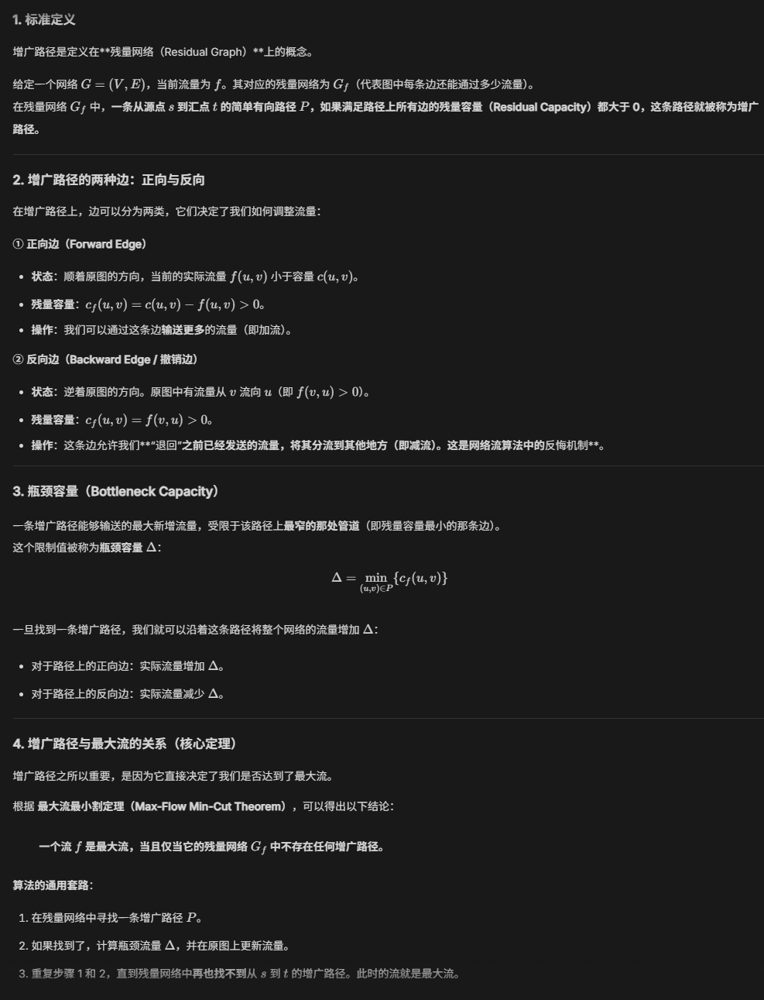
### 朴素贪心算法
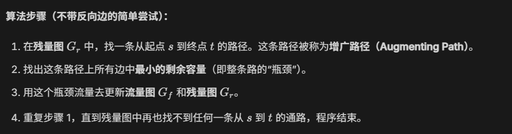

### 引入反向边：可以撤销灌水操作改道
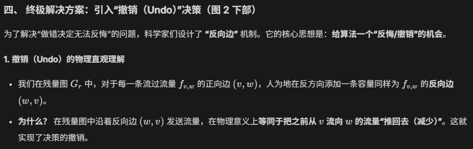

### 如何挑选增广路径
由于存在百万流量噩梦，我们不能随意挑选增广路径
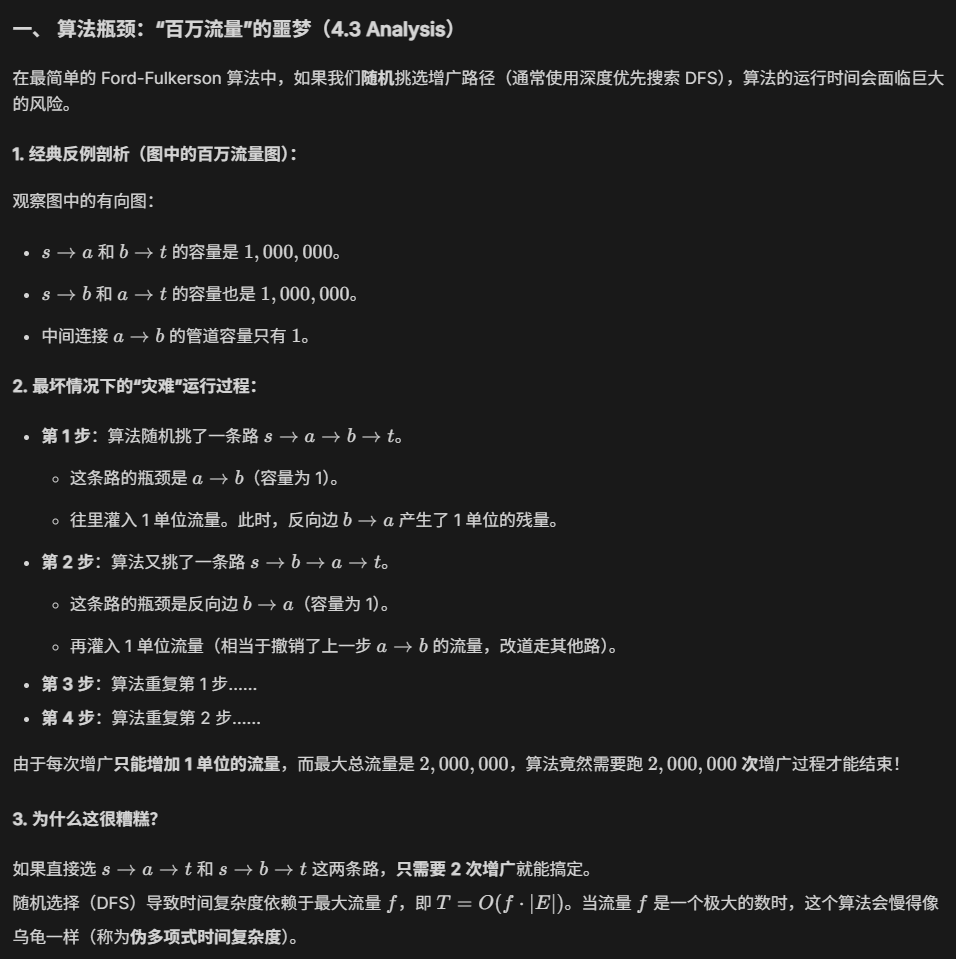

#### 总是挑选**对流量提升最大**的路径——Dijkstra 修改版
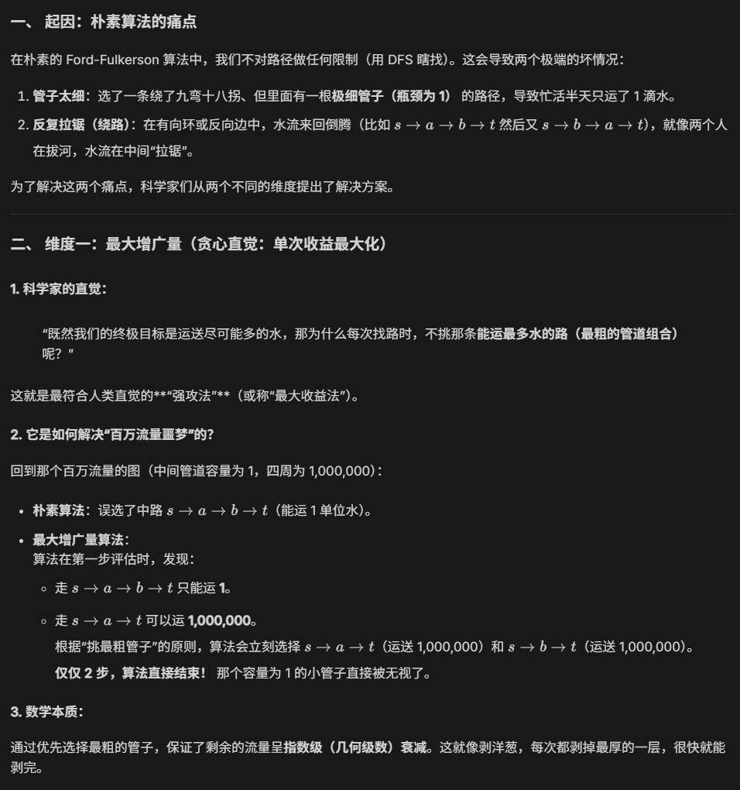
#### 总是挑选**边最少**的增广路径——Edmonds-Krap 算法
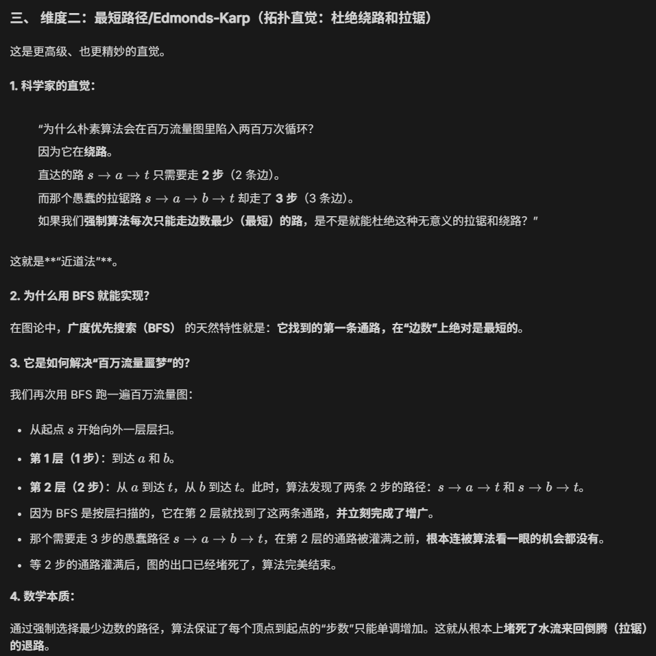

#### 对比
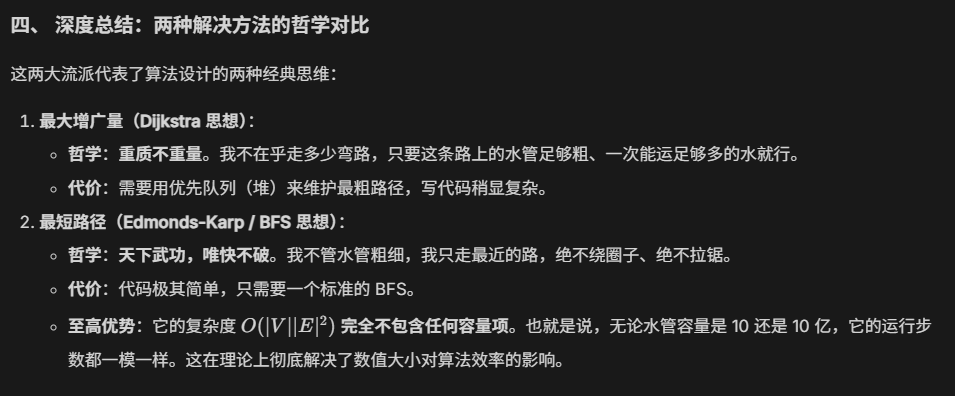

### 时间复杂度总结
所有的网络流算法都可以拆解为同一个**核心工作模板**：
$$
总时间复杂度=找一次增广路径的时间 (T)×总共需要找路（增广）的次数 (N)
$$

我们只需要记住每种算法在 **“怎么找路（T）”** 和 **“找几次（N）”** 上的决策，就能瞬间推导并记住它们的复杂度。

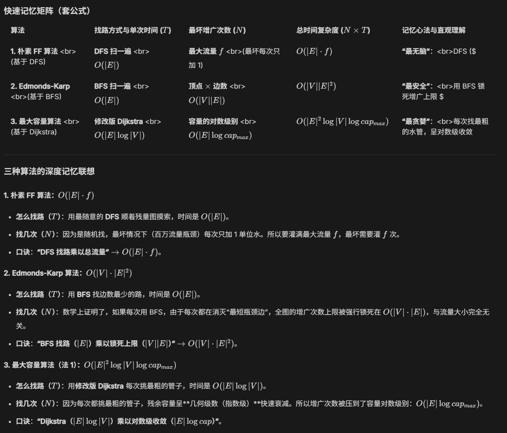
## Minimum Spanning Tree
### 定义 
- “最小”：保证生成树的所有边的权重和最小
- “生成”：覆盖所有的顶点
- “树”：无环且边的数量为 |V| - 1
    > 因此当图的边数 < |V| - 1 时，该图不存在最小生成树
- 最小生成树存在的**充要条件**是图是**连通的**
- 如果在生成树中添加一条边，就会形成一个环
- 最小生成树并不一定是唯一的，但最小生成树的**总权重是唯一的**

如何求解？——**贪心算法 (greedy algorithm)**，每一步都采取最优策略，但有以下限制：
- 必须使用图里面的边
- 必须用到 ∣V∣−1 条边
- 不能出现环

### Prim 算法
#### 步骤
- 初始情况下，先将一个顶点作为树的**根**放入树内
- 在每个阶段，添加边 (u, v)，需满足：
	- 来自已有生成树的顶点 u 和来自生成树外的 v 之间的所有边中权重最小的那条
	- 不产生环
- 重复上述步骤，直至所有顶点均在生成树内

#### 不用堆的代码实现
```C
//数组定义
int prim(int w_adj_mat[MAX][MAX], int n){
	int dist[MAX]; //存储每个顶点到**当前已生成树**的最短距离。
	int prev[MAX];//记录顶点的父亲节点（前驱），用于最后输出树的边。
	int known[MAX];//标记数组，1 表示已在树内，0 表示在树外。
}

//初始化
for (int i = 0; i < n; i++) {
    dist[i] = INFINITY;
    prev[i] = -1;
    known[i] = 0;
}
dist[0] = 0; // 默认将 0 号顶点作为树的根节点

//双重循环
for (int k = 0; k < n; ++k) 
{
    // --- 步骤一：寻找树外距离树最近的顶点 (FindMin) ---
    int min_d = INFINITY;
    int min_v = -1;
    for (int i = 0; i < n; i++) {
        if (!known[i] && dist[i] < min_d) {
            min_d = dist[i];
            min_v = i;
        }
    }
    
    known[min_v] = 1; // 将该顶点拉入树中
    
    // --- 步骤二：更新邻接点的 dist 值 (松弛操作) ---
    for (int i = 0; i < n; i++) {
        if (!known[i]) {
            // 如果 min_v 和 i 之间有边，且这条边的权重比 i 之前到树的距离还要小
            if (w_adj_mat[min_v][i] && dist[i] > w_adj_mat[min_v][i]) {
                dist[i] = w_adj_mat[min_v][i]; // 更新 i 到树的距离为单边权重
                prev[i] = min_v;               // 记录 i 是通过 min_v 被拉入树的
            }
        }
    }
}

//总权重加和
int total_w = 0;
for (int i = 1; i < n; ++i)
    total_w += dist[i];
return total_w;
```

> 注意，无向图要用两张邻接表存储
> 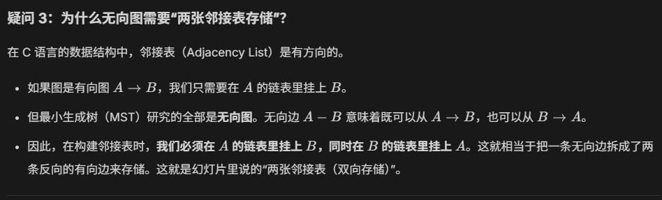

#### 与 Dijsktra 的对比
- 要保存两类值 $d_v$ 和 $p_v​$ ​：
    - $d_v$ ​：连接 v 和已知顶点的最短路的权重
    - $p_v​$：最后一个导致 $d_v$ ​ 改变的顶点
- 更新规则更加简单：对于已经选入树内的顶点 $v$，它的邻接顶点 $w$ 满足 $d_w=min⁡(d_w, c_{w, v})$
- 也就是说 Prim 只看增量最小，Dijkstra 要维护整条路径总长的最小
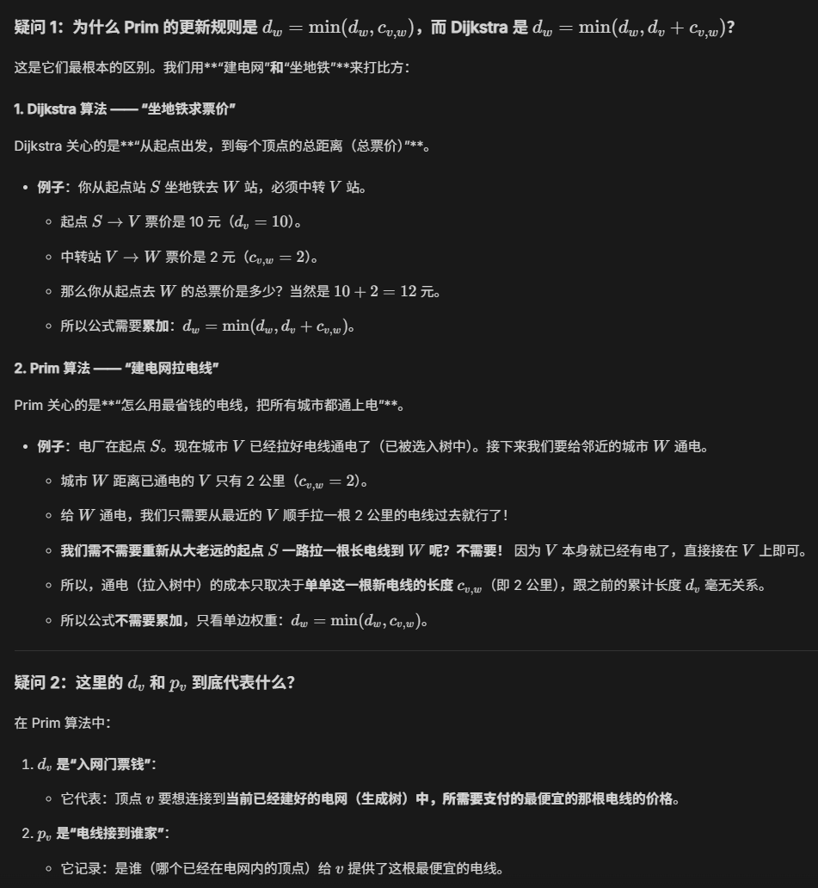

#### 时间复杂度 
- 不用堆（适用于稠密图）：$O(∣V∣^2)$
- 二叉堆（适用于稀疏图）：$O(Elog⁡∣V∣)$
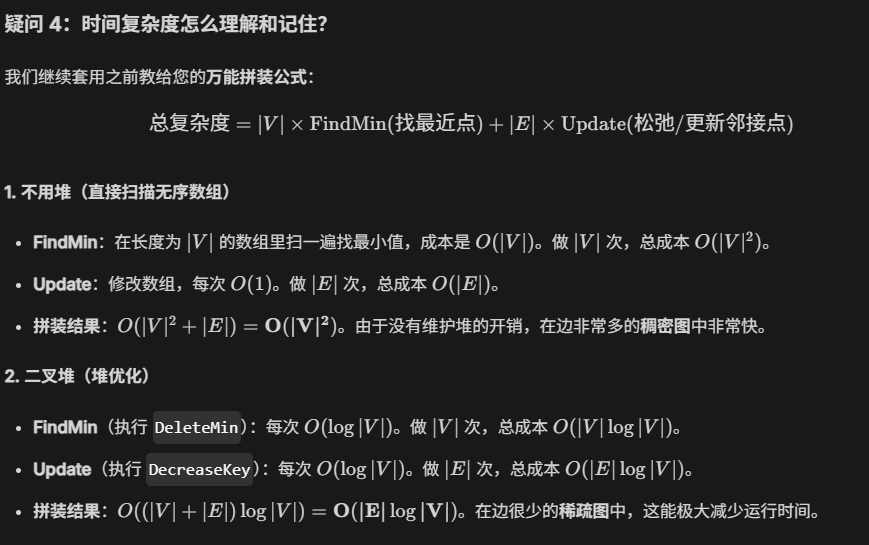

### Kruskal 算法
#### 步骤
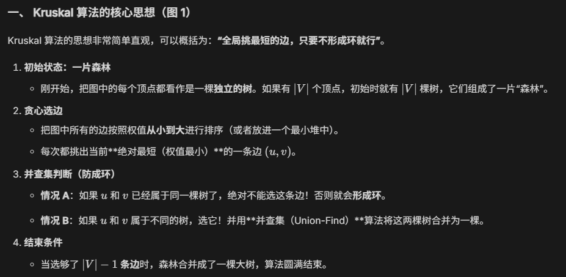
#### 最小堆+并查集的代码实现
```C
void Kruskal(Graph G)
{
    int EdgesAccepted;   // 记录已接受的边数
    DisjSet S;           // 并查集（用于管理连通分量，判断成环）
    PriorityQueue H;     // 优先队列/最小堆（用于快速获取最短边）
    Vertex U, V;
    SetType Uset, Vset;
    Edge E;

    Initialize(S);               // 1. 初始化并查集：每个顶点自成一集
    ReadGraphIntoHeapArray(G, H); // 2. 把所有边读入堆中
    BuildHeap(H);                // 3. 构建最小堆，时间复杂度 O(|E|)

    EdgesAccepted = 0;
    while (EdgesAccepted < NumVertex - 1) // 4. 循环直到选够 |V| - 1 条边
    {
        E = DeleteMin(H); // 5. 弹出当前最短的边 E = (U, V)
        Uset = Find(U, S); // 6. 查找 U 所在的集合（树）的根节点
        Vset = Find(V, S); //    查找 V 所在的集合（树）的根节点
        
        if (Uset != Vset) // 7. 如果根节点不同，说明在两棵不同的树上，不会形成环
        {
            EdgesAccepted++;        // 接受这条边
            SetUnion(S, Uset, Vset); // 将这两棵树合并（Union）
        }
    }
}
```

#### 时间复杂度
$T=O(|E|log|E|)=O(|E|log|V|)$
其中 $|E|=|V|^2$

#### 总结：如何选择 Prim 还是 Kruskal
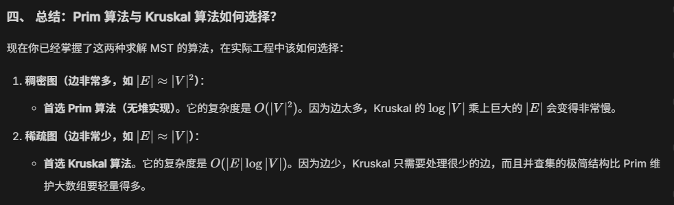
## 深度优先搜索 **depth-first search（DFS）**
> DFS 是一种前序遍历的泛化

- 树：$O(|E|)$
- 图：要避免环，对访问过的顶点标记
- 如果无向图不连通，或者有向图不是强连通的，那么用一次 DFS 无法访问所有顶点，需要对未标记的顶点再用一次 DFS，直至所有顶点都被标记。时间复杂度为 $O(|E|+|V|)$

```C
void DFS(Vertex V)
{
    visited[V] = true; // mark this vertex to void cycles
    for (each W adjacent to V)
        if (!visited[W])
            DFS(W);
}
```

深度优先搜索（DFS）是一种用于遍历或搜索树或图的算法。

- **核心策略**：**“尽可能深地搜索”**。从起点出发，沿着一条路径不断向前探索，直到无法继续（即所有邻接顶点都已被访问过），然后回溯（Backtrack）到上一个顶点，尝试其他路径，重复此过程，直到所有可达的顶点都被访问。
### Undirected Graphs 无向图
#### 无向图的 DFS 遍历    
- **连通性判断**：当且仅当 1 次 DFS 能够遍历所有顶点时，无向图是连通的。如果图是不连通的，单次 DFS 只能访问到起点所在的连通分量。
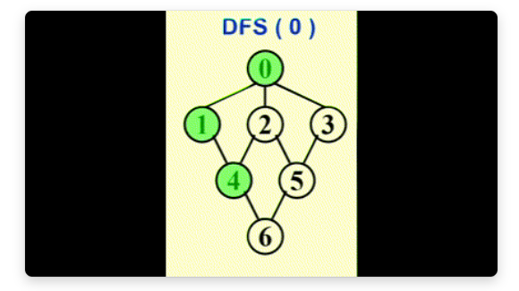
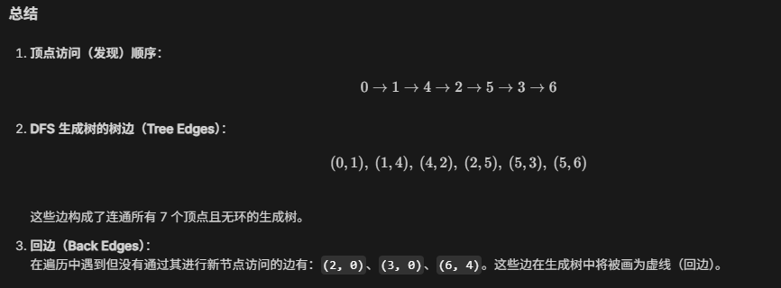
#### 深度优先生成树 (depth-first spanning tree)
**深度优先生成树 (depth-first spanning tree)** 可以形象展示 DFS 的过程。
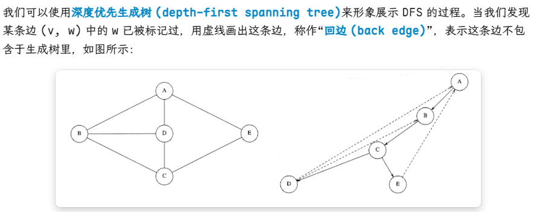

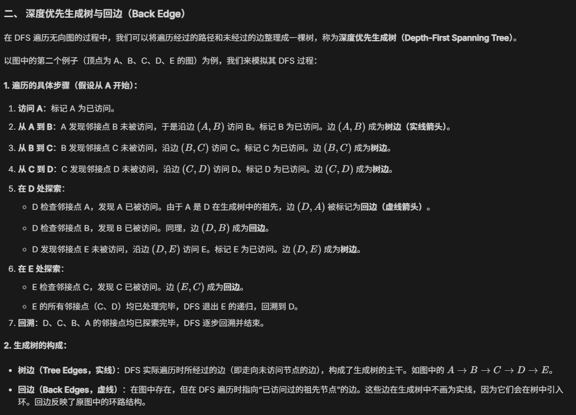
#### 深度优先生成森林 (depth-first spanning forest)
如果无向图是**非连通**的（即由多个彼此不相连的子图组成），单一的一次 DFS 无法访问所有顶点。此时，我们需要多次调用 DFS，每次调用都会生成一棵生成树，这些树共同构成了**深度优先生成森林（Depth-First Spanning Forest）**。

```C
void ListComponents(Graph G)
{
    for (each V in G)
    {
        if (!visited[V])
            DFS(V);
            printf("\n");
    }
}
```

### Biconnectivity 双连通性（只针对无向图）
#### 基本概念
- **关节点 (articulation point)/割点 (cut vertex)**：当 `G' = DeleteVertex(G, v)` 至少有 2 个连通分量时。关节点的移除能够破坏图的连通性
- **双连通图 (biconnected graph)**：没有关节点的连通图 G。至少需要移除两个及以上的顶点，才能形成有多个连通分量的子图
- **双连通分量 (biconnected component)**：极大双连通子图
- **“没有一条边会同时出现在多个双连通分量中”**。这意味着，双连通分量是以“边”为单位对图进行划分的，而割点则是这些分量之间的“粘合剂”或“交点”。
- **寻找无向连通图 G 中的双连通分量的个数 = 关节点的个数 + 1**（只有当图的结构呈简单的“树状单线拉长”时，这个公式才碰巧成立。）

#### 要解决的问题
- 寻找无向图中的**所有关节点**。   
- 通过找出关节点，进一步将图划分为多个**双连通分量**（在网络设计中，双连通意味着即使某一个节点坏掉，其余节点依然保持连通，代表了极高的网络可靠性）。

#### Tarjan 算法
通过一次 DFS 遍历，我们可以利用两个辅助数组 $Num(v)$ 和 $Low(v)$ 来在线性时间 $O(V + E)$ 内找出所有的关节点。

1. 两个核心变量：
* **$Num(v)$**：顶点 $v$ 在 DFS 过程中**被访问的次序（时间戳）**。先访问的节点 $Num$ 值较小。
* **$Low(v)$**：从顶点 $v$ 出发，通过其子树中的零条或多条树边，以及**最多一条回边**，所能到达的最小的 $Num$ 值。
> 也就是所有零级或一级关系所能链接到的最老的人（时间戳最小），算 Low 的时候看三个：1. 自己 2. 子节点的 Low 3. 自己的回边
* **回边 (back edges)**(u, v)：在图中而不在生成树内的边 (u, v)，它反映了 u 和 v 之间有祖辈和后辈的关系。如果 u 是 v 的祖先，则 `Num(u) < Num(v)`；反之 `Num(u) > Num(v)`

$$
Low(v) = \min \begin{cases}
Num(v) & \text{(Rule 1: 自身的时间戳)} \\
\min \{ Low(w) \mid w \text{ 是 } v \text{ 的子节点} \} & \text{(Rule 3: 子节点能到达的最小时间戳)} \\
\min \{ Num(w) \mid (v, w) \text{ 是一条回边} \} & \text{(Rule 2: 通过回边能直接到达的祖先时间戳)}
\end{cases}
$$


2. 两个判定规则：
* **非根节点 $u$ 是关节点的充要条件**：
  $u$ 至少有一个子节点 $w$，满足：$$Low(w) \ge Num(u)$$
  * **物理意义**：这表示子节点 $w$ 及其后代，没有任何一条回边能连回 $u$ 的祖先节点。如果把 $u$ 删掉，以 $w$ 为根的子树就会与 $u$ 之上的祖先部分彻底断开。

* **根节点（DFS 起点）是关节点的充要条件**：
  根节点在 DFS 生成树中至少有两个子节点。

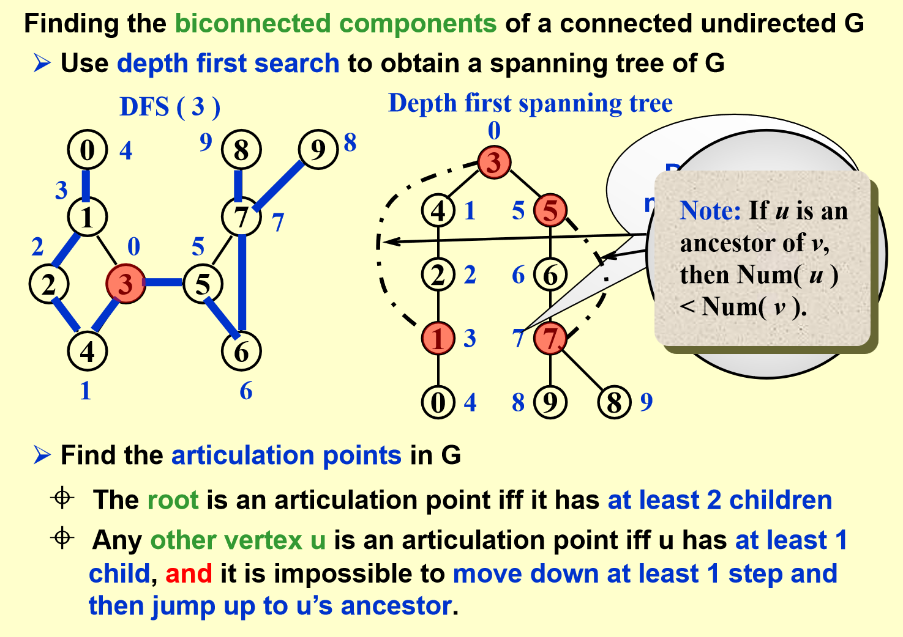

关节点：
- 3 为根节点
- 1,5,7 为非根节点
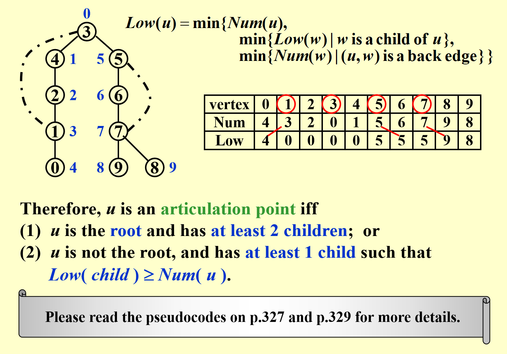
#### 代码实现
1. **两遍扫描法**：先用 `AssignNum` 计算 `Num`，再用 `AssignLow` 计算 `Low` 并找出关节点。
```C
// Assign Num and compute Parents
void AssignNum(Vertex V)
{
    Vertex W;

    Num[V] = Counter++;
    Visited[V] = ture;
    for each W adjacent to V
        if (!Visited[W])
        {
            Parent[W] = V;
            AssignNum(W);
        }
}

// Assign Low; also check for articulation points
void AssignLow(Vertex V)
{
    Vertex W;

    Low[V] = Num[V]; // Rule 1
    for each W adjacent to V
    {
        if (Num[W] > Num[V])
        {
            AssignLow(W);
            if (Low[W] >= Num[V])
                printf("%v is an articulation point\n", v);
            Low[V] = Min(Low[V], Low[W]);  // Rule 3
        }
        else if (Parent[V] != W)
            Low[V] = Min(Low[V], Num[W]);  // Rule 2
    }
}
```

2. **单遍扫描法**（最常用）：`FindArt` 函数在一次 DFS 过程中同时完成两者的计算。
```C
// 统一在一次深度优先搜索中寻找关节点
void FindArt(Vertex V)
{
    Vertex W;
    Visited[V] = True;                  // 标记当前顶点 V 为已访问
    Low[V] = Num[V] = Counter++;        // Rule 1: 初始化 Low[V] 和 Num[V] 为当前全局计时器的值
    
    for each W adjacent to V            // 遍历与 V 相邻的所有顶点 W
    {
        if (!Visited[W])                // 如果 W 还没有被访问过，说明 (V, W) 是一条【树边】
        {
            Parent[W] = V;              // 记录 W 的父节点是 V
            FindArt(W);                 // 递归对子节点 W 进行 DFS
            
            // 【核心判断】当从子节点 W 递归返回时：
            // 如果子节点 W 无法通过回边到达 V 之外的祖先（即 Low[W] >= Num[V]）
            if (Low[W] >= Num[V])
            {
                // 注意：在实际完整算法中，如果 V 是根节点，还需要判断其子节点数是否 >= 2
                // 这里简写为标准非根节点的判断公式
                printf("%v is an articulation point\n", V); 
            }
            
            // Rule 3: 用子节点 W 的 Low 值来更新 V 的 Low 值
            Low[V] = Min(Low[V], Low[W]); 
        }
        else if (Parent[V] != W)        // 如果 W 已经访问过，且 W 不是 V 的直接父节点
        {                               // 说明 (V, W) 是一条【回边】（指向祖先节点的边）
            
            // Rule 2: 用 W 的 Num 值更新 V 的 Low 值
            Low[V] = Min(Low[V], Num[W]); 
        }
    }
}
```

### Euler Circuits/Tour
- 欧拉路 (Euler tour)：一笔画
- 欧拉环 (Euler circuit)：一笔画回到起点

判断方法：
- 无向图：
    - 当且仅当图是连通的，且**每个顶点的度为偶数**时，存在**欧拉环**（因为是环，你每次进入一个顶点，就必须离开它。进去用掉 1 条边，出来用掉 1 条边，每次“路过”都消耗 2 的度数。）
    - 当且仅当图是连通的，且**仅有两个顶点的度为奇数**（一个起点，一个终点）时，存在**欧拉路**
- 有向图：
    - 当且仅当图是弱连通的，且每个顶点的**出度 = 入度**时，存在**欧拉环**
    - 当且仅当图是弱连通的，且有且仅有**一个**顶点的出度 = 入度 + 1（这个点是起点），有且仅有**一个**顶点的入度 = 出度 + 1（这个点是终点），其余顶点的出度 = 入度时，存在**欧拉路**

#### Hierholzer 算法
- 用链表维护路径：在 DFS 过程中，当我们发现一个“子环”时，需要把它插入到当前已经找到的路径中。链表支持 $O(1)$ 的任意位置插入。
- **当前弧优化**：对于每个邻接表，维护一个指向最后被扫描的边（下一次再访问这个顶点时，直接从书签处继续向下找，绝不回头看已经扫描过的边。）
- 时间复杂度 $T=O (∣E∣+∣V∣)$ ：得益于上述的“当前弧优化”，图中的每条边只会被扫描和遍历恰好一次，每个顶点也只会被初始化一次。因此算法达到了完美的线性时间复杂度。

#### 例子
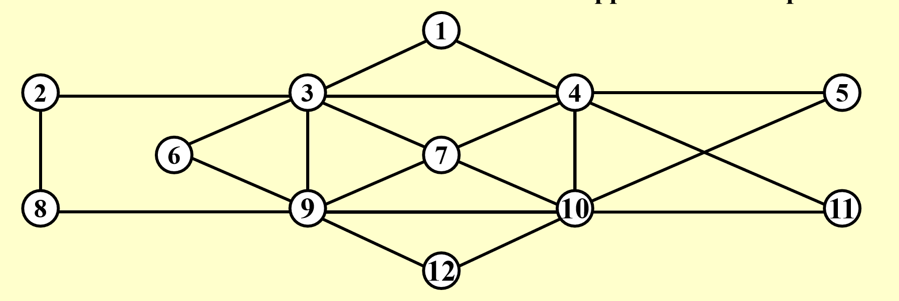

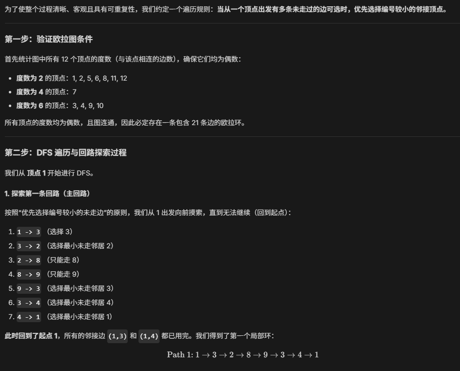

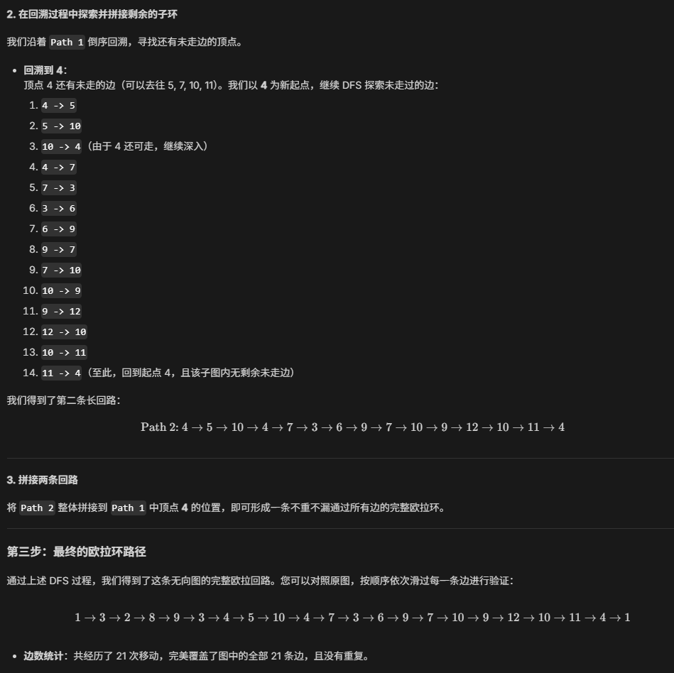

## 总结：四种图的典型应用
- 网络流：一般用于有向图
- MST：只需掌握经典定义无向图
- DFS：适用于有向图和无向图，我们只需掌握无向图
- 最短路：适用于有向图和无向图，两个都要掌握还要注意区分


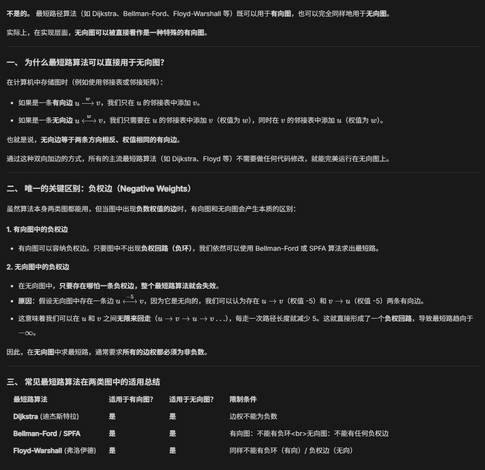
## 解题技巧
