> 搜索算法分为两种：
> 1. 搜索树
> 2. 哈希表
## General Idea
### 插值排序 (interpolation sort)
本质为基于公式的搜索
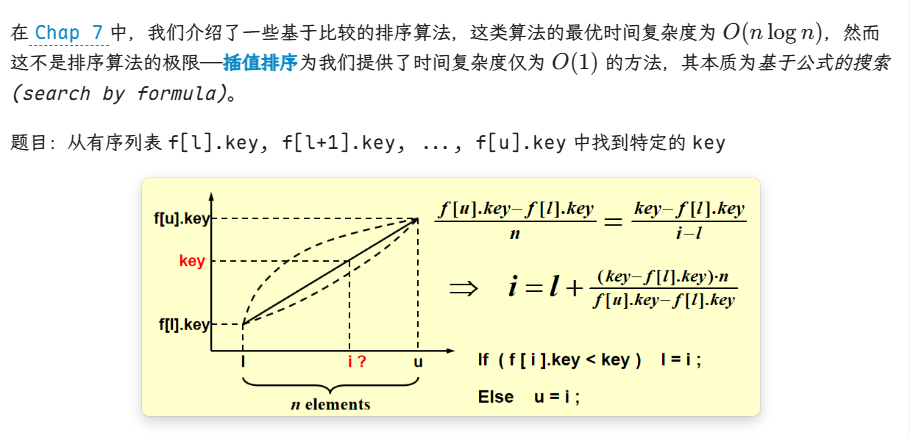

### 简单表 symbol table
- **Objects**：一组 " 名称 + 属性 " 对的集合，集合中的每个名称是唯一的
    
- **Operations**：
    - `SymTab Create(TableSize)`
    - `Boolean IsIn(symtab, name)`
    - `Attribute Find(symtab, name)`
    - `SymTab Insert(symtab, name, attr)`
    - `SymTab Delete(symtab, name)`

### 散列表 (hash tables)
对于每个标识符 x，我们定义一个**散列函数 (hash function)** f (x)，用来表示 x 在 `ht[]` 的位置
- T 表示标识符的总数
- n 表示 `ht[]` 中（即已排好序的）标识符的总数
- **标识符密度 (identifier density)** = $\frac{n}{T}$ ​
- **加载密度 (loading density)** $λ=\frac{n}{s⋅b}​$

常见问题
- **冲突 (collision)**：2 个不同的标识符放入相同的篮子内，即 $f(i1)=f(i2)$ 且 $i_1≠i_2$
- **溢出 (overflow)**：某个（些）篮子的空间已满，无法安置新的标识符
    > 注：当篮子容量 s = 1 时，冲突和溢出同时发生
    
若没有溢出，散列表的主要操作的时间复杂度均为常数级，即：

$$T_{search}=T_{insert}=T_{delete}=O (1) $$

## Hash Function 散列函数
### 散列函数 f 的性质
- f (x) 必须容易计算，且能最小化冲突的可能
- f (x) 不能有 " 偏见 "，能够将所有的键平均分配至散列表内，也就是说： $∀x, ∀i，f (x)=i 的概率为 ​\frac{1}{b}$。这样的散列函数被称为_统一散列函数 (uniform hash function)

### 三种构造方法
#### 除留余数法
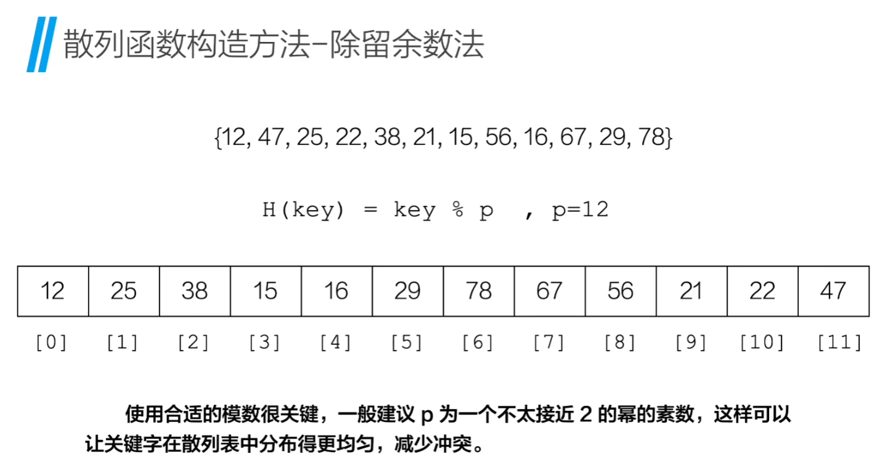
#### 数字分析法
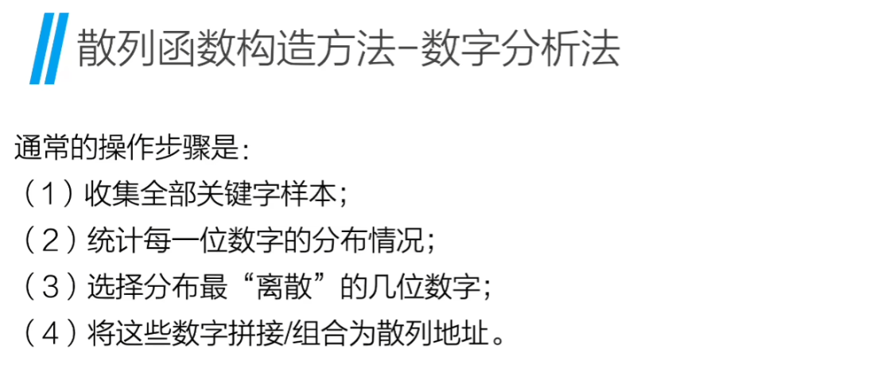

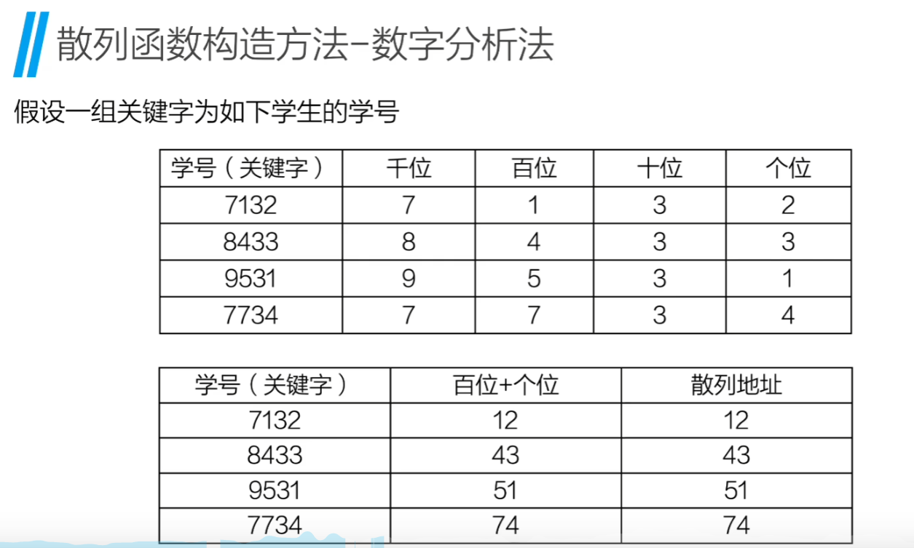

#### 平方取中法
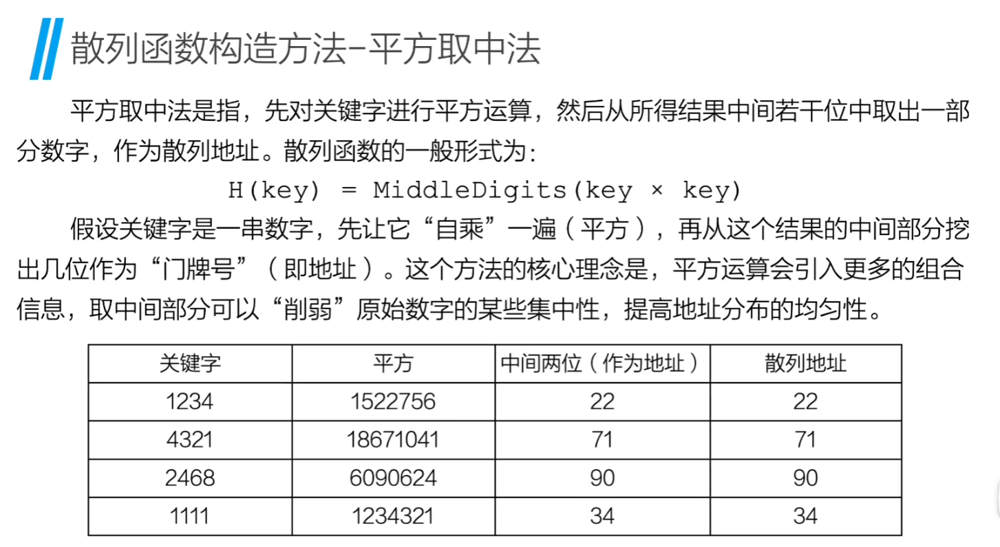


### 一些散列函数
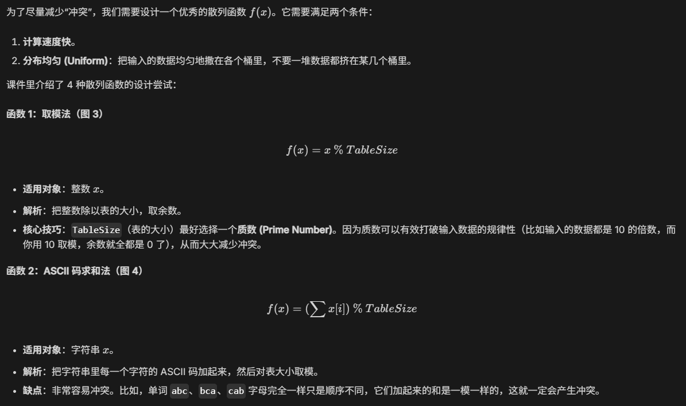
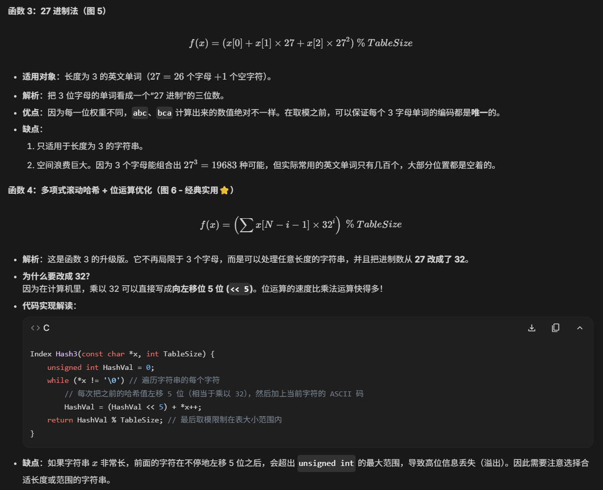

## Separate Chaining 单独链表法(链地址法)/ Open Hashing 开散列法
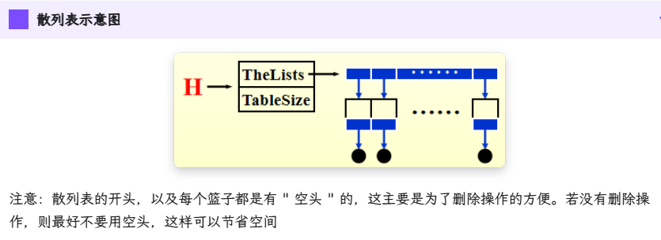

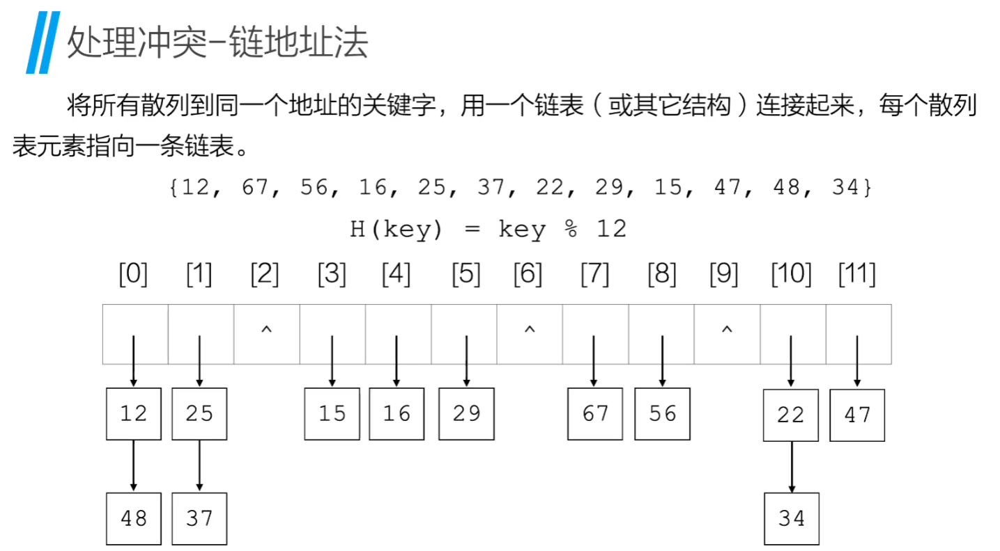
### 数据结构定义
```C
struct ListNode;
typedef struct ListNode * Position;
struct HashTbl;
typedef struct HashTbl * HashTable;

struct ListNode
{
    ElementType Element;
    Position Next;
};
typedef Position List;

/* List *TheList will be an array of lists, allocated later */ 
/* The lists use headers (for simplicity), */ 
/* though this wastes space */ 
struct HashTbl
{
    int TableSize;
    List * TheLists;
};
```

### 初始化空表
```C
HashTable InitializeTable(int TableSize) {
    HashTable H;
    int i;
    
    // 1. 检查表是否太小
    if (TableSize < MinTableSize) { 
    	Error("Table size too small"); 
    	return NULL; 
    }
    
    // 2. 申请哈希表结构体本身的内存空间
    H = malloc(sizeof(struct HashTbl));
    
    // 3. 将表的大小设置为不小于传入参数的下一个质数（质数能减少冲突）
    H->TableSize = NextPrime(TableSize);
    
    // 4. 为“指针数组”申请内存，大小为 TableSize 个 List 指针
    H->TheLists = malloc(sizeof(List) * H->TableSize);
    
    // 5. 为每一个桶（每一个挂钩）创建一个“空头结点（Dummy Head）”
    for(i = 0; i < H->TableSize; i++) {
        H->TheLists[i] = malloc(sizeof(struct ListNode)); // 申请一个节点空间
        H->TheLists[i]->Next = NULL;                      // 初始时后面没有挂衣服
    }
    return H;
}
```

### 查找键值 `Find`
先找到是哪个挂钩，然后沿着这个挂钩的链表往下一个一个找。
```C
Position Find(ElementType Key, HashTable H) {
    Position P;
    List L;
    
    // 1. 用哈希函数计算出 Key 应该在哪个桶（哪个挂钩）
    L = H->TheLists[Hash(Key, H->TableSize)];
    
    // 2. L 是空头结点，L->Next 才是链表中第一个真正存数据的节点
    P = L->Next;
    
    // 3. 顺着链表一直往后找，直到：
    //    要么找到头了（P == NULL），要么找到了我们要的 Key（P->Element == Key）
    while (P != NULL && P->Element != Key)
        P = P->Next;
        
    return P; // 如果找到了，返回该节点的指针；没找到则返回 NULL
}
```

### 插入键值 `Insert`
先查重，如果不存在，就采用“头插法”插入到链表的最前面。
```C
void Insert(ElementType Key, HashTable H) {
    Position Pos, NewCell;
    List L;
    
    // 1. 先找一下这个 Key 是不是已经在表里了（避免重复插入）
    Pos = Find(Key, H);
    
    if (Pos == NULL) { // 如果没找到，说明可以插入新元素
        // 2. 申请一个新节点的内存空间
        NewCell = malloc(sizeof(struct ListNode));
        
        if (NewCell == NULL) FatalError("Out of space!!!");
        else {
            // 3. 找到该 Key 对应的链表头 L
            L = H->TheLists[Hash(Key, H->TableSize)];
            
            // 4. 将新节点插入到“空头结点”和“第一个真正节点”之间（头插法）
            NewCell->Next = L->Next;  // 新节点指向原来的第一个节点
            NewCell->Element = Key;   // 存入数据
            L->Next = NewCell;        // 空头结点指向新节点
        }
    }
}
```

## Open Addressing 开放地址法 / Close Hashing 闭散列法
### 线性探测法 Linear Probing
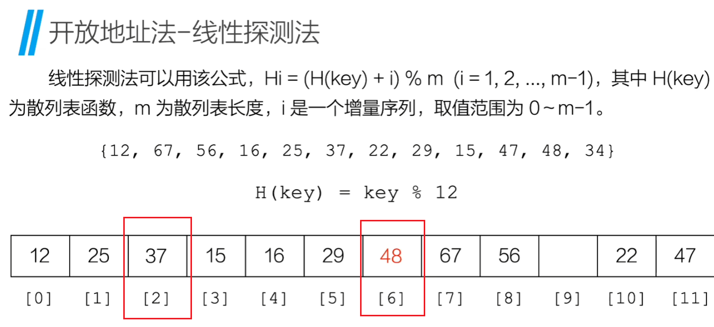

### 二次探测法 Quadratic Probing
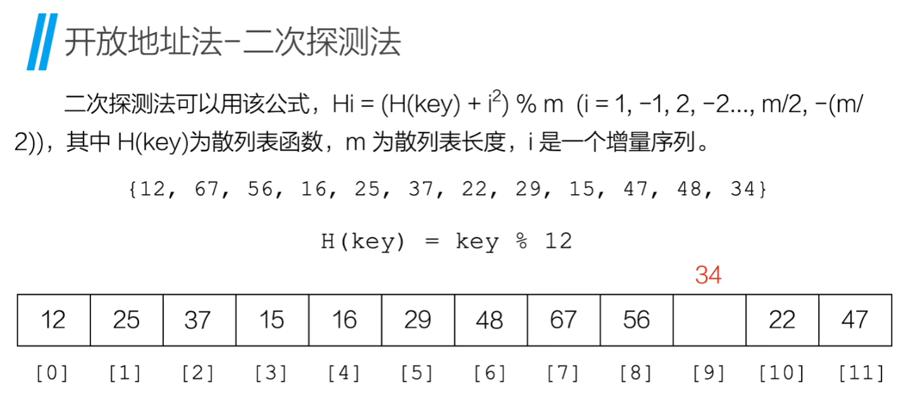

### 双哈希法 / 双重散列 (Double Hashing)
- 方法：使用第二个哈希函数来决定探测的步长（即步长为 `hash2(key)` )
- 优点：探测序列更加随机，不易产生聚集

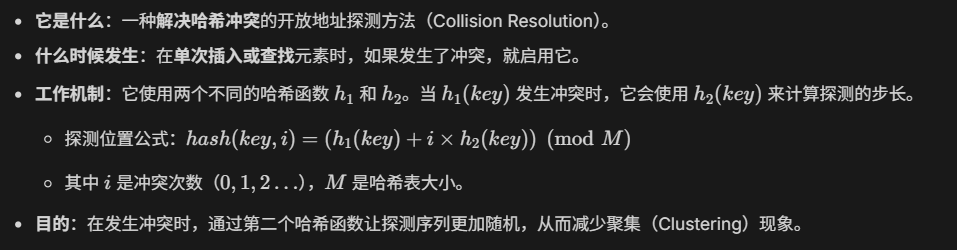
### 伪随机探测法


## RobinHood Hashing: 开放地址法（线性探测）的一种改良版

## ReHashing 哈希表扩容
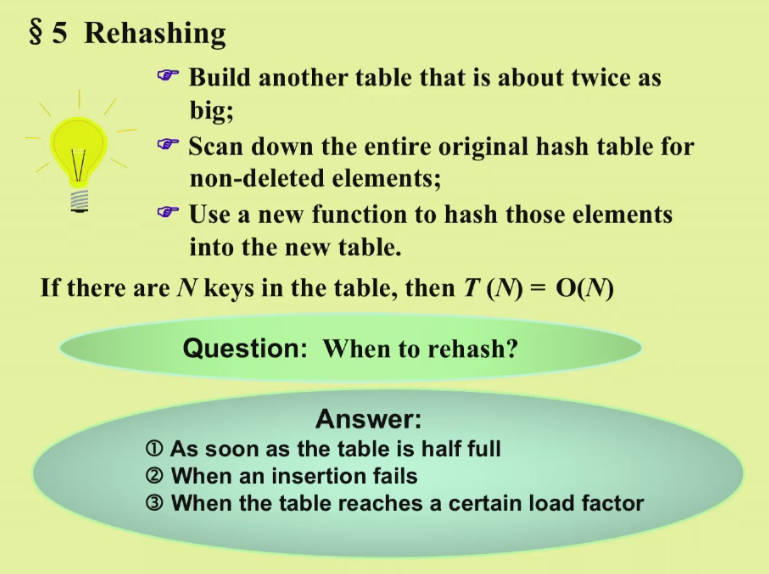
## 散列表的查找
### 流程
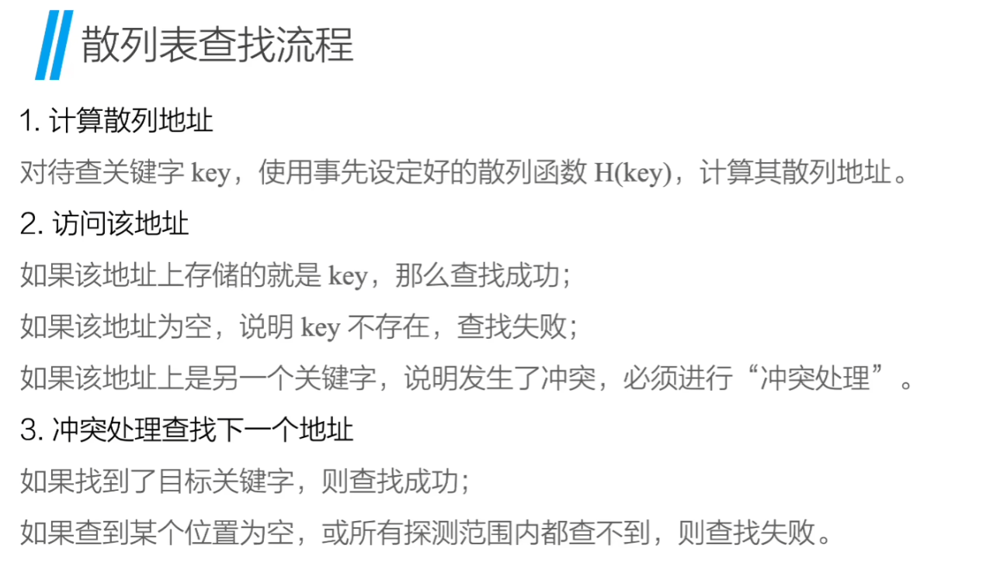

### 影响性能的因素
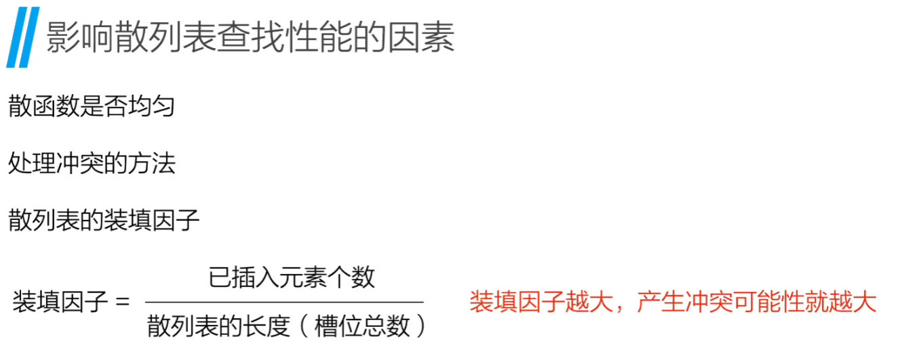


## 解题技巧
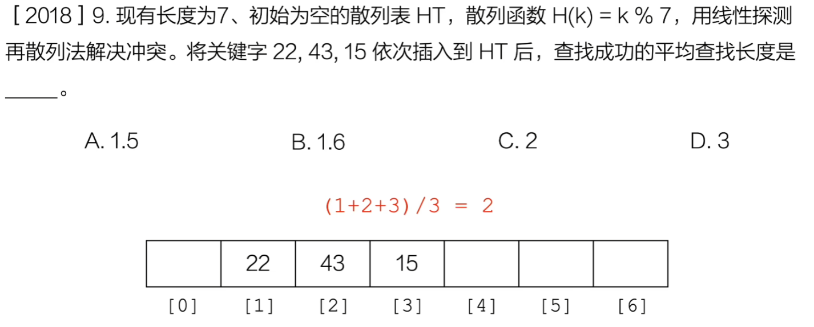

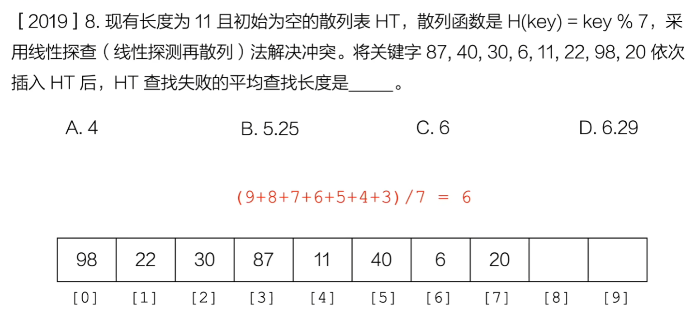