## Algorithm
Algorithm 的 5 大特点 (算法就是一个 idea)
- Input 输入 : There are zero or more quantities that are externally supplied. **随机数生成器没有 input**
- Output 输出: At least one quantity is produced. 
- Definiteness 确定：Each instruction is clear and unambiguous. 
- Finiteness 有穷：If we trace out the instructions of an algorithm, then for all cases, the algorithm terminates after finite number of steps.
- Effectiveness 可行：Every instruction must be basic enough to be carried out, in principle, by a person using only pencil and paper. It is not enough that each operation be definite as in (3); it also must be feasible.

Program 和 Algorithm 的区别：
- A program is written in some programming language, and does not have to be finite (e.g.an operation system).
- An algorithm can be described by human languages, flow charts, some programming languages, or pseudo- code.

> 查找是计算机的核心功能

## What to Analyze
### 语句频度
程序运行的总时间 run times主要和两点有关：
- 执行每条语句的耗时: 我们把这点固定
- 每条语句的执行频率：只关心这点

**语句频度**是指一条语句在算法中被执行的总次数。
由于语句的执行要由源程序翻译成目标代码，目标代码经装配再执行，因此语句执行一次实际所需的具体时间是与机器的软、硬件环境（如机器速度、编译程序质量等) 密切相关的。所以，所谓的算法分析并非实际执行所需时间，而是针对算法中语句的执行次数做出估计，从中得到算法执行时间的信息。

> 当我们评价一个算法的效率时，不能用“秒”来衡量（因为不同电脑的速度不同）。我们需要一个客观的标准，这个标准就是：随着输入数据量 n 的增大，程序里的语句一共执行了多少次？

**时间复杂度 T (n)** 实际上就是算法中所有语句频度的总和。
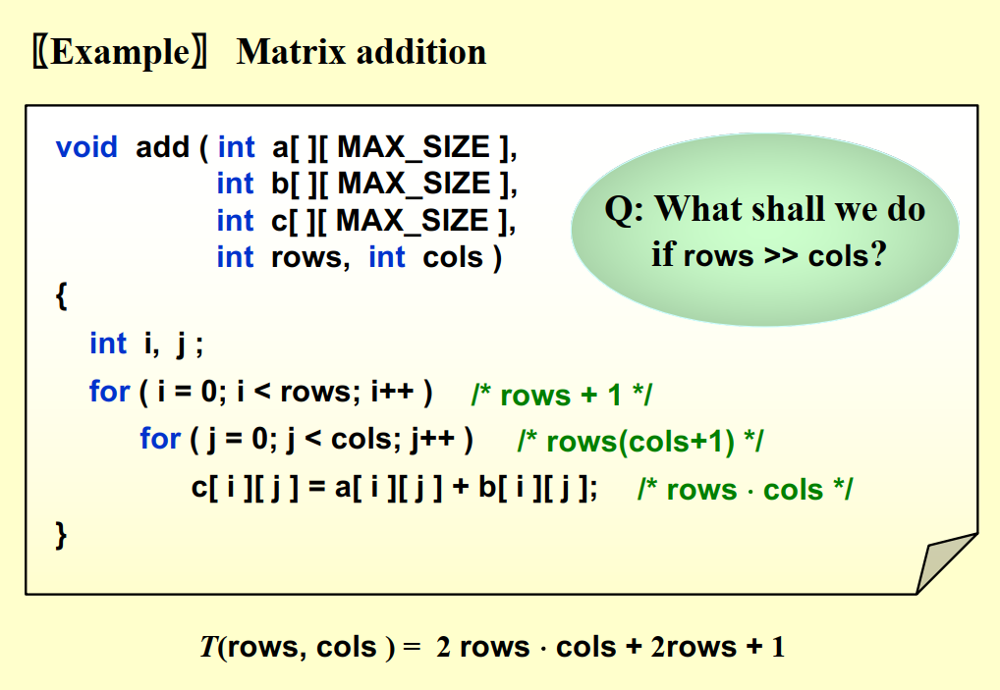
### 对比两种求和方法 ：迭代和递归
选择和冒泡排序复杂度是一个层级，但是选择排序效率更高，因为每次排序处理的 set 在减小

- **步数（Steps）** 只是一个逻辑上的度量，假设每行代码运行时间一样。
- **实际开销（Overhead）：** 虽然递归步数少，但递归每进行一次，CPU 都要在内存中开辟新的**栈帧（Stack Frame）** 等等
- 所以，在求和这种简单的任务上，迭代（循环）总是比递归更高效，且不会有栈溢出的风险。
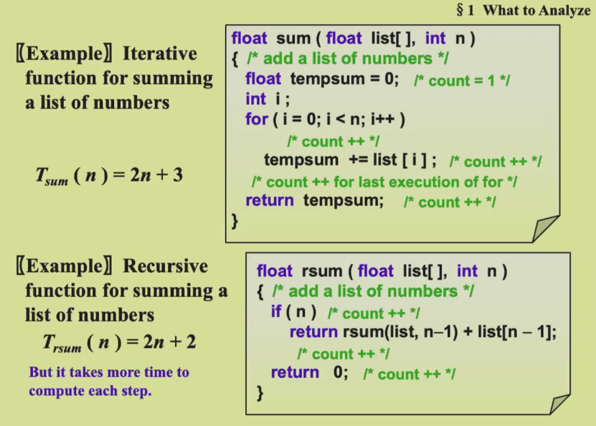
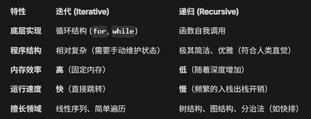

## Asymptotic Notation 渐进符号
若 $f(n) = a_m n^m + a_{m-1}n^{m-1} + \dots + a_1 n + a_0$ 是一个 $m$ 次多项式，则 $T(n) = O(n^m)$ 。
在计算算法时间复杂度时，可以忽略所有低次幂和最高次幂的系数，这样可以简化算法分析，也体现出了增长率的含义。 
### 基本定义 (Definitions)
- **大 O 表示法 (Upper Bound):**  小于等于
    $T(N) = O(f(N))$ if there are positive constants $c$ and $n_0$ such that $T(N) \leq c \cdot f(N)$ for all $N \geq n_0$.
- **大** **`Ω` 表示法 (Lower Bound):**  大于等于
    $T(N) = \Omega(g(N))$ if there are positive constants $c$ and $n_0$ such that $T(N) \geq c \cdot g(N)$ for all $N \geq n_0$.
- **大** **`Θ` 表示法 (Tight Bound):**  等于
    $T(N) = \Theta(h(N))$ if and only if $T(N) = O(h(N))$ and $T(N) = \Omega(h(N))$.
- **小 o 表示法:**  严格小于
    $T(N) = o(p(N))$ if $T(N) = O(p(N))$ and $T(N) \neq \Theta(p(N))$.

> 我们需要 take the smallest $f(N)$ and the largest $g(N)$
### 计算规则 (Rules)
若 $T_1(N) = O(f(N))$ 且 $T_2(N) = O(g(N))$，则：
1. **加法规则：** $T_1(N) + T_2(N) = \max(O(f(N)), O(g(N)))$
2. **乘法规则：** $T_1(N) \cdot T_2(N) = O(f(N) \cdot g(N))$

如果 T(N)是一个 k 次多项式，则 $T(N) = \Theta(N^k)$。  
对于任意常数 k，$\log^k N = O(N)$。这说明对数级的时间复杂度远优于线性复杂度。

> 当比较两个程序的复杂度时，必须确保 N 足够大。

## 时间复杂度
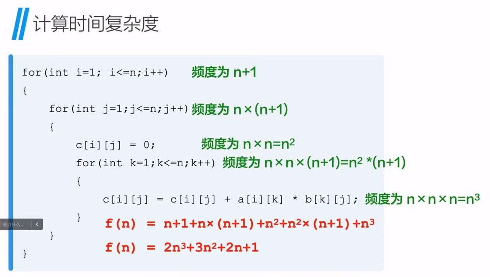

#### 常量阶 T (n)=O (1)
```C
for(int i=0;i<100000;i++){
	x++;
	s=0;
}
```

#### 线性阶  T (n)=O (n)
```C
for(int i=0;i<n;i++){
	x++;
	s=0;
}
```

#### 平方阶  T (n)=O ($n^2$)
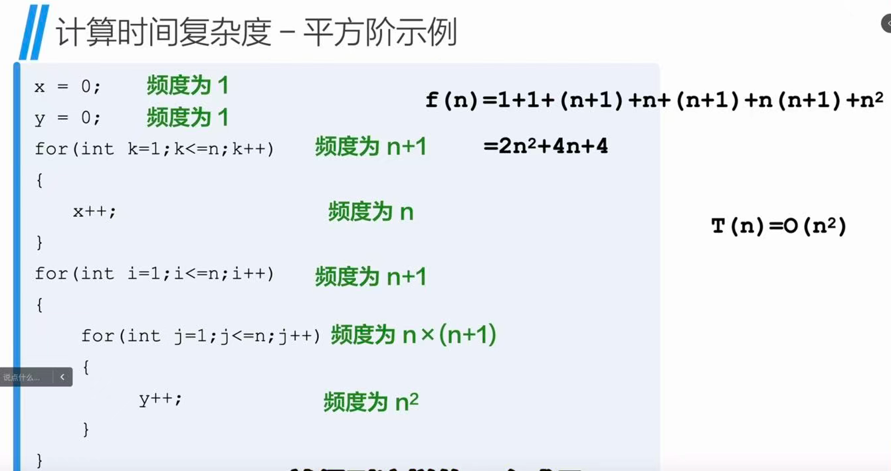

#### 立方阶  T (n)=O ($n^3$)
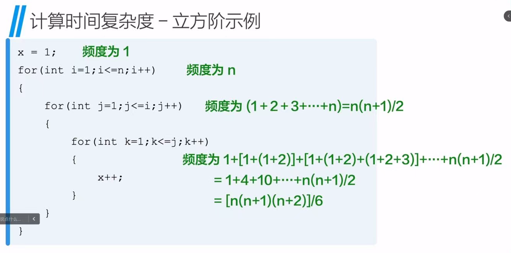

#### 对数阶 T (n)=O ($log_2N$)
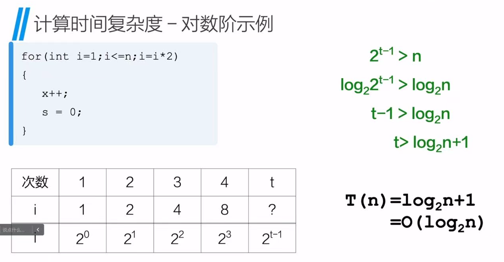

### 递归求斐波那契数列
```C
long int Fibe(int N){
	if(N<=1)
		return 1;
	else 
		return Fib(N-1)+Fib(N-2);
}
```

## Compare the Algorithms 求最大连续子列和
大部分除法指的是计算机中的整数除法

课程中都用 recursion 分析，工程中实际都用 iteration

这门课关键是逻辑清晰，不卡运行时间

### 二重循环
```C
int MaxSubSum(const int A[],int N){
	int ThisSum,MaxSum,i,j;
	MaxSum=0;
	for(i=0;i<N;i++){
		ThisSum=0;
		for(j=i;j<N;j++){
			ThisSum+=A[j];
			if(ThisSum>MaxSum)
				MaxSum=ThisSum;
		}
	}
}
```

### 分治算法
```C
int MaxSubSum(const int A[],int Left,int Right){
	int MaxLeftSum,MaxRightSum;
	int LeftBorderSum,RightBorderSum;
	int MaxLeftBorderSum,MaxRightBorderSum;
	
	if(Left == Right){
		if(A[Left]>0)
			return A[Left];
		else
			return 0;
	}
	
	int Center=(Left+Right)/2;
	int MaxLeftSum=MaxSubSum(A,Left,Center);
	int MaxRightSum=MaxSubSum(A,Center+1,Right);
	
	MaxLeftBorderSum=0;
	LeftBorderSum=0;
	for(i=Center;i>=Left;i--){
		LeftBorderSum+=A[i];
		if(LeftBorderSUm>MaxLeftBorderSum)
			MaxLeftBoderSum=LeftBorderSum;
	}
	MaxRightBorderSum=0;
	RightBorderSum=0;
	for(i=Center+1;i<=Right;i++){
		RightBorderSum+=A[i];
		if(RightBorderSUm>MaxRightBorderSum)
			MaxRightBoderSum=RightBorderSum;
	}
	
	return Max3(MaxLeftSum,MaxRightSum,MaxLeftBoderSum+MaxRightBoderSum);
}
```

### 联机算法 (On-line/ Kadane)
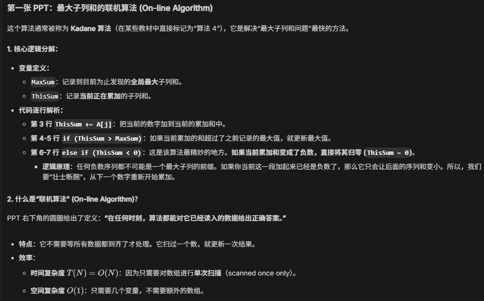
```C
int MaxSubSum(const int A[],int N){
	int ThisSum,MaxSum,j;
	
	ThisSum=MaxSum=0;
	for(j=0;j<N;j++){
		ThisSum+=A[j];
		
		if(ThisSum>=MaxSum)
			MaxSum=ThisSum;
		else if(ThisSum<0)
			ThisSum=0;
	}
	return MaxSum;
}
```


## Logarithm in the Running Time
### 二分查找
```C
int BinarySearch(const int A[],int X,int N){
	int Low,Mid,High;
	Low=0;
	High=N-1;
	
	while(Low<High){
		Mid=(Low+High)/2;
		if(A[Mid]<X)
			Low=Mid+1;
		else if(A[Mid]>X)
			High=Mid-1;
		else
			return Mid;
	}
	return NotFound;
}
```

### 辗转相除法
```C
unsigned int Gcd(unsigned int M,unsigned int N){
	unsigned int Rem;
	
	while(N>0){
		Rem=M%N;
		M=N;
		N=Rem;
	}
	return M;
}
```

### 求幂
```C
long Pow(long X,unsigned int N){
	if(N==0)
		return 1;
	if(IsEven(N))
		return Pow(X*X,N/2);
	else
		return Pow(X*X,N/2)*X;
}
```

## Checking Your Analysis

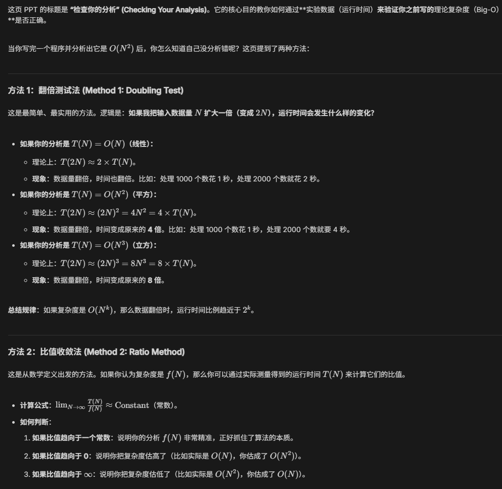

---
## 理论题
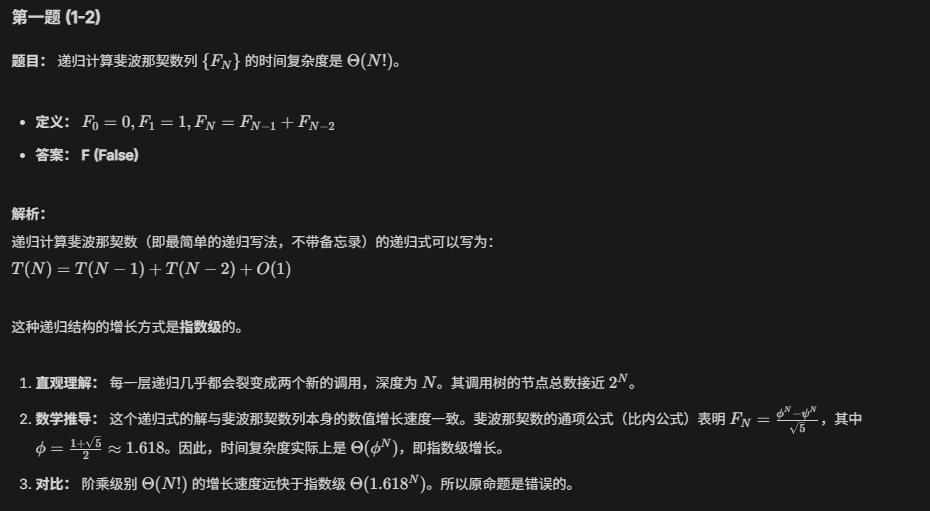

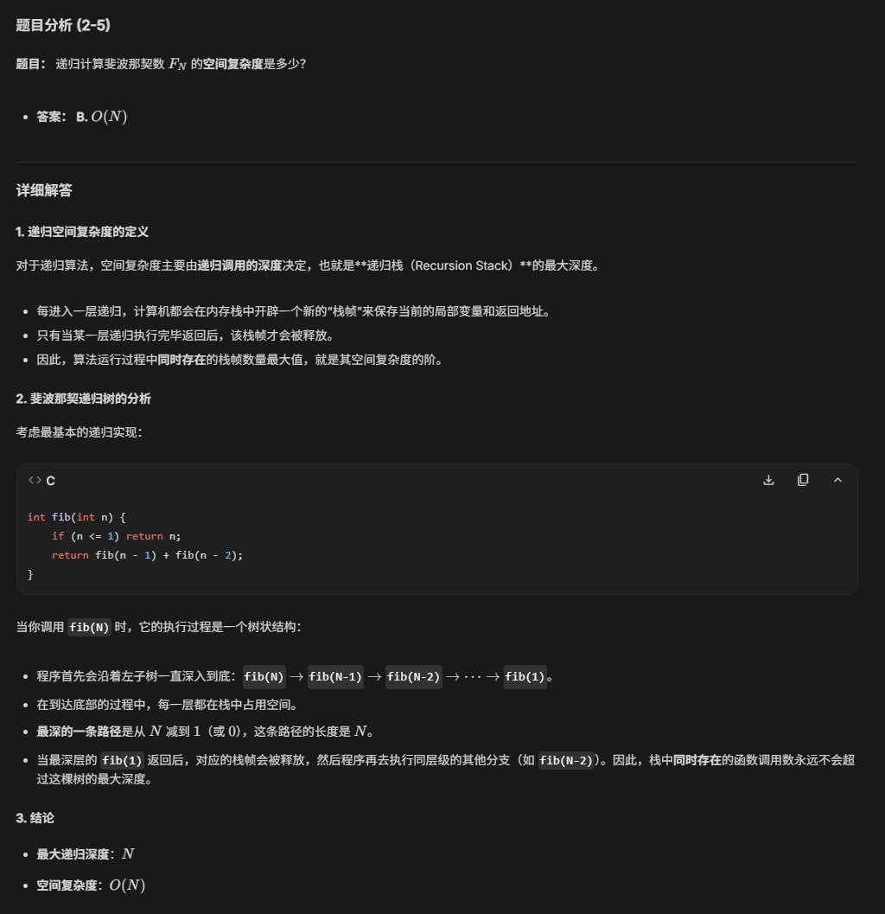

主定理


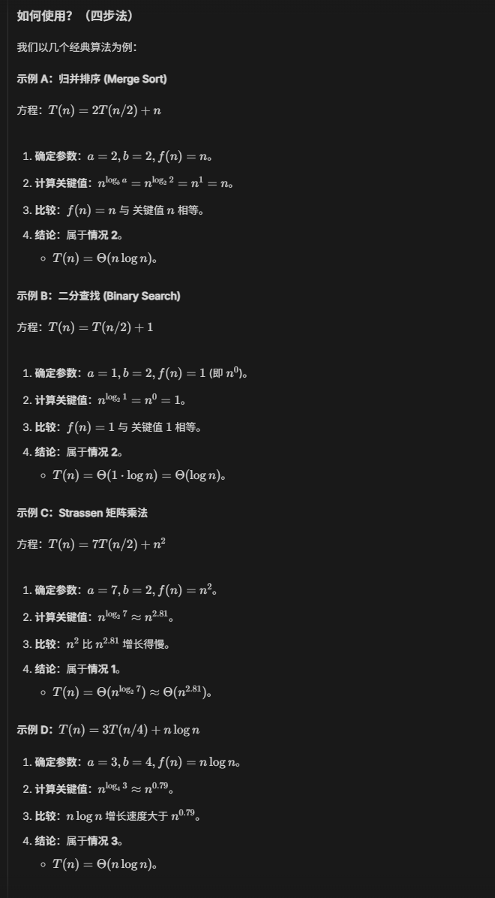

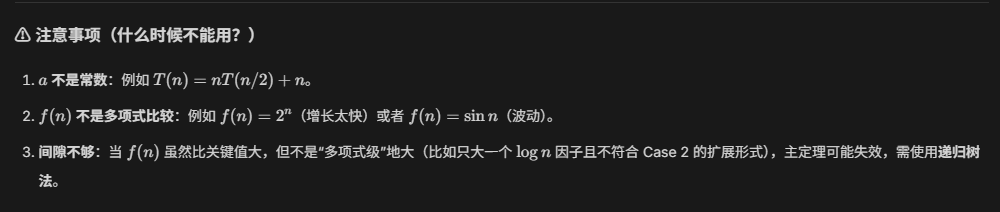

