## 线性表 Linear List
线性表是 n 个具有**相同特性**的数据元素的**有限序列**。
有两种实现形式，按照物理存储分为：
- 顺序表（连续）
- 链表（不连续）
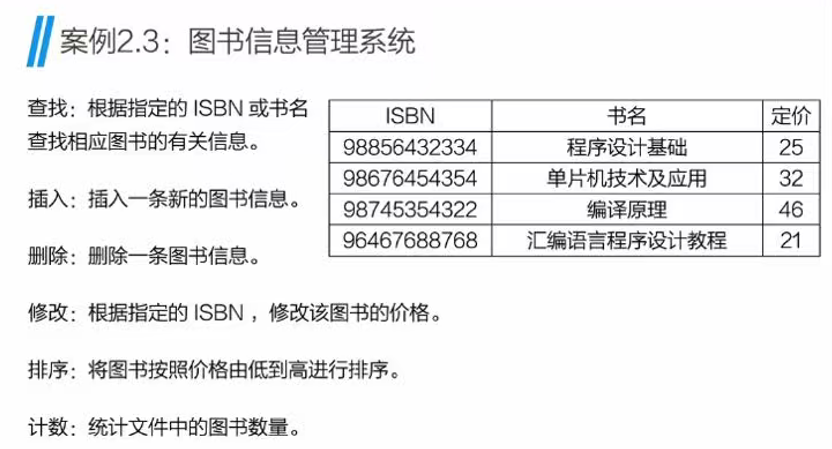
## 顺序表 Sequential List (类似数组)
用一组连续的内存单元依次存储线性表的各个元素，也就是说，逻辑上相邻的元素，实际的物理存储空间也是连续的。
### 初始化
```C
#define MAXSIZE 100
typedef int ElemType //便于更改数据类型
typedef struct{
	ElemType data[MAXSIZE];
	int length;
}SeqList;

void initList(SeqList* L){
	L->length=0;
}
```

### 遍历
```C
void listElem(SeqList* L){
	for(int i=0;i<n;i++){
		printf("%d\n",L->data[i]);
	}
}
```

### 头插法
```C
int insertHead(SeqList* L,ElemType* e){
	if(L->length>=MAXSIZE){
		printf("满了\n");
		return 0;
	}
	for(int i=L->length;i>0;i--){
		L->data[i]=L->data[i-1];
	}
	L->data[0]=e;
	L->length++;
	return 1;
}
```

### 尾插法
```C
int appendElem(SeqList* L,ElemType e){
	if(L->length>=MAXSIZE){
		printf("满了\n");
		return 0;
v	}
	L->data[L->length]=e;
	L->length++;
	return 1;
}
```

### 指定位置插入元素
```C
int insertElem(SeqList* L,int pos,ElemType e){
	// 1. 检查表是否已满
	if (L->length >= MAXSIZE) { 
		printf("满了\n"); 
		return 0;
	} 
	// 2. 检查插入位置 pos 是否合法 
	if (pos < 1 || pos > L->length + 1) { 
		printf("位置不合法\n"); 
		return 0; 
	} 
	// 3. 将第 pos 个位置及之后的元素后移 // 注意：数组下标是从 0 开始的，所以第 pos 个元素的下标是 pos-1 
	for (int i = L->length; i >= pos - 1; i--) {
		L->data[i] = L->data[i-1];
	} 
	// 4. 插入新元素 
	L->data[pos - 1] = e; 
	// 5. 长度加 1
	L->length++;
}
```

### 指定位置删除元素
```C
int deleteElem(SeqList* L,ElemType* e){
	// pos 应该在 1 到 L->length 之间 
	if (pos < 1 || pos > L->length) { 
		printf("位置不合法\n"); 
		return 0;
	} 
	*e = L->data[pos - 1]; 
	 for (int i = pos; i < L->length; i++) {
	 	L->data[i - 1] = L->data[i];
	 } 
	 L->length--;
	  return 1;
}
```

### 查找元素
```C
int findElem(SeqList* L,ElemType e){
	for(int i=0;i<L->length;i++){
		if(L->data[i]==e){
			return i+1;//数组下标=0返回元素位置=1
		}
	}
	return 0;
}
```

### 动态分配内存地址初始化
```C
typedef struct{
	ElemType data[MAXSIZE];
	int length;
}SeqList;

SeqList* initList(SeqList* L){
	SeqList* L=(SeqList*)malloc(sizeof(SeqList));
	L->data=(ElemType*)malloc(sizeof(ElemType)*MAXSIZE);
	L->length=0;
	return L;
}
```

## 链表
### （单）链表 （Singular）Linked List

节点 Node 包含：
- 数据域
- 指针域：其中存储的信息称为指针或链

> 注意，下文中的 pos=1 对应数组下标为 0
#### 初始化
```C
Node* initLIst(){
	Node* head=(Node*)malloc(sizeof(Node));
	head->data=0;
	head->next=NULL;
	return head;
}
int main(){
	Node* list=initList();
	Node* tail=get_tail(list);
	return 1;
}
```
#### 头插法
头插法的顺序和排列的顺序是相反的。
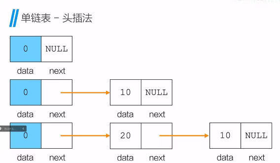

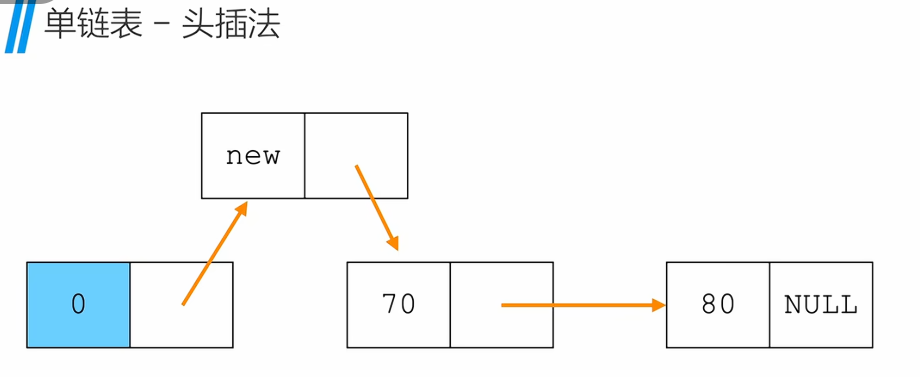

```C
int insertHead(Node* L,ElemType){
	Node* p=(Node*)malloc(sizeof(Node));
	p->data=e;
	//注意先后
	p->next=L->next;
	L->next=p;
}
int main(){
	Node* list=initList();
	insertHead(list,10);
	insertHead(list,20);
}
```

#### 尾插法
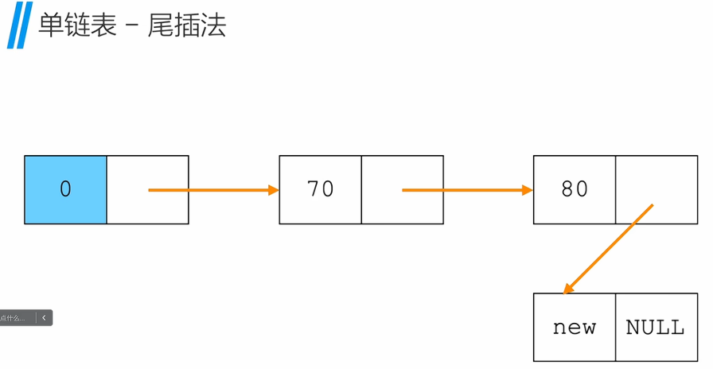

```C
Node* insertTail(Node* tail,ElemType){
	Node* p=(Node*)malloc(sizeof(Node));
	p->data=e;
	tail->next=p;
	p->next=NULL;
	return p;
}
```
#### 遍历
```C
void listNode(Node* L){
	Node* p=L->next;
	while(p!=NULL){
		printf("%d\n",p->data);
		p=p->next;
	}
	printf("\n");
}
```

#### 插入节点
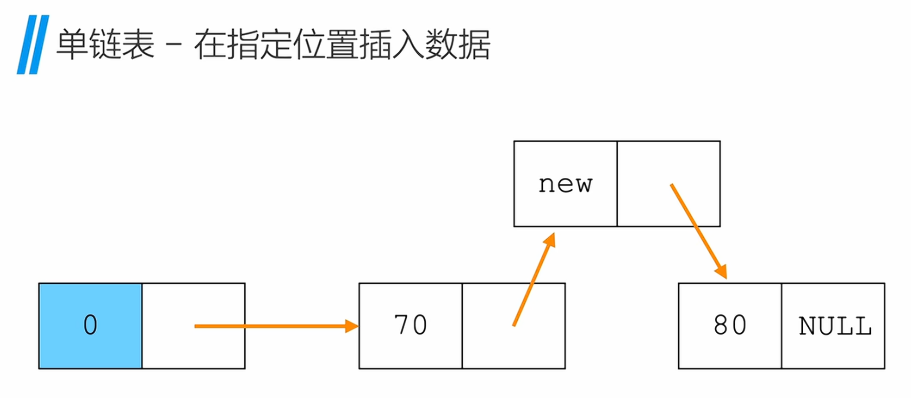
```C
int insertNode(Node* L,int pos,ElemTyep e){
	Node* p=L;
	int i=0;
	while(i<pos-1){
		p=p->next;
		i++;
		if(p==NULL){
		return 0;
		}
	}//p为想插入位置的前一个节点pos-1
	Node* q=(Node*)malloc(sizeof(Node));
	q->data=e;
	q->next=p->next;
	p->next=q;
	return 1;
}
```

#### 删除节点
```C
int deleteNode(Node* L,int pos){
	Node* p=L;
	int i=0;
	while(i<pos-1){
		p=p->next;
		i++;
		if(p==NULL){
			
		}
	}
	if(p->next==NULL){
		printf("要删除的位置错误");
		return 0;
	}
	Node* q=p->next;
	p->next=q->next;
	free(q);
	return 1;
}
```

#### 释放链表
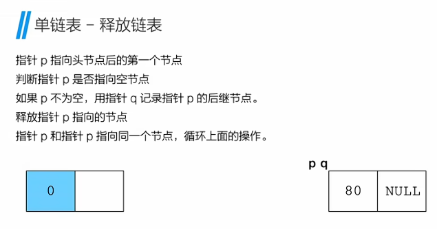
```C
void freeList(Node* L){
	Node* p=L->next;
	Node* q;
	while(p!=NULL){
		q=p->next;
		free(p);
		p=q;
	}
	L->next=NULL;
}
```

#### 获取链表长度
```C
int listLength(Node* L){
	Node* p=L;
	int len=0;
	while(p!=NULL){
		p=p->next;
		len++;
	}
	return len;
}
```
### 单链表的应用
#### 双指针（快慢指针）
找到倒数第 k 个节点
```C
int findNodeFS(Node* L,int k){
	Node* fast=L->next;
	Node* slow=L->next;
	for(int i=0;i<k;i++){
			fast=fast->next;
	}
	while(fast!=NULL){
		fast=fast->next;
		slow=slow->next;
	}
	printf("倒数第k个节点为：%d\n",k,slow->data);
}
```

#### 反转链表
```C
List Reverse( List L )
{
    Position cur;
    Position pre;
    Position rear;

    cur = L->Next;
    while (cur != NULL)
    {
        rear = cur->Next;
        if (cur == L->Next)
            cur->Next = NULL;
        else
            cur->Next = pre;
        pre = cur;
        cur = rear;
    }
    L->Next = pre;

    return L;
}
```
#### 找到链表中间节点

#### 多项式 ADT

#### Multilists

#### Cursor 游标 Implementation of Linked Lists
### （单向）循环链表（Singular）Circular Linked List
#### 找到链表环的入口
快慢指针相遇的地方就是环的入口 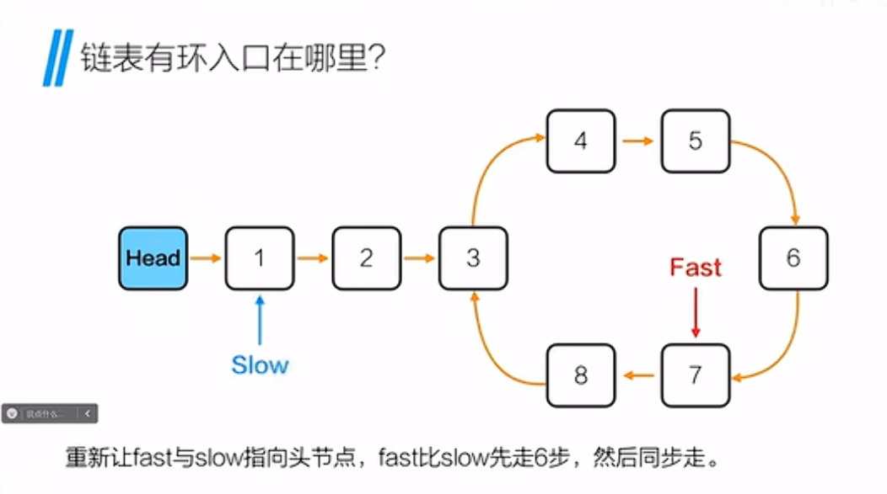 
```C
Node* findBegin(Node* head){
	Node* fast=head;
	Node* slow=head;
	
	while(fast!=NULL && fast->next!=NULL){
		fast=fast->next->next;
		slow=slow->next;
		if(fast==slow){
			Node *p=fast;
			int count =1;
			while(p->next!=slow){
				count++;
				p=p->next;
			}
		}
		fast=head;
		slow=head;
		
		for(int i=0;i<count;i++){
			fast=fats->next;
		}
		while(fast!=slow){
				fast=fast->next;
				slow=slow->next;
		}
		return slow;
	}
	return NULL;
}
```

### 双向链表 Binaural Linked List
在单链表中，查找直接后继的执行时间为 $O(1)$，而查找直接前驱的执行时间为 $O(n)$。
双向链表的节点中有两个指针域，一个指向直接后继，另一个指向直接前驱。
#### 头插法
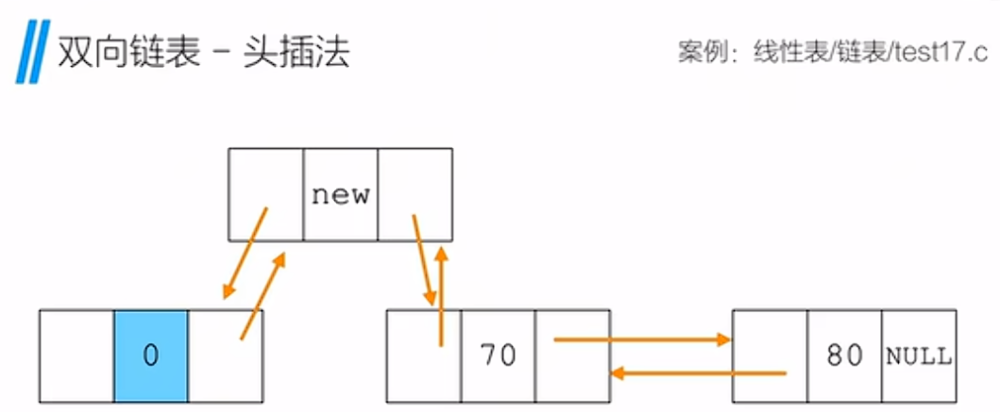

```C
int insertHead(Node* L,ElemType e){
	Node* p=(Node*)malloc(sizeof(Node));
	//将新节点首尾嵌入链表
	p->data=e;
	p->prev=L;
	p->next=L->next;
	//将原链表与新节点相连，先接后面再接前面，顺序不可颠倒
	if(L->next!=NULL){
		L->next->prev=p;
	}
	L->next=p;
	return 1;
}
//从右向左看
```

#### 尾插法
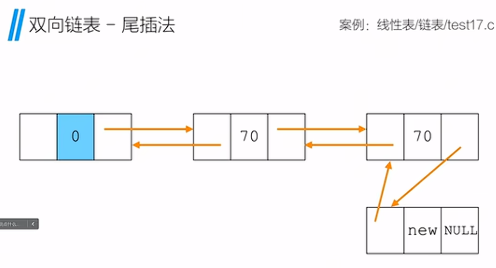

```C
Node* insertTail(Node* tail,ElemType e){
	Node* p=(Node*)malloc(sizeof(Node));
	p->data=e;
	p->prev=tail;
	p->next=NULL;
	tail->next=p;
	return p;
}
```

#### 指定位置插入数据
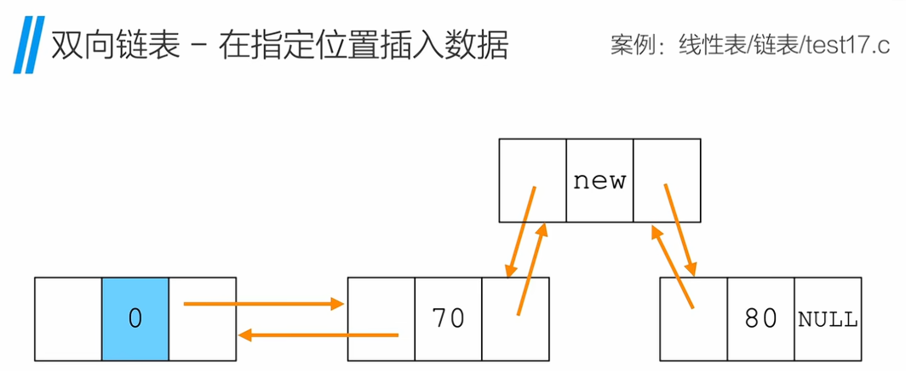

```C
int insertNode(Node* L,int pos,ElemTyep e){
	Node* p=L;//p指向要插入位置的前置节点pos-1
	int i=0;
	while(i<pos-1){
		p=p->next;
		i++;
		if(p==NULL){
			return 0;
		}
	}
	Node* q=(Node*)malloc(sizeof(Node));
	q->data=e;
	q->prev=p;
	q->next=p->next;
	//注意先后
	p->next->prev=q;
	p->next=q;
	return 1;
}
```

#### 删除节点
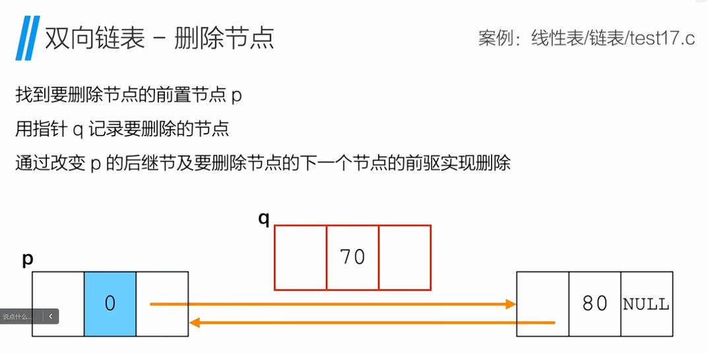

```C
int delete(Node* L,int pos){
	Node* p=L;
	int i=0;
	while(i<pos-1){
		p=p->next;
		i++;
		if(p==NULL){return 0;}
	}
	if(p->next==NULL){
			printf("要删除的位置错误\n");
			return 0;
	}
	Node* q=p->next;
	p->next=q->next;
	q->next->prev=p;
	free(p);
	return 1;
}

```

### 顺序表 VS 链表
顺序表适合访问，链表适合插入删除操作
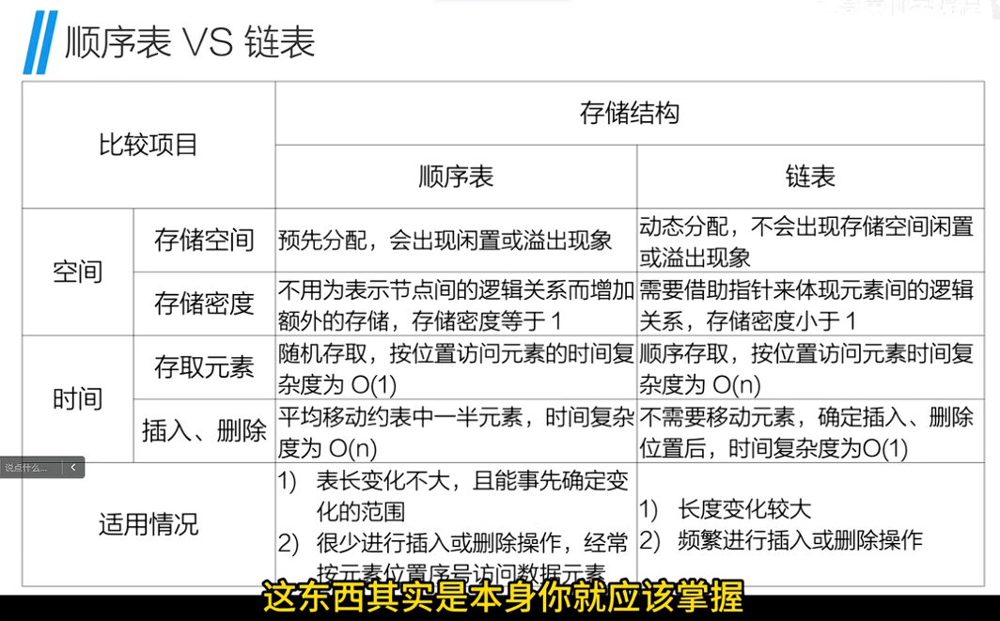


## 栈 Stack
后进先出 LIFO 像弹夹。 
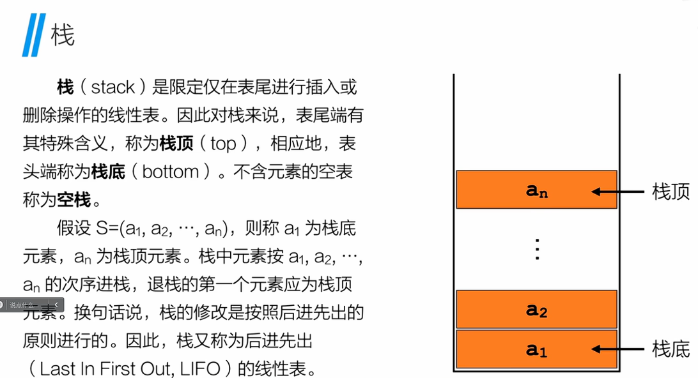
栈是限制插入和删除操作只能在一个位置进行的表，该位置是表的末端，叫作栈顶（top)。
对栈的基本操作有进栈（push) 和出栈（Pop), 前者相当于插入，后者则是删除最后插入的元素。
### 栈的顺序结构
#### 栈的初始化
```C
#define MAXSIZE=100
typedef int ElemType;
typedef struct{
	ElemType data[MAXSIZE];
	int top;
}Stack;

void initStack(Stack* s){
	s->top=-1;
}
```

#### 判断栈是否为空
```C
int isEmpty(Stack* s){
	if(s->top==-1){
		printf("空的\n");
		return 1;
	}
	else{
		return 0;
	}
}
```

#### 进栈/压栈
```C
int push(Stcak* s,ElemType* e){
	if(s->top>=MAXSIZE-1){
		printf("满了\n");
		return 0;
	}
	s->top++;
	s->data[s->top]=e;
	return 1;
}
```

#### 出栈
```C
ElemType pop(Stack* s,ElemType* e){
	if(s->top==-1){
		printf("空的\n");
		return 0;
	}
	*e=s->data[s->top];
	s->top--;
	return 1;
}
```

#### 获取栈顶元素
```C
int getTop(Stack* s,ElemType* e){
	if(s->top==-1){
		printf("空的\n");
		return 0;
	}
	*e=s->data[s->top];
	return 1;
}
```

### 栈的链式结构
#### 动态内存分配
```C
#define MAXSIZE 100
typedef struct{
	ElemType* data;
	int top;
}Stack;
Stack* initStack{
	Stack* s=(Stack*)malloc(sizeof(Stack));
	s->data=(ElemType*)malloc(sizeof(ElemType)*MAXSIZE);
	s->top=-1;
	return s;
}
```

#### 初始化
```C
typedef struct stack{
	ElemType data;
	struct stack* next;
}Stack;
Stack* initStack(){
	Stack* s=(Stack*)malloc(sizeof(Stack));
	s->data=0;
	s->next=NULL;
	return s;
}
```

#### 判断栈是否为空
```C
int isEmpty(Stack* s){
	if(s->next==NULL){
		printf("空的\n");
		return 1;
	}else{
		return 0;
	}
}
```

#### 进栈/压栈 (相当于链表头插法)
```C
int push(Stack* s,ElemType e){
	Stack* p=(Stack*)malloc(sizeof(Stack));
	p->data=e;
	p->next=s->next;
	s->next=p;
	return 1;
}
```

#### 出栈（相当于删除头结点后的那个节点）
```C
int pop(Stack* s,ElemType* e){
	if(s->next==NULL){
		printf("空的\n");
		return 0;
	}
	*e=s->next->data;
	Stack* q=s->next;
	s->next=q->next;
	free(q);
	return 1;
}
```

#### 获取栈顶元素
```C
int getTop(Stack* s,ElemType* e){
	if(s->next==NULL){
		printf("空的\n");
		return 0;
	}
	*e=s->next->data;
	return 1;
}
```

## 队列
队列 (queue) 是一种先进先出（First In First Out,, FIFO) 的线性表。它只允许在表的一端进行插入，而在另一端删除元素。
在队列中，允许插入的一端称为队尾 (rear), 允许删除的一端则称为队头（front)。
假设队列为 q=(a 1, a 2,…, an), 那么，a 1 就是队头元素，an 就是队尾元素。队列中的元素是按照 a 1, a 2,…, an 的顺序进入的，退出队列也只能按照这个次序依次退出，也就是说，只有在 a 1, a 2,…, an-1 都离开队列之后，an 才能退出队列。
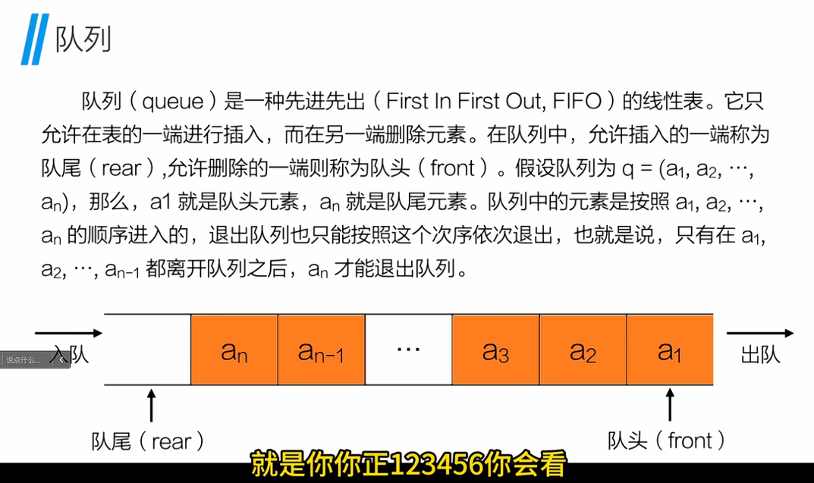

### 顺序结构
#### 队列初始化
```C
#define MAXSIZE=100
typedef struct{
	ElemType data[MAXSIZE];
	int front;
	int rear;
}Queue;

void initQueue(Queue* Q){
	Q->front=0;
	Q->rear=0;
}
```

#### 判断队列是否为空
队列为空时 front 和 rear 重合，但是很可能不是 0。
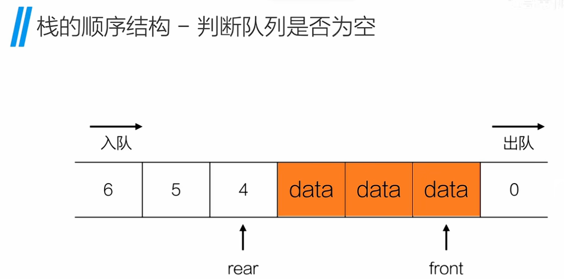
```C
int isEmpty(Queue* Q){
	if(Q->front==Q->rear){
		printf("空的\n");
		return 1;
	}else{
		return 0;
	}
}
```

#### 出队
```C
ElemType dequeue(Queue* Q){
	if(Q->front==Q->rear){
		printf("空的\n");
		return 0;
	}
	ElemType e=Q->data[Q->front];
	
}
```
 
#### 入队
```C
int equeue(Queue* Q,ElemType e){
	if(Q->rear>=MAXSIZE){
		if(!queueFull(Q)){
			return 0;
		}
	}
	Q->data[Q->rear]=e;
	Q->rear++;
	return 1;
}
```

#### 调整队列
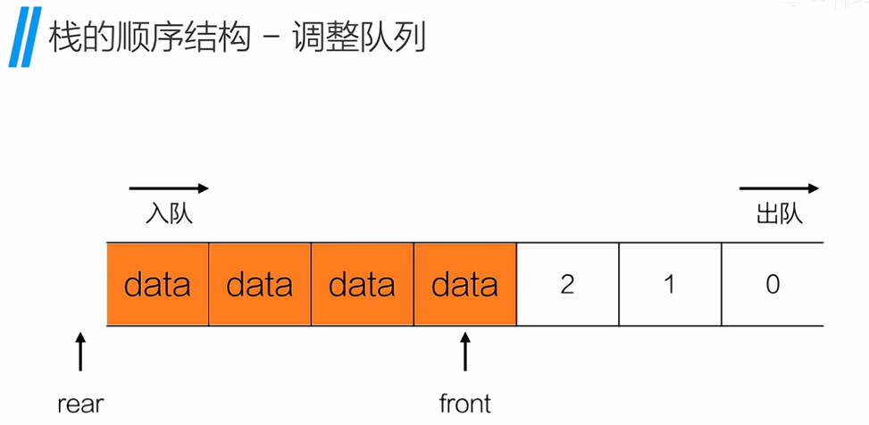

```C
int queueFull(Queue* Q){
	if(Q->front>0){
		int step=Q->front;
		for(int i=Q->front;i<=Q->rear;i++){
			Q->data[i-step]=Q->data[i];
		}
		Q->front=0;
		Q->rear=Q->rear -step;
		return 1;
	}else{
		printf("真的满了\n");
		return 0;
	}
}
```

#### 获取队头数据
```C
int getHead(Queue* Q,ElemType* e){
	if(Q->front==Q->rear){
		printf("空的\n");
		return 0;
	}
	*e=Q->data[Q->front];
	return 1;
}
```

#### 动态分配内存
```C
typedef struct queue{
	ElemType* data;
	int front;
	int rear;
}Queue;
Queue* initQueue(){
	Queue* q=(Queue*)malloc(sizeof(Queue));
	q->data=(ElemType*)malloc(sizeof(ElemType)*MAXSIZE);
	q->front=0;
	q->rear=0;
	return q;
}
```

### 循环队列
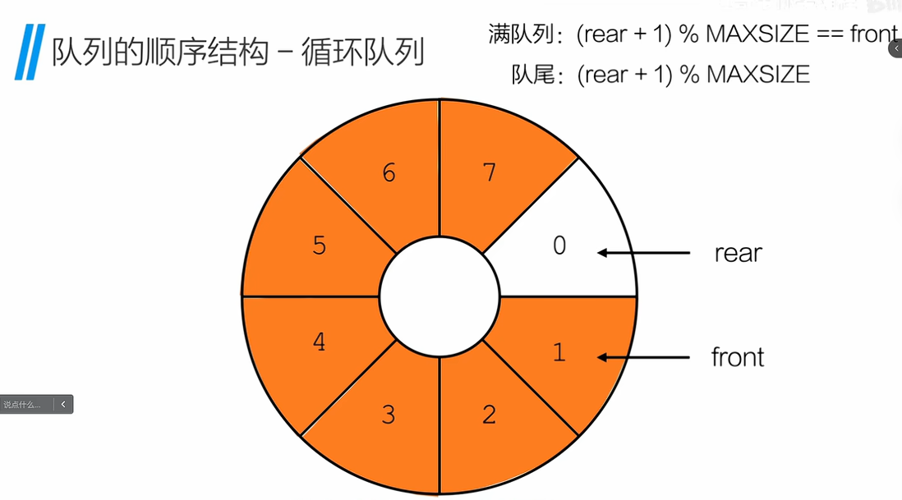

#### 入队
```C
int equeue(Queue* Q,ElemType e){
	if((Q->rear+1)%MAXSIZE==Q->front){
		printf("满了\n");
		return 0;
	}
	Q->data[Q->rear]=e;
	Q->rear=(Q->rear+1)%MAXSIZE;
	return 1;
}
```
#### 出队
```C
int dequeue(Queue* Q,ElemType* e){
	if(Q->front==Q->rear){
		printf("空的\n");
		return 0;
	}
	*e=Q->data[Q->front];
	Q->front=(Q->front+1)%MAXSIZE;
	return 1;
}
```


### 链式结构
```C
typedef struct QueueNode{
	ElemType data;
	struct QueueNode* next;
}QueueNode;

typedef struct{
	QueueNode* front;
	QueueNode* rear;
}Queue;
```

#### 入队 
```C
void equeue(Queue* q,ElemType e){
	QueueNode* node=(QueueNode*)malloc(sizeof(QueueNode));
	node->data=e;
	node->next=NULL;
	q->rear->next=node;
	q->rear=node;
}
```

#### 出队
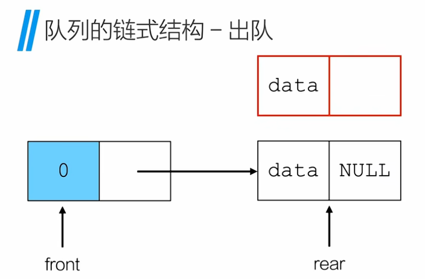

```C
int dequeue(Queue* q,ElemType* e){
	QueueNode* node=q->front->next;
	*e=node->data;
	q->front->next=node->next;
	if(q->rear==node){
		q->rear=q->front;
	}
	free(node);
	return 1;
}
```

#### 获取队首元素
```C
ElemType getFront(Queue* q){
	if(isEmpty(q)){
		printf("空的\n");
		return 0;
	}
	return q->front->next->data;//头结点不算
}
```

### 双端队列
选 C
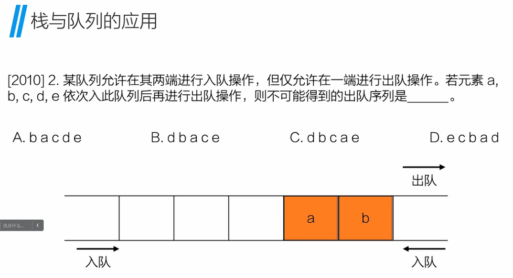


### 例题
选 B
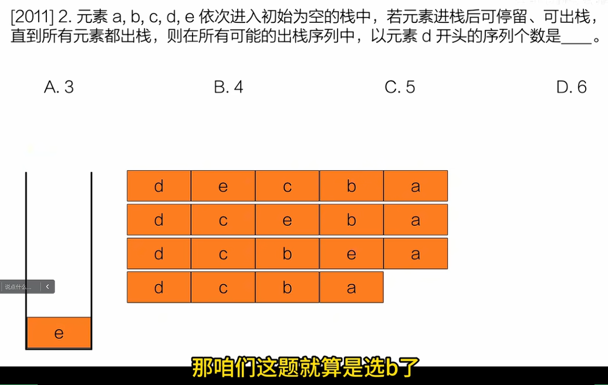

#### 循环队列
选 B
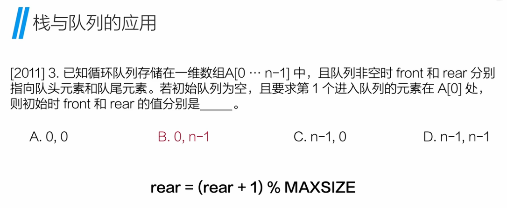

选 C
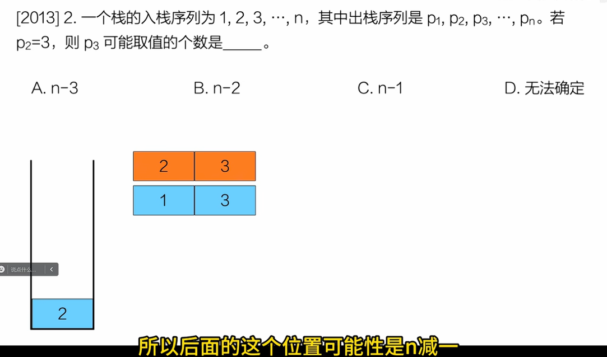

选 B
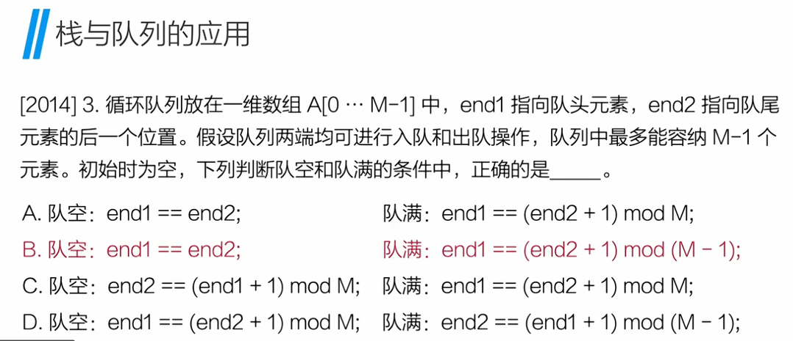

选 C
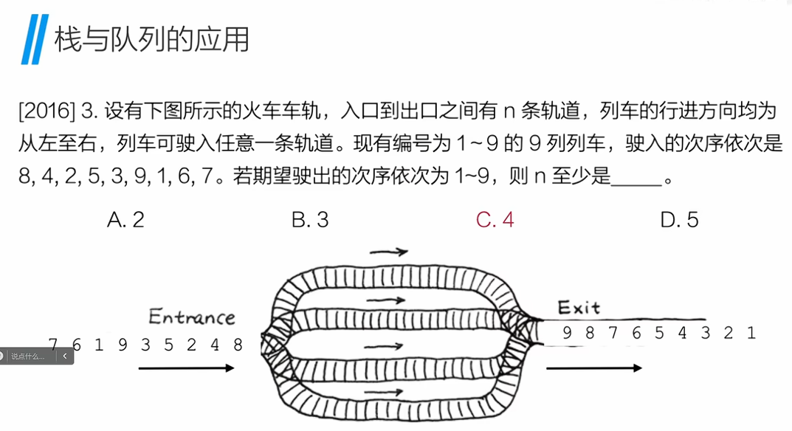
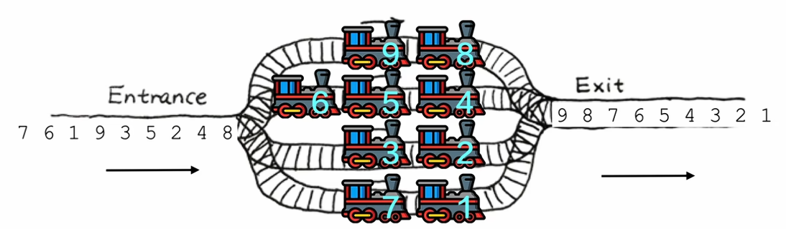

选 C
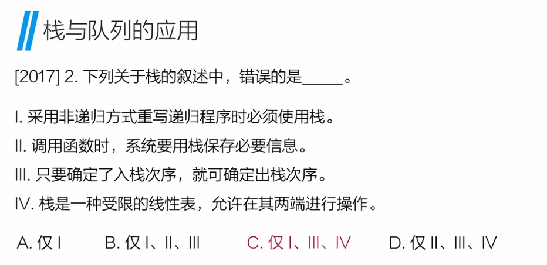

注意操作符先后
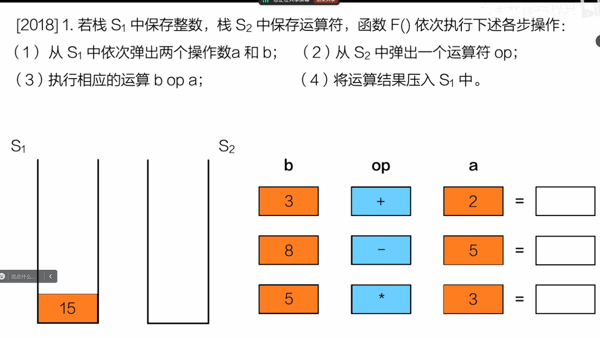

### 栈和队列
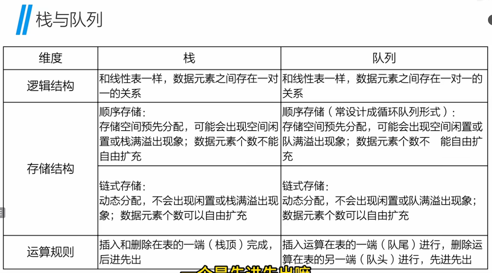


## 递归
在函数调用过程中，调用自己本身。
### 计算 1-n 的和
#### 非递归方式
```C
int fun(int n){
	int sum=0;
	for(int i=0;i<n;i++){
		sum+=i;
	}
	return sum;
}
```

#### 递归方式
```C
int fun(int n){
	if(n==1){
		return 1;
	}else{
		return fun(n-1)+n;
	}
}
```

### 斐波那契数列
#### 非递归方式
```C
int fibonacci(int n){
	int last1=1;
	int last2=1;
	int result=0;
	for(int i=3;i<n;i++){
		result=last1+last2;
		last2=last1;
		last1=result;
	}
	return result;
}
```

#### 递归方式
```C
int fibonacci(int n){
	if(n==1|n==2){
		return 1;
	}else{
		return fibonacci(n-1)+fibonacci(n-2);
	}
}
```

## 表达式求值
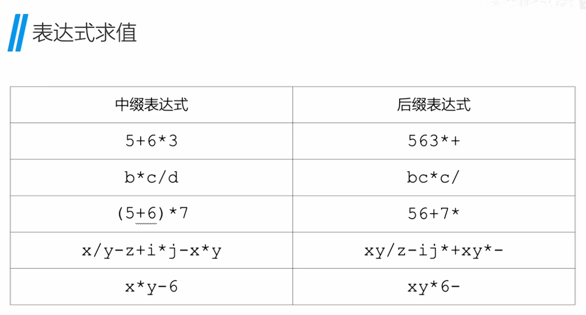

### 枚举
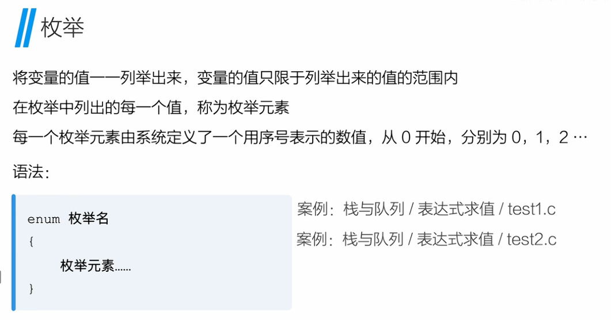

```C
typedef enum weekday{
	mon=1,tue,wed,thu,fri,sat,sun
}weekday;
//前面一个weekday是标签名（可以删除是匿名枚举），后面一个weekday是别名
int main(int argc,char const* argv[]){
	weekday a;
}
```

### 后缀表达式如何计算
先出栈的放 op 2，后出栈的放 op 1
遇到 `\0` 弹出最终结果
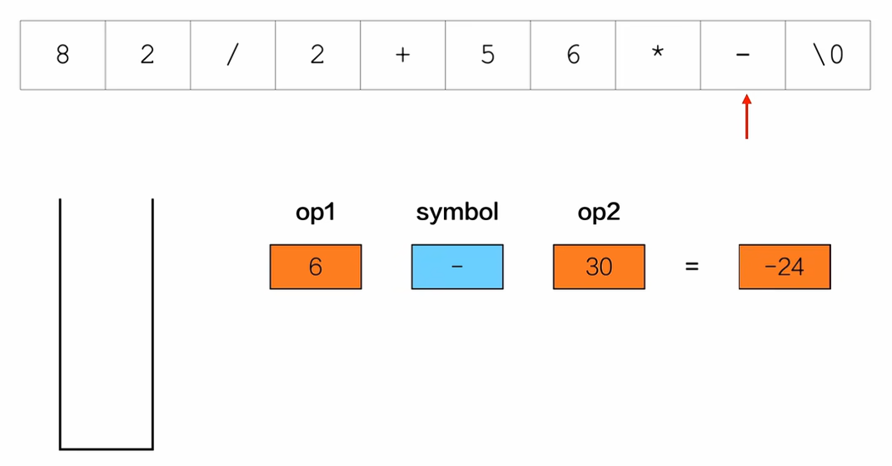

```C
#include <stdio.h>
#inculde <stdlib.h>
#define MAXSIZE 100
typedef int ElemType;
typedef struct{
	ElemType* data;
	int top;
}Stack;
typedef enum{
	LEFT_PARE,RIGHT_PARE,
	ADD,SUM,MUL,DIV,MOD,
	EOS,NUM
}contentType;//分为运算符和操作数

char expr[]="82/2+56*-";

contentType getToken(char* symbol,int* index){
	*symbol=expr[*index];
	*index=*index+1;
	switch(*symbol){
		case '(':
			return LEFT_PARE;
		...
		case '\0':
			return EOS;
		default:
			return NUM;
	}
}
int eval(Stack* s){
	char symbol;
	int op1,op2;
	int index=0;
	contentType token;
	token=getToken(&symbol,&index);
	ElemType result;
	while(token!=EOS){
		if(token==NUM){
			push(s,symbol-'0');
		}else{
			pop(s,&op2);
			pop(s,&op1);
			switch(token){
				case ADD:
					push(s,op1+op2);
				case SUM:
					push(s,op1-op2);
				...
				default:
					break;
			}
		}
	}
	token=getToken(&symbol,&index);
	pop(s,&result);
	printf("%d\n",result);
	return 1;
}
int main(int argc,char const* argv[]){
	Stack* s=initStack();
	eval(s);
	return 0;
}
```

### 中缀表达式转后缀表达式
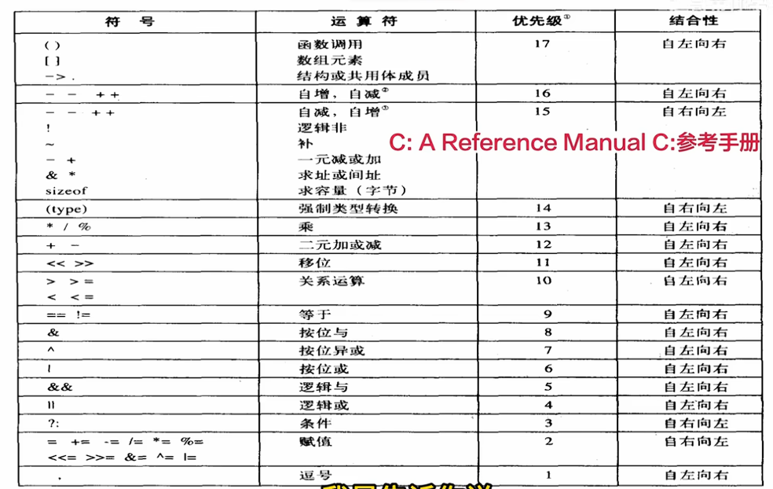

- 如果是操作数，直接输出
- 如果是运算符，判断优先级，如果优先级大于栈顶元素，压入栈中；否则将栈顶元素出栈输出，然后将当前运算符压入栈中
- 当左括号在栈外时，属于最高优先级，当左括号在栈里时，属于最低优先级
- 如果是右括号，且栈顶元素不是左括号，持续出栈并输出，直到栈顶为左括号出栈结束最后将左括号也出栈

```C
```C
#include <stdio.h>
#inculde <stdlib.h>
#define MAXSIZE 100
typedef int ElemType;
typedef struct{
	ElemType* data;
	int top;
}Stack;
typedef enum{
	LEFT_PARE,RIGHT_PARE,
	ADD,SUM,MUL,DIV,MOD,
	EOS,NUM
}contentType;

char expr[]="x/(i-j)*y";

int print_token(contentType token){
	switch(token){
		case ADD:
			printf("+");
			break;
		...
		default:
			break;
	}
}

int posfix(Stack* s){
	//字符在栈内栈外的优先级
	int in_stack[]={0,19,12,12,13,13,13,0};
	int out_stack[]={20,19,12,12,13,13,13,0};
	contentType token;
	int index=0;
	s->data[0]=EOS;
	char symbol;
	ElemType e;
	
	token=getToken(&symbol,&index);
	
	while(token!=EOS){
		if(token==NUM){
			printf("%c",symbol);
		}
		else if(token==RIGHT_PARE){
			while(s->data[s->top]!=LEFT_PARE){
				pop(s,&e);
				print_token(e);
			}
			pop(s,&e);
		}else{
			while(in_stack[s->data[s->top]]>=out_stack[s->data[s->top]]){
				pop(s,&e);
				print_token(e);
			}
			push(s,token);
		}
	}
	token=getToken(&symbol,&index);
}

int main(int argc,char const* argv[]){
	Stack* s=initStack();
	printf("%s\n",expr);
	postfix(s);
	return 0;
}
```

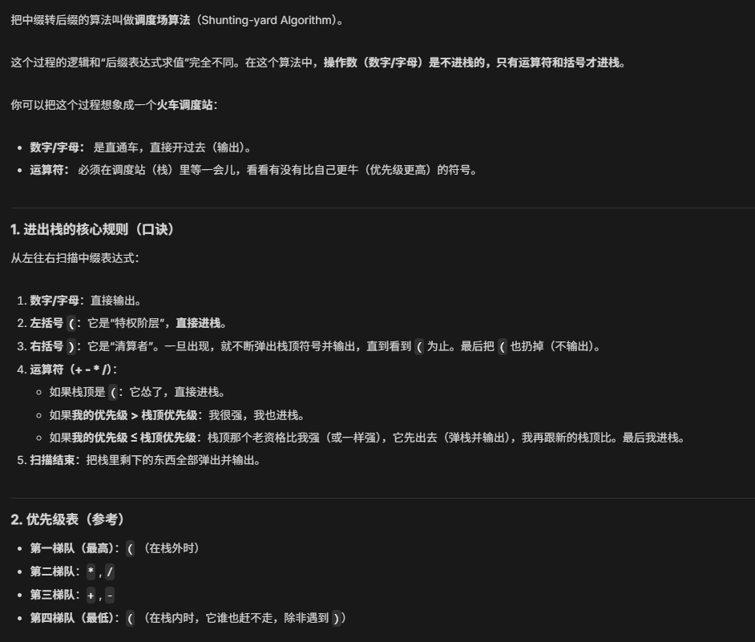
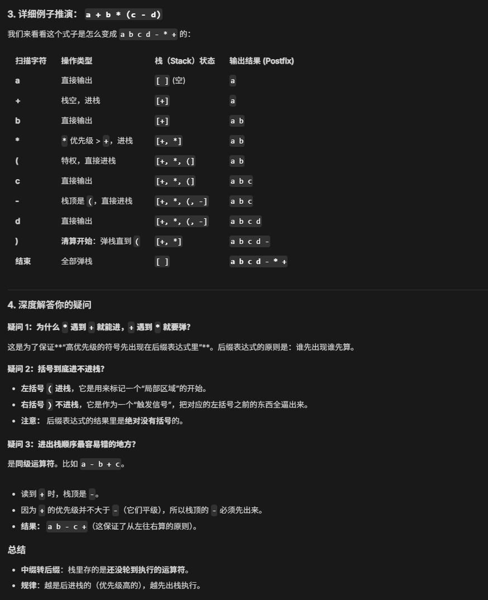

### 后缀表达式转换为表达式树
#### **疑问 1：运算符和括号进不进栈？**
- **关于括号：** 在**后缀表达式**里，是**没有括号**的！括号在“中缀转后缀”的过程中就已经被消耗掉并扔掉了。所以在这个建树的过程中，你根本看不见括号。
- **关于运算符：** 运算符**不长期留在栈里**。它就像是一个“粘合剂”：一出现就从栈顶抓走两个东西，把自己变成它们的爸爸，然后以“爸爸”的身份带着孩子们重新回到栈里。
#### **疑问 2：进出栈顺序为什么容易错？**
一定要记住：**第一个弹出的是右孩子，第二个弹出的是左孩子。**
- 为什么？因为栈是“后进先出”。在表达式 a b - 中，a 先进去，b 后进去。当你看到 - 时，最先抓出来的是最后进去的 b。所以 b 必须在 - 的右手边。
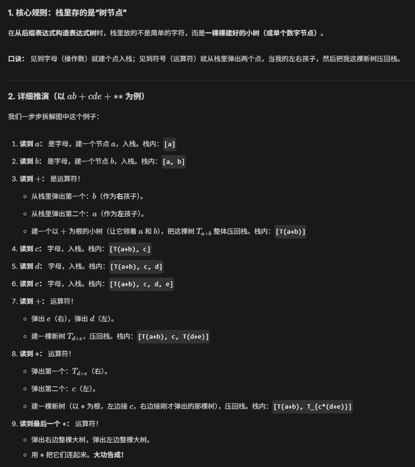


---
## 解题技巧
### n 个元素入栈，有多少种出栈顺序
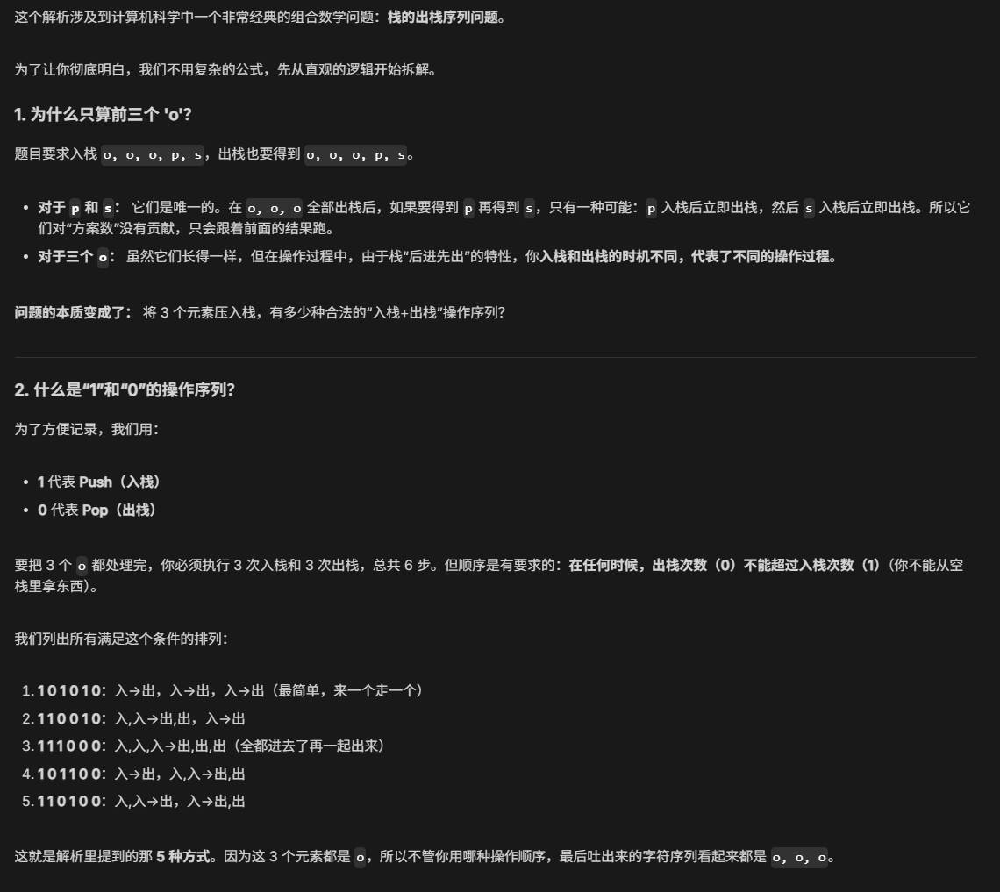
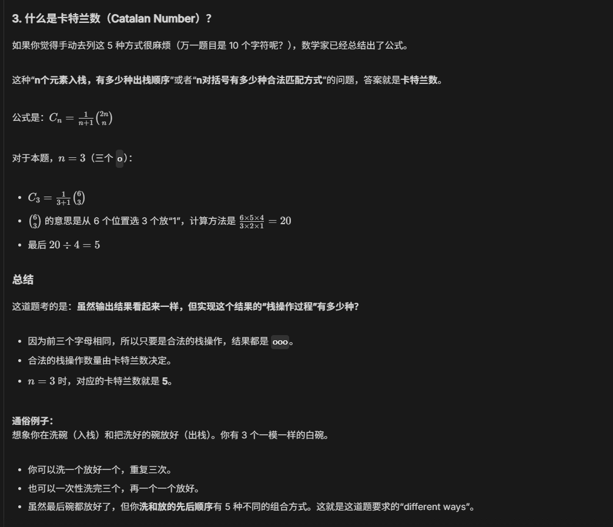

  
### front 和 rear 的定义是什么
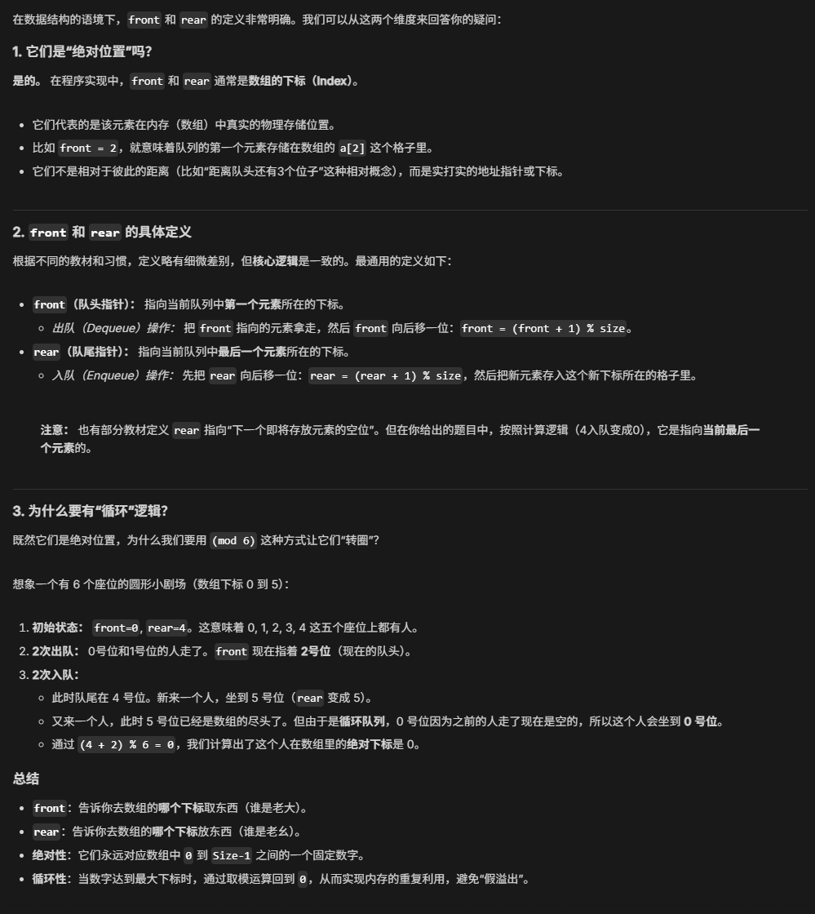
### 融合两个降序链表
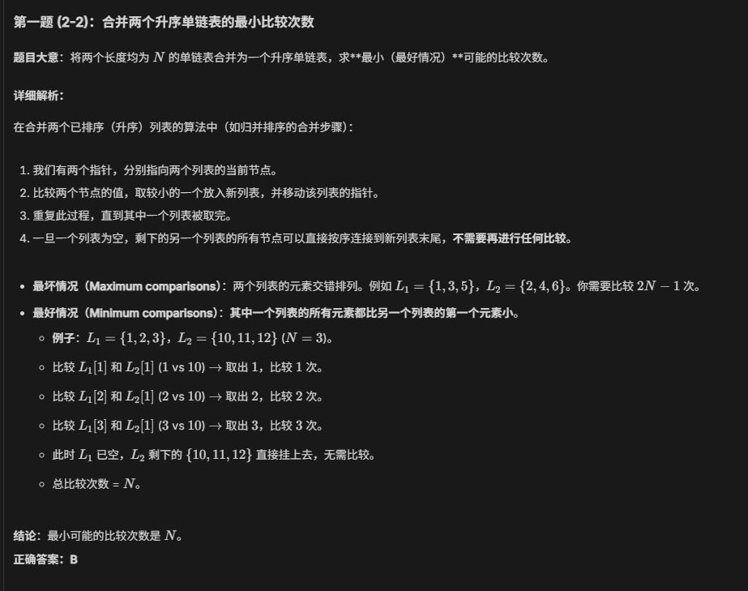

### 让每个节点都指向自己
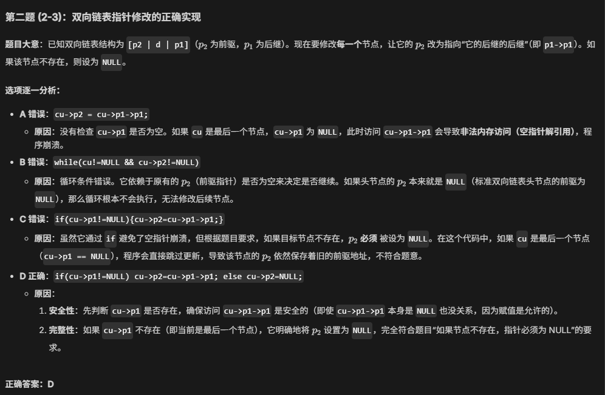

### 出栈序列可能性
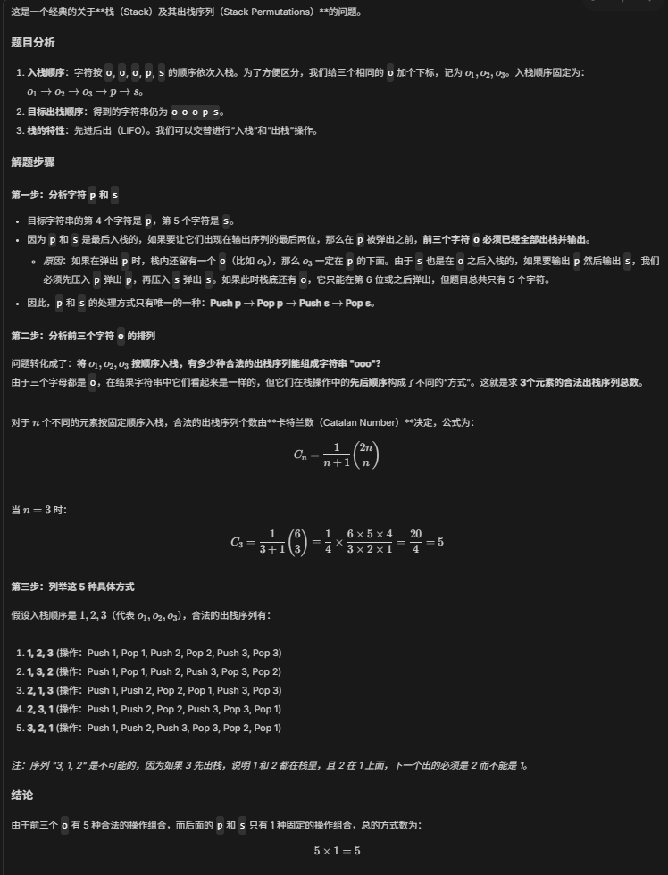 

## 注意事项
链表：
- **内存访问错误 (memory access violation)** 或**段错误 (segmentation violation)**：可能因为错误的初始化，或者引用不存在的指针（该指针已被 `free()` 了）
- 判断何时使用 `malloc()`
    - 如果想要创建一个之前未声明的指向结构的指针，需要用到 `malloc()`
    - 如果想要用指针遍历一遍链表，则无需使用 `malloc()`
        
        > 注意：`malloc()` 是给指针分配存储空间，而不是用于结构的
        
- 记得使用 `free()`，尤其是**删除**节点时，否则会带来严重后果

栈：
- 对**空**的栈使用 `Pop` 或 `Top` 操作将会引发**栈 ADT 错误**
- 对**满**的栈使用 `Push` 操作将会引发**实现错误 (implementation error)**
- 栈模型需要**封装**好。也就是说，除了栈相关函数外，代码的其他部分不能使用 `Array` 或 `TopOfStack` 的变量
- 在执行 `Push` 和 `Pop` 前必须进行**错误检查**