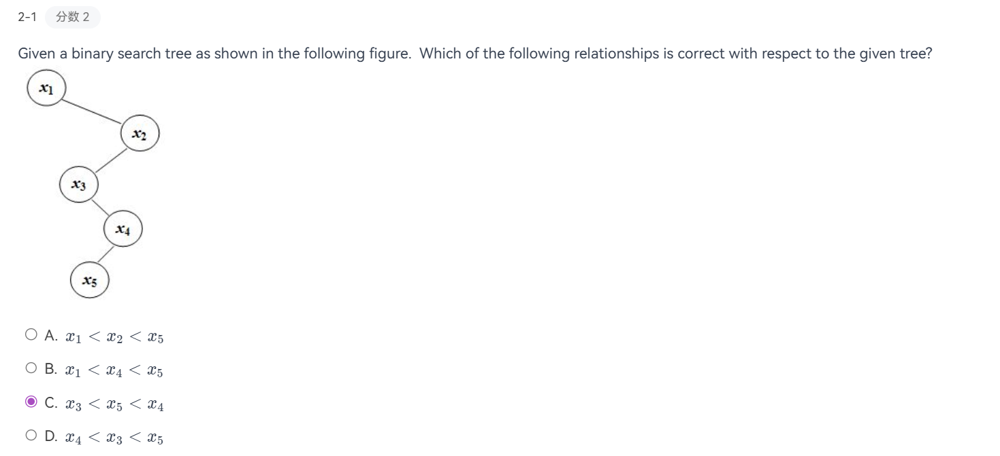
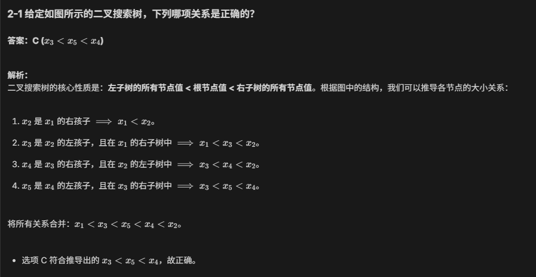
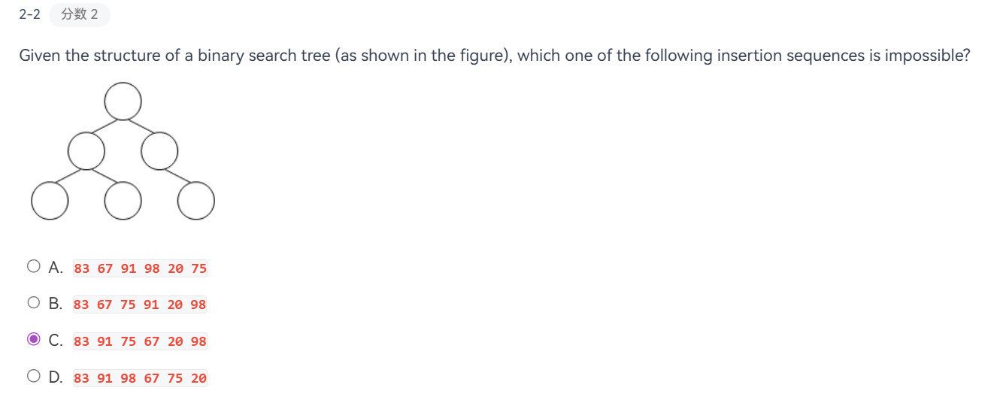
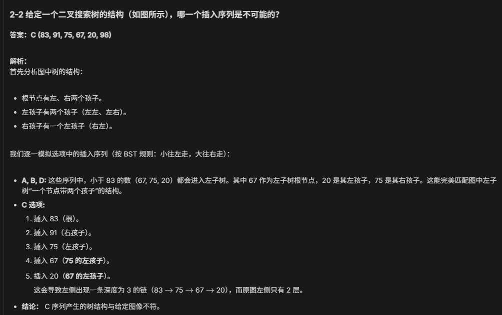
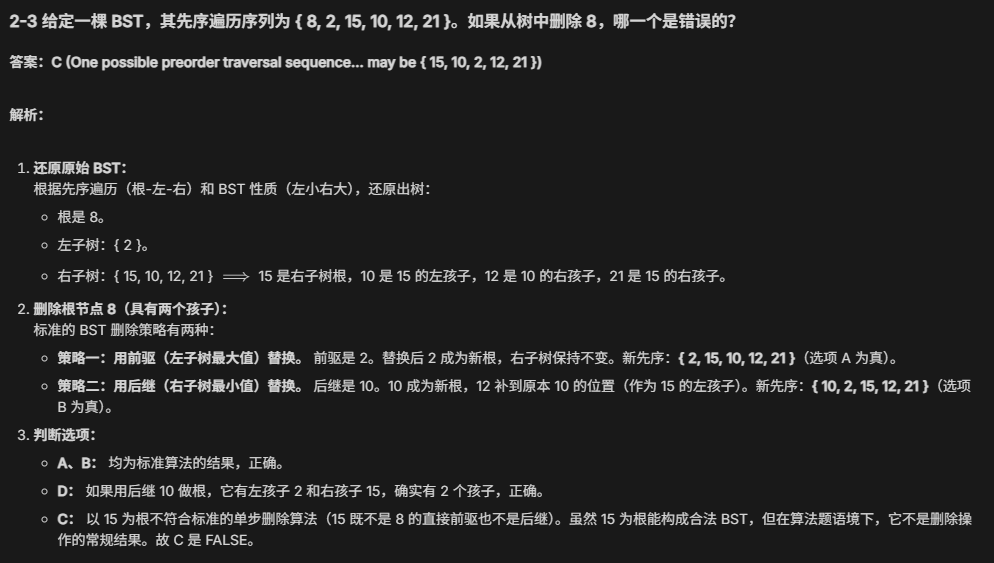

## 定义
- 每个节点有一个整数的**键 (key)**，每个键互不相同
    
    > 这里这么定义是为了方便后面的操作，实际上键不必是整数，键也可以相同
    
- 非空**左**子树的键必须**小于**根上的键
- 非空**右**子树的键必须**大于**根上的键
- 左右子树也是二叉搜索树
## 性质
- 对二叉搜索树的**同一层**从左往右遍历，得到的键的序列是**有序**的
- 通过对二叉搜索树的**中序遍历**得到的元素序列是**有序**的
- 给出一棵二叉搜索树的**前序** 或者 **后序**遍历，根据二叉搜索树的定义，我们应当可以还原出这棵树
- 对于一棵完全的二叉搜索树，它**最小**的节点一定是**叶子节点**，最大的就不一定了

与二分查找不同的是，二分搜索树的搜索路径实际上是由树的形状决定的，而树的形状是由它的生长方式，也就是插入数据的顺序决定的。不太的插入顺序可能导致这棵树又矮又胖（好），或者退化成链表（数据从小到大顺序插入时，不好）。
## 基本操作
### 预处理
```C
#ifndef _Tree_H
struct TreeNode;
typedef struct TreeNode* Position;
typedef struct TreeNode* SearchTree;

SearchTree MakeEmpty(SearchTree T);
Position Find(ElemType X,SearchTree T);
Position FindMax(SearchTree T);
Position FindMax(SearchTree T);

#endif

struct TreeNode{
	ElemType Element;
	SearchTree Left;
	SearchTree Right;
}

SearchTree MakeEmpty(SearchTree T){
	if(T!=NULL){
		MakeEmpty(T->Left);
		MakeEmpty(T->Right);
		free(T);
	}
	return NULL;
}
```

### Find
时间复杂度=空间复杂度= $O(d)$ ，其中 d 为树 X 的深度
```C
Position Find(ElemType X,SearchTree T){
	if(T==NULL) //必须先判断树是否为空
		return NULL;
	if(X<T->Element)
		return Find(X,T->Left);
	else if(X>T->Element)
		return Find(X,T->Right);
	else
		return T;
}

Position Iter_Find(ElemType X,SearchTree T){
	while(T)
	{
		if(X==T->Element)
			return T;
		if(X<T->Element)
			T=T->Left;
		else
			T=T->Right;
	}
	return NULL;	
}
```

### FindMax（循环版）
时间复杂度 $O(d)$ ，其中 d 为树 X 的深度
```C
Position FindMax(SearchTree T){
	if(T!=NULL)
		while(T->Right!=NULL)
			T=T->Right;
	return T;
}
```

### FindMin (迭代版)
时间复杂度 $O(d)$ ，其中 d 为树 X 的深度
```C
Position FindMin(SearchTree T){
	if(T==NULL)
		return NULL;
	else if(T->Left==NUll)
		return T;
	else
		return FindMin(T->Left);	
}
```
### Insert
- 如果找到了该节点，可以不做任何处理，也可以给它的计数器 +1（如果节点有计数字段的话）
- 否则将最后遇到的**非空节点**视为新节点的父节点，然后将新节点插入 `NULL` 的位置上
- 如果最后没有在树中找到要插入的节点，那么就需要新建一棵子树。
- 如果建完这棵树后没有返回，那么这棵子树的父节点无法与它建立联系，这棵子树与原来的树就是断开的，因此建了也等于白建。
```C
SearchTree Insert(ElemType X,SearchTree T){
	if(T==NULL){
		T=(SearchTree)malloc(sizeof(struct TreeNode));
		if(T==NULL){
			FatalError("Out of Space");
		}else{
			T->Element=X;
			T->Left=T->Right=NULL;
		}
	}else{
		if(X<T->Element)
			T->Left=Insert(X,T->Left);
		else if(X>T->Element)
			T->Right=Insert(X,T->Right);
		// Else X is in the tree already, we'll do nothing
	}
	return T;
}
```

### Delete
我们要处理有三种情况：
- 删除**叶子节点**：直接将它的父节点连接到空节点上
- 删除**度为 1**的节点：用该节点的子节点替换它自身
- 删除**度为 2**的节点：
    - 用该节点**左子树的最大节点**或**右子树的最小节点**（挑一种）替换它自身
    - 从子树中删除用来替换的节点：注意用来替换的节点的度不超过 1
```C
SearchTree Delete(ElemType X,SearchTree T){
	Position TmpCell;
	if(T==NULL)
		Error("Element not found");
	else{
		if(X<T->Element)
			T->Left=Delete(X,T->Left);
		else if(X>T->Element)
			T->Right=Delete(X,T->Right);
		else{
			if(X==T->Element){
				// Replace with smallest in right subtree
				TmpCell=FindMix(T->Right);
				T->Element=TmpCell->Element;
				T->Right=Delete(T->Element,T->Right);
			}
			else{
				TmpCell=T;
				if(T->Left==NULL)
					T=T->Right;
				else if(T->Right==NULL)
					T=T->Left;
				free(TmpCell);
			}
		}
	}
	return T;
}
```

时间复杂度：$O (h)$，h是树的高度。显然，这种删除的操作效率不高

改进方法：如果删除操作用的不多，可以采用 **lazy deletion** 的方法——为每个节点添加一个 `flag` 字段，来标记节点是否被删除。因此我们不必通过释放节点的空间的方式来删除节点；而且如果我们重新插入已经删除的节点，也不需要使用 `malloc()` 分配内存，从而提高程序的效率。

## Average-Case Analysis
通过计算发现，树的所有节点的平均深度为 $O (logN)$
二叉搜索树的大小取决于**插入的顺序**和**删除**操作

- 插入：如果顺序不够随机（最坏的情况：升 / 降序），则树会**退化**成一个链表，因此**最坏情况**的时间复杂度为 O (N) O (N)
- 删除：以替换为右子树最小节点为例，过多的删除操作会导致右子树不断缩小，左子树的规模会大于右子树，破坏了树的平衡
---
## 解题技巧
### 节点大小




### 给序列判断树形
假如有单调序列，应当是分布在不同层随深度加深递减的，所以这个序列的长度就反应了层数。



### 删除节点



### 得到非递减序列


