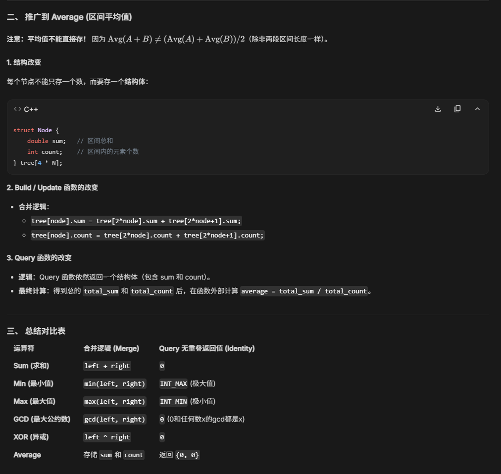

> 当我们只关心一个列表中最小（大）的元素时（频繁查找或使用），我们应优先使用**堆**
## 优先队列 (Priority Queue) 
它是一种 **抽象数据类型 (ADT)**。  
普通的队列是“先来后到”（FIFO），而**优先队列**是“看谁级别高谁先走”。

**它的核心要求只有两个：**
1. **插入（Insert）：** 往里存一个带优先级的元素。
2. **删除最大/最小（Delete Max/Min）：** 每次拿出来的必须是优先级最高的那一个。
    
**注意：** 优先队列并没有规定你内部怎么存。你可以用数组存，可以用链表存，也可以用排序好的列表存。

虽然优先队列可以用很多方式实现，但**堆是目前最高效、最完美的实现方式**。

- **用普通数组实现优先队列：** 插入快 $O(1)$，但找最大值要遍历全表，慢 $O(N)$。  
- **用排好序的数组实现：** 找最大值快 $O(1)$，但插入新元素要移动一堆数，慢 $O(N)$。
- **用堆实现：** 插入和删除都是 $O(logN)$。这是一个非常完美的平衡点。
## 二叉堆 Binary Heap
> 重点是两个伪代码，pocolate up 和 down
### 定义
- 父节点的索引 = $\begin{cases} \lfloor \frac{i}{2} \rfloor & \text{if } i \neq 1 \\ \text{None} & \text{if } i = 1 \end{cases}$ 
- 左孩子的索引 = $\begin{cases} 2i & \text{if } 2i \le n \\ \text{None} & \text{if } 2i > n \end{cases}$
- 右孩子的索引 = $\begin{cases} 2i + 1 & \text{if } 2i + 1 \le n \\ \text{None} & \text{if } 2i + 1 > n \end{cases}$

索引从 1 开始，看似只是为了得到比较舒服的表示法。但这样做后，索引为 0 的位置就空出来了，我们之后会利用这个位置，作为**哨兵 (sentinel)**（将其设为整个堆的最小值），方便后面的插入和删除操作。

### 性质
- **最小树 (min tree)**：一棵树中每个节点的键值不大于它的孩子
- **最小堆 (min heap)**：完全二叉树 + 最小树
- 显而易见，**根节点**是堆中最小 ( 大 ) 的节点
- 从堆的根节点出发，到任意节点的路径上的节点是**有序**的（比如最小堆中路径上的节点是按升序排列的）
- 但是对整个堆的遍历无法表示所有节点的顺序
### 预处理
```C
#include <stdio.h>
#include <stdlib.h>

/* 为了方便演示，定义一些基础类型和常量 */
typedef int ElementType;
#define MinData -32767  // 哨兵值，设置一个极小值
#define MinPQSize 5

/* 1. 结构体声明部分 */
struct HeapStruct {
    int Capacity;       // 堆的最大容量
    int Size;           // 当前堆中的元素个数
    ElemType *Elements; // 存储元素的数组指针
};

typedef struct HeapStruct *PriorityQueue;

/* 2. 初始化函数部分 */
PriorityQueue Initialize(int MaxElements) {
    PriorityQueue H;

    // 检查请求的大小是否合法
    if (MaxElements < MinPQSize) {
        printf("Priority queue size is too small\n");
        return NULL;
    }

    // 第一步：为堆结构体本身申请内存
    H = (PriorityQueue)malloc(sizeof(struct HeapStruct));
    if (H == NULL) {
        printf("Out of Space!!!\n");
        return NULL;
    }

    // 第二步：为存储数据的数组申请内存
    // 注意：申请 MaxElements + 1 个空间，因为 0 号位置要放哨兵
    H->Elements = (ElemType *)malloc((MaxElements + 1) * sizeof(ElemType));
    if (H->Elements == NULL) {
        printf("Out of Space!!!\n");
        free(H); // 数组申请失败时，记得把刚才申请的结构体也释放掉
        return NULL;
    }

    // 第三步：设置初始状态
    H->Capacity = MaxElements;
    H->Size = 0;
    H->Elements[0] = MinData; // 设置哨兵：它比任何可能进入堆的值都要小

    return H;
}
```


### 插入Insert (上滤 percolate up)
```C
// 上滤操作：用于向最小堆中插入元素时维护堆序性
void PercolateUp(int p, PriorityHeap H){
    int i;
    // 暂存待插入的元素 X（即刚才被放在堆底 p 位置的元素）
    ElemType X = H->Elements[p];

    // 自底向上寻找合适的位置
    // 初始 i 指向堆底 p，只要父节点 H->Elements[i/2] 的值大于 X，就继续循环
    // 【💡注意】：PPT 上的更新表达式写成了 "i/2"（这是一个无效果表达式），
    // 实际代码中必须写成 "i /= 2" 或 "i = i / 2" 才能让指针向上移动，否则会死循环。
    for(i = p; H->Elements[i/2] > X; i /= 2) {
        // 将比 X 大的父节点“拉”下来，占领当前子节点的位置
        H->Elements[i] = H->Elements[i/2];
    }

    // 循环结束时，i 指向了 X 应该放入的正确位置（空穴）
    H->Elements[i] = X;
}
```

### 删除 DeleteMin（下滤 percolate down）
> 注意“下滤”和“上滤”的本质相同，它们只是通过比较元素大小确定新元素应放的位置，中间**没有**采用**交换**的操作。

```C
// 下滤操作：用于从最小堆中删除元素（或建堆）时维护堆序性
// 参数 p 通常为 1（代表堆顶空穴的位置）
void Percolate(int p, PriorityQueue H){
    int i, child;
    // 暂存需要向下调整的元素 last（通常是堆底的最后一个元素）
    // 【💡注意】：此处 PPT 上写的是 H->Element[p]，应统一为 H->Elements[p]
    ElemType last = H->Elements[p];

    // 自顶向下寻找合适的位置
    // 初始 i 指向堆顶 p，只要当前节点存在至少一个孩子（i*2 <= H->Size），就继续循环
    for(i = p; i * 2 <= H->Size; i = child){
        child = 2 * i; // 先指向左孩子

        // 如果右孩子存在（child != H->Size），且右孩子比左孩子还要小
        if(child != H->Size && H->Elements[child+1] < H->Elements[child]) {
            child++; // 将 child 移动到右孩子（即选择左右孩子中较小的那个）
        }

        // 如果待调整元素 last 比较小的那个孩子还要大（违反最小堆性质）
        if(last > H->Elements[child]) {
            // 将较小的子节点“提”上去，占领当前父亲的位置
            H->Elements[i] = H->Elements[child];
        } else {
            // 如果 last 已经小于或等于两个孩子，说明堆序性已满足，提前结束
            break;
        }
    }
    // 循环结束时，i 指向了 last 应该放入的正确位置
    H->Elements[i] = last;
}
```
### 其他堆操作
如果我们想要频繁地**查找**某个列表中的**任意**元素，那么**堆**绝对**不是**合理的选择，因为在堆里找元素需要线性扫描（$O (n)$）。


### 代码要点
- **i / 2 和 i * 2**：
    - 这是利用了**完全二叉树**的特性。找爸爸除以 2，找孩子乘以 2。不需要指针，数组下标就能飞速定位。
- **哨兵位（`Elements[0]`）**：
    - 这是一个典型的算法优化。它省去了每次向上爬都要判断“我是不是到顶了”的麻烦，代码更简洁，运行更高效。    
- **空穴赋值（空位法）**：
    - 代码里并没有频繁使用 swap（交换），而是先用一个 x 存住新人的值，让原本的人不断挪位，最后再把 x 填进去。**这样做比每次都交换三行代码要快得多。**

#### 为什么线性建堆用上滤不用下滤
- **下滤建堆（Floyd 算法）：** 像是一个经理在管理公司。他让成千上万的底层员工原地不动（代价 0），让少数几个主管动一动，最后只让一个大老板费心走最远的路。总成本很低。
- **上滤建堆（逐个插入）：** 像是强迫每一个新入职的底层员工（人数最多）都必须从基层爬到 CEO 的办公室汇报工作。总成本极高。

