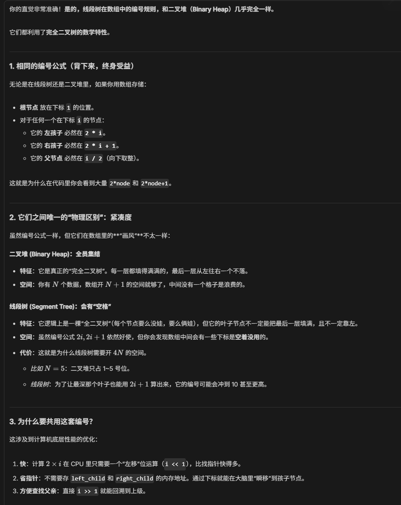
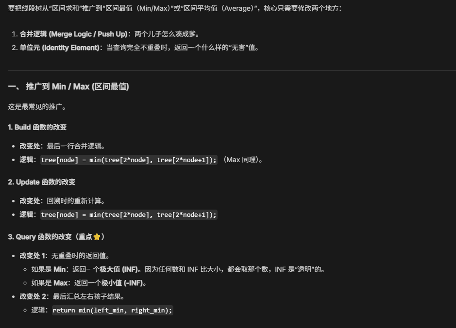

维护区间和这一信息

存在一个大数组 `tree[]` 里，采用的是完全二叉树的通用编号法。
- 根节点（大老板）永远住在 `tree[1]`。
- 如果你住在 node 号位，你的左孩子一定住在 `2 * node`，右孩子一定住在 `2 * node + 1`。

核心：从根节点出发 equal partation, postorder 遍历

## 基本操作（都是递归）
### Build
先自上而下作二分，再自下而上层层加

```C
void Build(int node,int start,int end){
	//1.递归终点
	if(start==end){
		tree[node]=A[start];
		return;
	}
	//2.递归步骤
	int mid=(start+end)/2;
	Build(2*node,start,mid);
	Build(2*node+1,mid+1,end);
	//3.合并
	tree[node]=tree[2*node]+tree[2*node+1];
}
```

### Query
全在里面直接拿，部分重叠拆开找

```C
int Query(int node,int start,int end,int L,int R){
	//1.完全不重叠(Node is completely outside query range)
	if(R<start || end<L){ 
		return 0;
	}
	//2.完全重叠(Node is completely inside query range)
	if(L<=start && end<=R){ 
		return tree[node];
	}
	//3.部分重叠
	int mid=(start+end)/2;
	int left_sum=Query(2*node,start,mid,L,R);
	int right_sum=Query(2*node+1,mid+1,end,L,R);
	return left_sum+right_sum;
}
```

### Update
```C
void Update(int node,int start,int end,int idx,int val){
	//1.递归终点
	if(start==end){
		tree[node]=val;
		return;
	}
	//2.递归步骤
	int mid=(start+end)/2;
	if(start<=idx && idx<=mid){
		// Index is in the left child
		Update(2*node,start,mid,idx,val);
	}else{
		// Index is in the right child
		Update(2*node+1,mid+1,end,idx,val);
	}
	//3.回溯：重新计算父节点
	tree[node]=tree[2*node]+tree[2*node+1];
}
```

### 函数调用
原数组  `A = [0:4] = {7, 2, 5, 8, 3}
`
`Build(1,0,4)` 就是以编号1 为根建树，起点为 `A[0]`, 终点为 `A[4]` 
node 是 `tree[]` 的索引，start 和 end 是 `A[]` 的索引

求区间 `[2, 4]` 的和，调用：`Query (1, 0, 4, 2, 4)`

把 `A[1]` 的 2 改成 10，调用：`Update (1, 0, 4, 1, 10)`

idx 和 start 和 end 是原区间 A，L 和 R 是待查找的区间


## 推广：求 min, max, average


