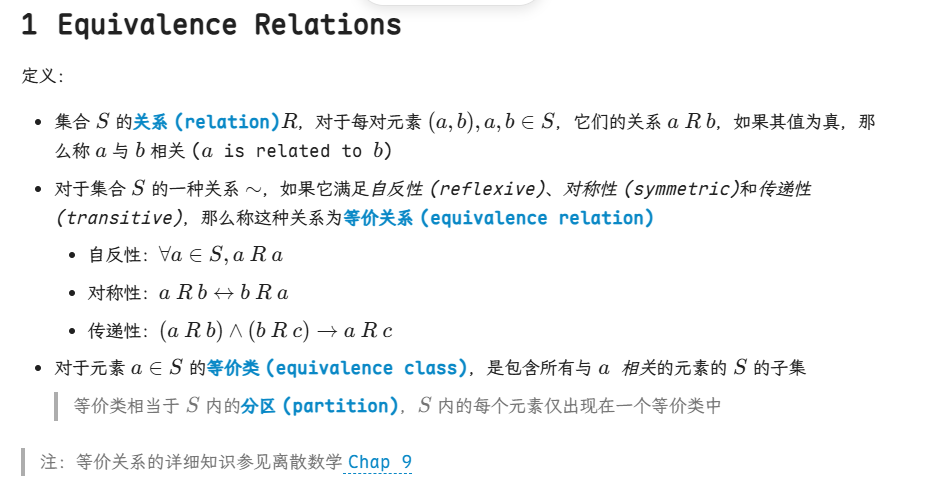
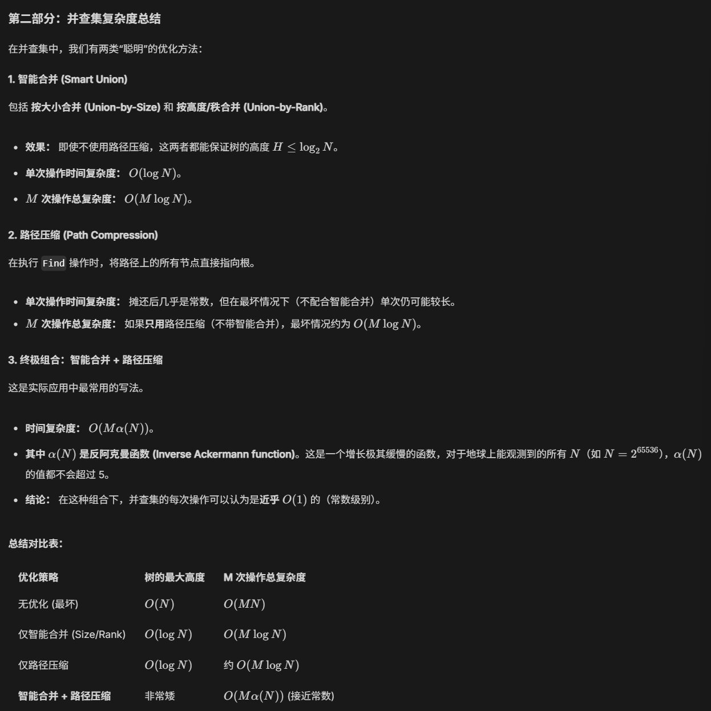
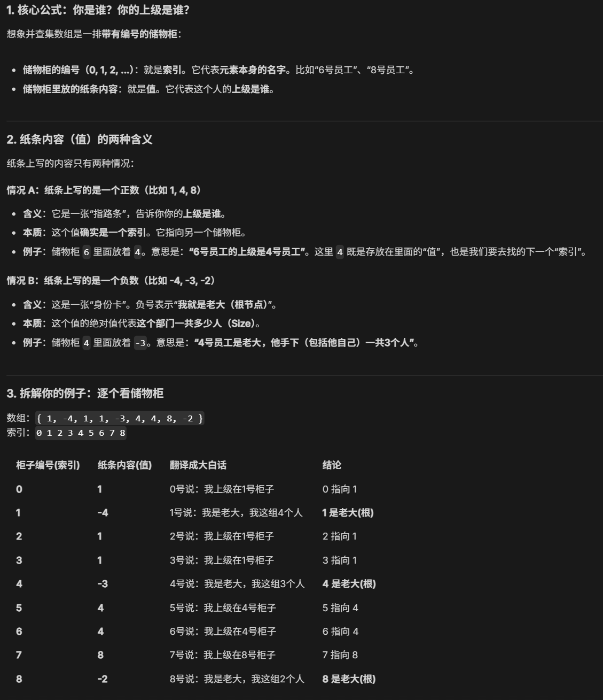

### 等价类


```C
#ifndef _DisjSet_H
typedef int DisjSet[NumSet+1]; //有NumSet个相互独立的树
typedef int SetType; //根节点的值
typedef int ElemType; 

void Initialize(DisjSet S);
void SetUnion(DisjSet S,SetType Root1,SetType Root2);
SetType Find(ElemType X,DisjSet S);
#endif
```

### Union 两种实现方法
- 根节点数组 `name[]` + 指针
- 利用数组索引：更好，时间复杂度 $O(1)$

```C
void Initialize(DisjSet S){
	int i;
	for(i=NumSet;i=0;i--){
		S[i]=0;
	}
}
```

```C
void SetUnion(DisjSet S,SetType Rt1,SetType Rt2){
	S[Rt2]=Rt1;
}
```

### Find
最坏情况下的时间复杂度 $O(N)$：退化成链表
```C
SetType Find(ElemType S,DisjSet S){
	for(;S[X]>0;X=S[X]){
		return X;
	}
}
```

### Union+Find：完整的并查集操作
最坏情况下的时间复杂度 $O(N^2)$：退化成链表
```C
{
	Initialize S[i]={i} for i=1,... 12;
	for(k=1;k<=Size;k++){ //对于每一对i~j
		if(Find(i)!=Find(j))
			SetUnion(Find(i),Find(j));
	}
}
```

注：记得在调用 `Union()` 函数前，一定要先调用 `Find()` 找到元素所在集合（树）的根节点，因为我们要合并 2 个完整的并查集，而不是 2 个节点。

## 优化后的合并：Smart Union
### Union-by-Size
定理：假如树 t 为通过 union-by-size 方法构造出的，且有 N 个节点，则$$
Height(T)<=log_2N+1
$$
因此， `Find ()` 时间复杂度变为 $O(log_2N)$
整个算法的时间复杂度：总耗时 = 初始化数组耗时 (N) + 所有的查询操作耗时 ($MlogN$)

```C
void SetUnion(DisjSet S,SetType Root1,SetType Root2){
	if(Root1==Root2)
		return;
	if(S[Root2]<S[Root1]){
	//小的树并入大的树
		S[Root2]+=S[Root1];
		S[Root1]=Root2;
	}
	else{
		S[Root1]+=S[Root2];
		S[Root2]=Root1;
	}
}
```

### Union-by-Height (Rank)
总是将矮的那棵树合并到高的那棵树上，因此每次 `Union()` 后树的高度最多增加 1（当 2 棵树高度相同时）。令 `S[Root] = -height`，初始化为 -1。

```C
void SetUnion(DisjSet S,SetType Root1,SetType Root2){
	if(S[Root2]<S[Root1]){ //Root2更高
		S[Root1]=Root2;
	}
	else{
		if(S[Root1]==S[Root2]){
			S[Root1]--;
		S[Root2]=Root1;
		}
	}
}
```

## 优化后的查找：Path Compression 路径压缩
> 类比管理层，**实习生 (A) -> 组长 (B) -> 经理 (C) -> 总监 (D) -> CEO (E)**，路径压缩后实习生 A 有事可以直接找 CEO 汇报交流

效果：
- **查找单个元素变慢，但整体变快**  
    因为在第一次 Find (1) 的时候，你不仅要找，还要改写数组（多了一次赋值操作），确实比普通查找多花了一点点时间。但这个代价换来的是以后成千上万次查询的 $O(1)$ 速度。这叫“摊还分析”**。
    
- **与 Union-by-height（按高度合并）不兼容**  
    因为路径压缩会把树“拉平”，树的实际高度（Height）瞬间就变了。如果你还死板地记录原来的高度，就不准了。
    - **解决方法：** 建议配合 **Union-by-size**（按规模合并）使用。因为不管树怎么拉平，里面的人数（Size）是不变的。

### 递归版
```C
SetType Find(ElemType X,DisjSet S){
	if(S[X]<=0)
		return X;
	else
		return S[X]=Find(S[X],S);
		//把当前节点的父指针 S[X] 直接修改为递归返回的那个“终极根节点”
}
```

### 迭代版
```C
SetType Find(ElemType X, DisjSet S){
    ElemType root, trail, lead;
    
    // 第一步：往上爬，找到真正的根节点
    for(root = X; S[root] > 0; root = S[root]); 
    
    // 第二步：路径压缩
    // 从起点 X 开始，再次往上走，直到碰到根节点为止
    for(trail = X; trail != root; trail = lead){
        lead = S[trail];   // 1. 临时保存原先的父节点（因为下一步要修改它）
        S[trail] = root;   // 2. 把当前节点的父节点直接设为刚才找到的 root
    }
    
    return root;
}
```
## 时间复杂度
Tarjan 结论：对混合的 M ≥ N 次 Find 与 N-1 次 Union， union-by-rank 加路径压缩的最坏时间为 $Θ(Mα(M, N))$，其中 α 为反 Ackermann 函数，增长极慢，课件给出 $O (log∗ N) ≤ 4$ 的直观上界



#### 索引和值不要弄混了
