## Graph Definition
### 图 G(V, E) 的分类：
- 有向图 <vi,vj>—— 有向无环图（DAG）
- 无向图 (vi, vj)
- 完全图：任意两点之间有边
- 子图

### 图的限制 ：
- 不允许自环
- 不考虑多重图

### 图的性质 ：
- 邻接 (adjacent)：分为有向和无向
- 路径 —— 简单路径（经过顶点不重复）—— 环
- 连通(connected)：
	- 无向图：连通分量（极大连通子图，一张图中可能有多个）
	- 有向图：
		- 强连通——强连通分量（极大强连通子图）
		- 弱连通——弱连通分量（极大弱连通子图）
- 度：有向图分入度+出度
	- 握手定理：边数 e=度数 d 之和/2
	- 对有向图，所有顶点入度之和 = 所有顶点出度之和

### 图的表示 ：
- 邻接矩阵（列标题为起点，行标题为终点） —— 度数：适用于稠密图 dense
- 邻接表 lists：适用于稀疏图 sparse
	- 对无向图，邻接表的空间 S=n 个头+2 e 个节点=（n+2 e）个指针+2 e 个整型
	- 时间复杂度 $T=O (|V|+|E|)$
- 处理带权边：矩阵的值为权重，表则要为每个节点添加权重的字段
> 什么时候用矩阵什么时候用链表？
> 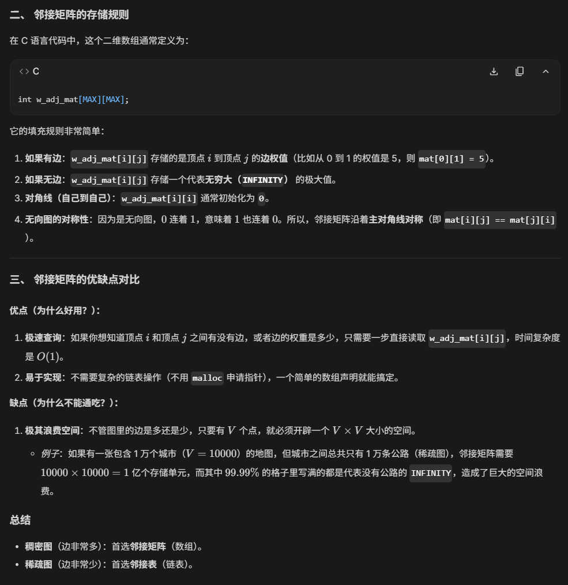

#### 矩阵
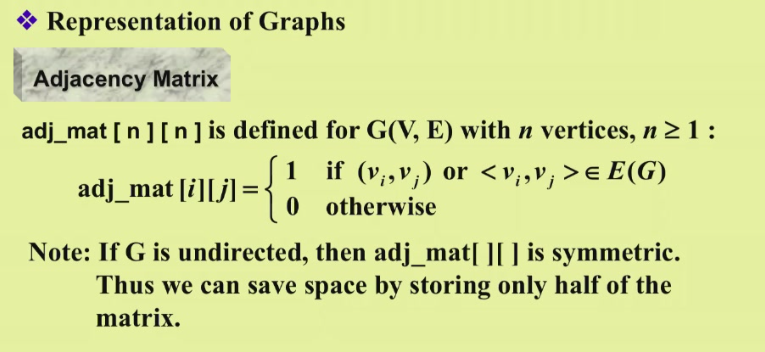
#### 邻接表
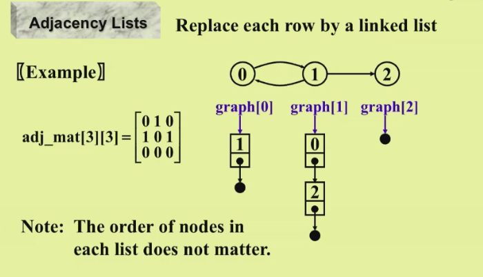
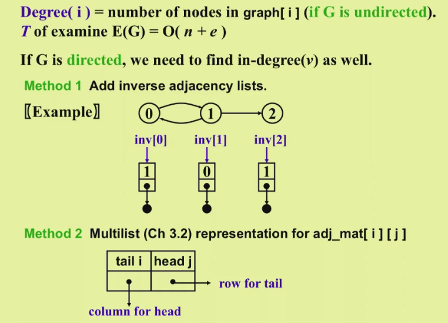
#### Muililists
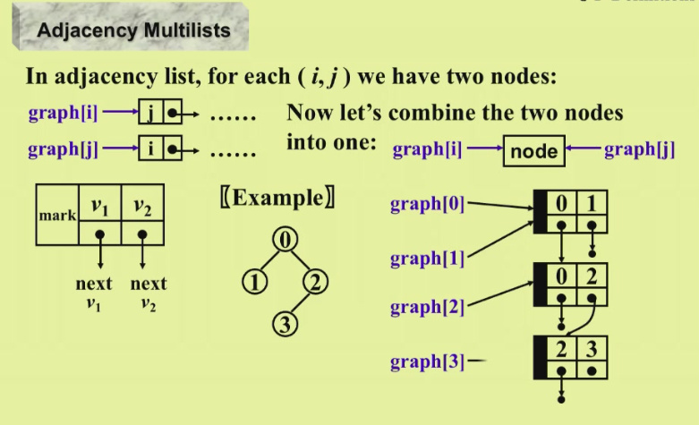

### 如何计算某个顶点的度 ：
- 无向图：`Degree(i) = graph[i]` 中节点的个数
- 有向图：`in-degree(i)` “逆转”邻接链表
	- $in-degree(i)=顶点 i 的逆邻接表 (inv[i]) 中单链表的节点个数$

## 拓扑排序 Topological Sort
### 定义
**AOV 网 (activity on vertex network)**：对于有向图 G，V (G) 表示活动，E (G) 表示位次关系。
可行的 AOV 必须是一个有向无环图。

**前任&后继：**
- i 是 j 的前任 predecessor：有从 i 到 j 的路径
- 直接前任/后任 successor

**偏序：** 反自反性+反对称性+传递性
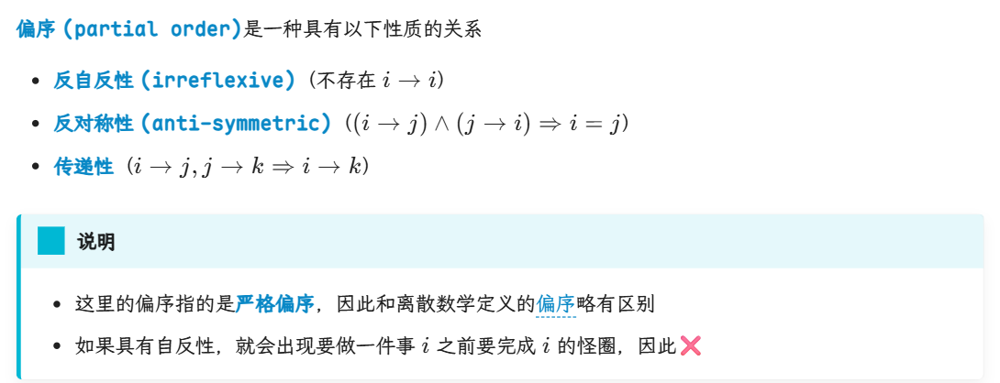

**拓扑序 (topological order)**：是一张图的顶点的线性顺序, 没有依赖关系的节点先后顺序随机
- 拓扑序不一定是唯一的
- 如果拓扑序中一个顶点出现在另一个顶点的前面，它们之间不一定存在路径
- 可以用拓扑序检验有向图是否存在环： 拓扑排序的前提是图必须是“无环”的。如果图里有环，它们互相依赖，谁也无法作为起点。此时，拓扑排序算法会无法处理完所有的顶点。如果算法结束时，排入序列的顶点个数小于图中的总顶点数，说明图里有环。

### 两种实现算法
#### 方法 1
```C
// version 1
void Topsort(Graph G)
{
    int Counter;
    Vertex V, W;
    for (Counter = 0; Counter < NumVertex; Counter++)
    {
        V = FindNewVertexOfDegreeZero(); // O(|V|)
        if (V == NotAVertex)
        {
            Error("Graph has a cycle");
            break;
        }
        TopNum[V] = Counter; // or output V
        for (each W adjacent from V)
            indegreep[W]--;
    }
}
```
- `FindNewVertexOfDegreeZero()` 的实现方式使得每找到一个入度为 0 的顶点需要扫描整个数组，数组大小为|V|, 一共有|V|个顶点要找
- 时间复杂度为 $O(|V|^2)$

#### 方法 2：将所有**未赋予拓扑序的、度为 0 的顶点**放入特殊的盒子（比如**队列**或栈）里
想象成排课表，有预修要求的一定要先上
```C
// version 2, using queue ADT
void Topsort(Graph G)
{
    Queue Q;
    int Counter = 0;
    Vertex V, W;

    Q = CreateQueue(NumVertex);
    //找出没有预修要求的课
    for (each vertex V)
        if (indegree[V] == 0) 
            Enqueue(V, Q);
    //只要代办清单不空，就拿出来一门课上掉,并记录它是你上的第几门课
    while (!isEmpty(Q))
    {
        V = Dequeue(Q);
        TopNum[V] = ++Counter;  // assign next
        for (each W adjacent from V)
            if (--indegree[W] == 0)
                Enqueue(W, Q);//关键优化点：如果在减1后W的入度变为0，则立即将W放入队列，这样就避免了在找入度为0顶点时的重复全局扫描
    } // end-while
    
    if (Counter != NumVertex)
        Error("Graph has a cycle")
    DisposeQueue(Q); // free memery
}
```
- 此处我们用的是队列
- 每一个顶点入队和出队各一次，总共执行 V 次，总时间为 $O(|V|$
- 只有当顶点出队时，才会遍历其发出的边，在整个算法运行期间，图中的每条有向边只会被检查一次，总时间为 $O(|E|)$
- 总时间复杂度为 $O(|V|+|E|)$
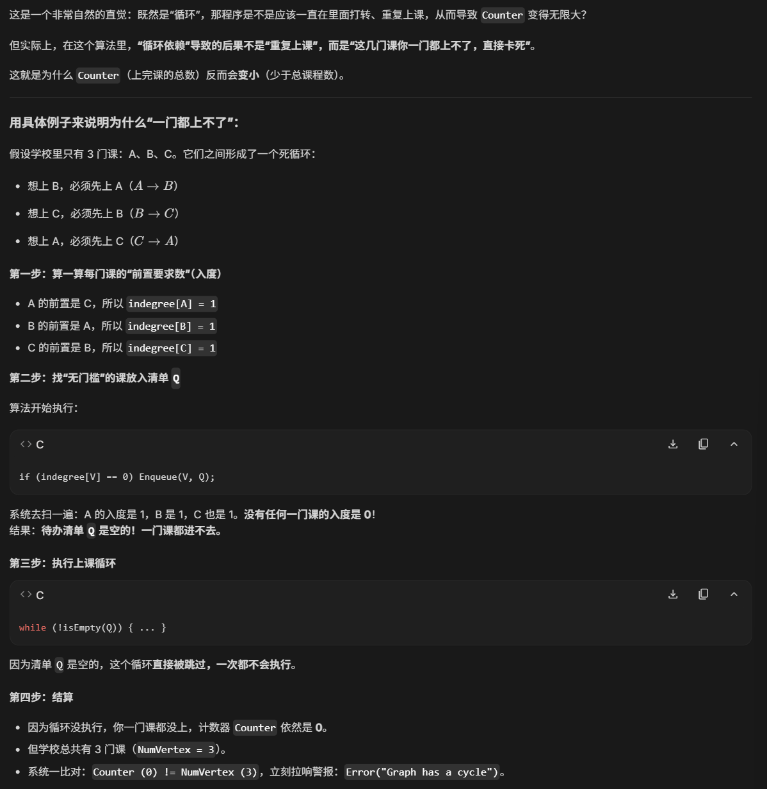
## 单源最短路算法 (Single-Source Shortest Path）
### 广度优先算法（无权图）
#### 方法 1：用广度优先思想的初版
```C
// version 1
void Unweighted(Table T)
{
    int CurrDist;
    Vertex V, W;
    for(CurrDist = 0; CurrDist < NumVertex; CurrDist++)
    {
        for (each vertex V)
            if (!T[V].Known && T[V].Dist == CurrDist)
            {
                T[V].Known = true; // 1. 立即将 V 标记为已知，避免以后重复处理 
                for (each W adjacent to V) // 2. 遍历 V 的所有邻接点 
                { if (T[W].Dist == infinity) // 3. 如果 W 还没有被访问过
                	{   T[W].Dist = CurrDist + 1; // 4. 更新 W 的距离
                		T[W].Path = V; // 5. 记录 W 的前驱是 V 
                		} 
                	}// end-if Dist == Infinity
            } // end-if !Known &&Dist == CurrDist
    } // end-for CurrDist
}
```

- 算法低效的原因：**两层嵌套循环**
	1. **外层循环**：CurrDist 从 0 变到 NumVertex。
	2. **中层循环**：for (each vertex V) 每次都要**无脑遍历全图的所有顶点**去寻找谁的距离等于 CurrDist 且未被标记。
- 如之前拓扑排序的优化一样，这个算法也可以通过引入**队列（Queue）** 来消除中层对所有顶点的无脑遍历
- 时间复杂度为 $O(|V|^2)$

#### 方法 2：广度优先算法 BFS（无权最短路径算法的最优版本）
```C
void Unweighted(Table T)
{
    Queue Q;
    Vertex V, W;
    
    Q = CreateQueue(NumVertex); // 1. 创建队列
    MakeEmpty(Q);
    
    // 假设起点为 S。在初始化时，T[S].Dist = 0，其他所有顶点的 Dist = Infinity
    Enqueue(S, Q); // 2. 将起点 S 放入队列
    
    while (!IsEmpty(Q)) // 3. 只要队列不为空，就继续处理
    {
        V = Dequeue(Q); // 4. 出队一个顶点 V
        T[V].Known = true; // （非必要）标记为已知：在 Version 1 中，我们需要 Known 来防止重复处理；而在 Version 2 中，一个顶点一旦被处理，距离就不是infty，因此不可能二次入队
                
        for (each W adjacent to V) // 5. 遍历 V 的所有邻接点 W
        {
            if (T[W].Dist == Infinity) // 6. 关键：如果 W 还没被访问过
            {
                T[W].Dist = T[V].Dist + 1; // 7. 更新 W 的距离
                T[W].Path = V;            // 8. 记录路径
                Enqueue(W, Q);            // 9. 将 W 入队，等待以后扩展它的邻接点
            }
        }
    } // end-while
    DisposeQueue(Q); // 释放队列内存
}
```

- 有定理：在任何时候，图里已经确定距离（但还未向外扩展）的顶点，其距离要么是 CurrDist，要么是 CurrDist + 1。不存在其他中间值。因此，我们可以准备两个箱子：
	- **箱子 1：** 存放当前距离为 CurrDist 的顶点（当前层）。
	- **箱子 2：** 存放距离为 CurrDist + 1 的顶点（下一层）。
	- 两个箱子的操作可以用一个队列就实现，因为队列的先进先出特性，所有距离为 d 的顶点必定会先于任何距离为 d+1 的顶点被弹出并处理
- **顶点处理：** 每个顶点仅入队一次，出队一次。队列操作的时间复杂度为 $O(|V|)$
- **边处理：** 只有在顶点出队时，才会遍历它的邻接边。在整个算法运行期间，图中的每条有向边只会被扫过一次（无向图为两次）。边处理的时间复杂度为 $O(|E|)$
- 总时间复杂度为 $O(|V|+|E|)$ ，这对于处理大规模稀疏图是非常理想的。

> 与拓扑排序的对比：
> - **拓扑排序（Queue 版本）：** 队列里存的是“入度为 0 且准备好被处理”的顶点，每次出队一个，就减少其邻接点的入度。
> - **无权最短路（Queue 版本）：** 队列里存的是“距离已被确定且准备好向外扩展”的顶点，每次出队一个，就更新其邻接点的距离。

### Dijkstra 算法（有权图，对负权图不管用）
#### 核心思想
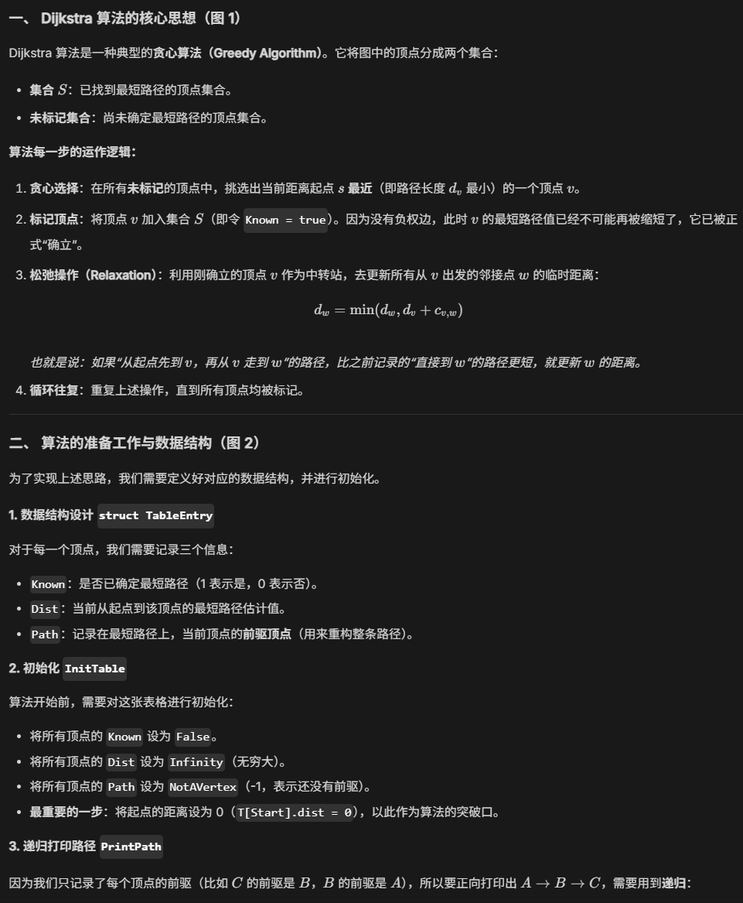
#### 预处理
`Table[i].Dist` 从 $s$ 到 $v_i$ 的距离 $= \begin{cases} \infty & \text{if } v_i \neq s \\ 0 & \text{if } v_i = s \end{cases}$ 
`Table[i].Known`$\mathrel{=} \begin{cases} 1 & \text{if } v_i \text{ is checked} \\ 0 & \text{if not} \end{cases}$ 
`Table[i].Path`$\mathrel{=}$ 记录路径上 $v_i$ 的前一个顶点，以便打印整条路径

```C
// Declarations for Dijkstra's algorithm
typedef int Vertex

struct TableEntry
{
    List Header; // Adjacency list
    int Known;
    DistType Dist;
    Vertex Path;
};

// Vertices are numbered from 0
#define NotAVerTex (-1)
typedef struct TableEntry Table[NumVertex];

// Initialization
void InitTable(Vertex Start, Graph G, Table T)
{
    int i;

    ReadGraph(G, T);
    for (i = 0; i < NumVertex; i++)
    {
        T[i].Known = False;
        T[i].Dist = Infinity;
        T[i].Path = NotAVerTex;
    }
    T[Start].dist = 0;
}

// Print shortest path to V after Dijkstra has run
// Assume that the path exists
void PrintPath(Vertex V, Table T)
{
    if(T[V].Path != NotAVertex)
    {
        PrintPath(T[V].Path, T);
        printf(" to");
    }
    printf("%v", V) // %v is pseudocode
}
```

#### 主循环
```C
void Dijkstra(Table T)
{
    Vertex V, W;
    for ( ; ; ) // 外层循环，每次确定一个顶点的最短路径
    {
        // 1. 寻找当前未标记且 Dist 最小的顶点
        V = smallest unknown distance vertex; 
        
        if (V == NotAVertex) // 如果找不到这样的顶点（所有顶点已处理完，或剩下的顶点不可达）
            break;           // 结束循环
            
        T[V].Known = true; // 2. 标记顶点 V 为“已确定”
        
        for (each W adjacent to V) // 3. 遍历 V 的所有未标记邻接点 W
        {
            if (!T[W].Known)
            {
                // 如果经过 V 中转到 W 的路径比原路径短
                if (T[V].Dist + Cvw < T[W].Dist) // “松弛操作”
                {
                    Decrease(T[W].Dist to T[V].Dist + Cvw); // 更新 W 的距离
                    T[W].Path = V;                          // 改变 W 的前驱为 V
                }
            }
        }
    }
}
```

#### 时间复杂度：如何寻找距离最短且未被标记的顶点+如何进行松弛操作的路径重新赋值
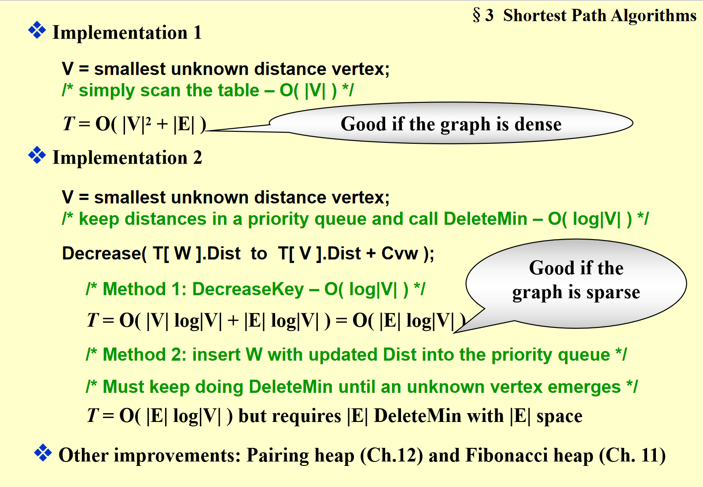
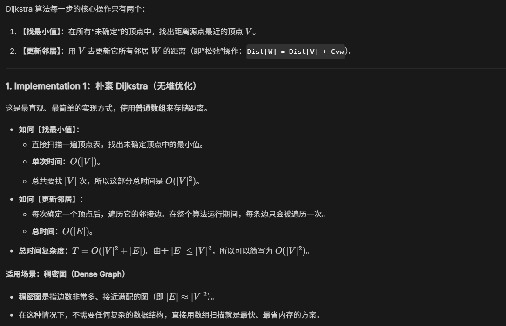
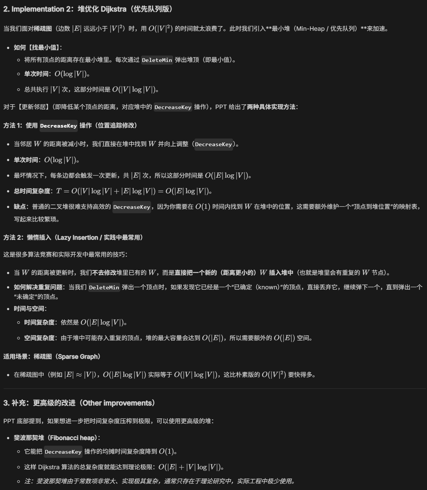
#### 用二叉堆具体实现前面的主循环
```C
// 1. 路径链表节点结构：用于存储前驱顶点
struct node {
    VType vertex;           // 前驱顶点的编号（例如 1, 2, 3...）
    struct node* next;      // 指向下一个前驱节点的指针
};
typedef struct node* Vertex; // 将 Vertex 定义为指向 node 的指针

// 2. 路由表项结构：对应代码中的 Table T
struct TableEntry {
    int Known;              // 是否已确认最短路径 (0 或 1)
    int Dist;               // 当前的最短距离
    Vertex Path;            // 指向【前驱链表】表头的指针
};
typedef struct TableEntry Table[NumVertex];
```

```C
void Dijkstra(VType s, Table T, int n)   // Finding all the shortest paths  
{
    VType V, W;           // V: the current vertex; W: the vertex adjacent to V
    Heap H;               // A heap maintaining the shortest unknown vertex
    Vertex cur, tmp;      // cur: obtaining the information of all adjacent vertice regarding V; tmp: containing new previous vertex adjacent to W
    int len, cnt = n;     // len: the distance of T[V].dist + the distance between V and W; cnt: used to terminate the loop

    H = InitHeap(n, s);   // Initialization of the heap

    while (cnt > 0)
    {
        V = DeleteMin(H); // Obtaining the shortest unknown vertex
        T[V].Known = 1;   // Marking it
        cnt--;
        cur = G[V];       // Getting all adjacent successors
        while (cur != NULL)  // Traversing all successors
        {
            W = cur->vertex;  // The current successor
            if (!T[W].Known)  // If W isn't marked, then try to update it
            {
                len = T[V].Dist + cur->length;   // New distance
                if (len < T[W].Dist)  // If the new distance is shorter than the previous one, then update it
                {
                    T[W].Dist = len;
                    if (pos[W] == 0)  // If W hasn't been in the heap, then insert it into the heap
                        Insert(W, len, H);
                    else  // If W is in the heap, then update the distance of W and update the whole heap
                        DecreaseKey(pos[W], len, H);

                    T[W].Path = NULL;    // Clearing out all previous vertice, because we find the new optimal one
                    tmp = (Vertex)malloc(sizeof(struct node));    // Insert the new one into the T[W].Path
                    tmp->vertex = V;
                    tmp->next = T[W].Path;
                    T[W].Path = tmp;
                }
                else if (len == T[W].Dist)  // If the new distance is equal to the old one, then just involve the new solution
                {        
                    tmp = (Vertex)malloc(sizeof(struct node));    // The same operations 
                    tmp->vertex = V;
                    tmp->next = T[W].Path;
                    T[W].Path = tmp;    
                }
            }
            cur = cur->next;     // Finding the next one
        }
    }
}
```

> 单链表路径更新
> 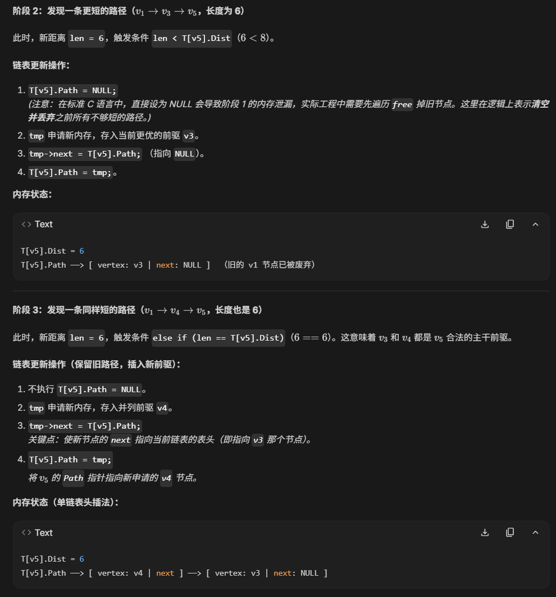
#### Dijikstra 算法不同实现方法的时间复杂度
通用思路
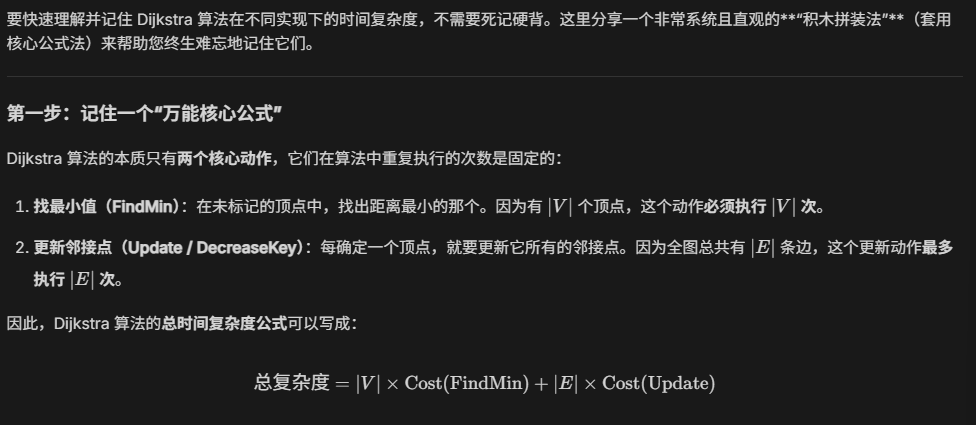
不同数据结构
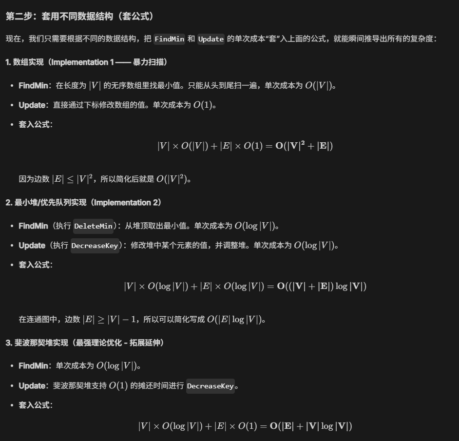
不同使用场景
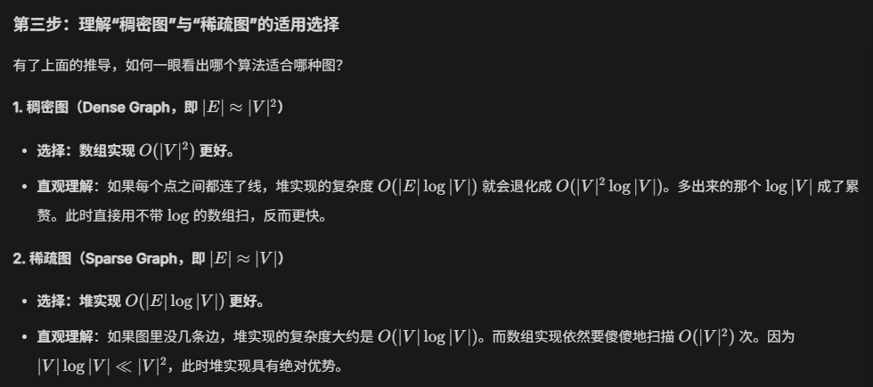
堆的两种具体实现方法
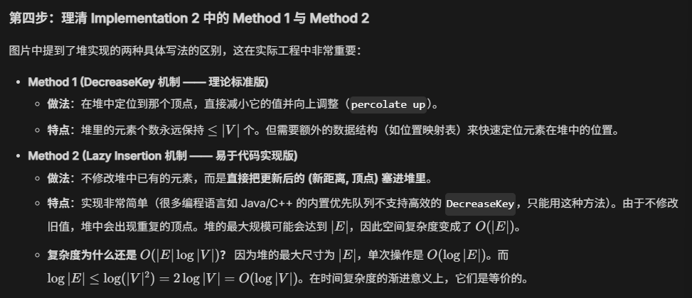
### 带有负值边的图 Graphs with Negative Edge Costs
- negative-cost cycle will cause indefinite loop
- 不能给所有边加上一个相同的正常数，使得所有边的成本为正数。这样做的话，原本包含边数较多的路径，它的成本增长就明显多于边数较少的路径，这就有可能改变最短路径的取法。
- 不过给所有边的权重都乘上一个相同的正常数，这不影响最短路的结果

#### SPFA 算法（Shortest Path Faster Algorithm）：无权重最短路算法 + Dijkstra 算法（其本质是 Bellman-Ford 算法的队列优化版本）
- **Dijkstra 的局限性**：Dijkstra 算法基于贪心策略，一旦一个顶点被标记为 Known，就再也不会去更新它。如果图中存在**负权边**，Dijkstra 可能会早早地锁定错误的“最短”路径，导致计算结果错误。 
- **本算法的解决方案**：允许顶点**多次入队、多次更新**。只要一个顶点的距离被缩短了，它就有机会重新进入队列，去更新它的邻接点。
```C
void WeightedNegative(Table T)
{
    Queue Q;
    Vertex V, W;
    Q = CreateQueue(NumVertex);
    MakeEmpty(Q);
    
    Enqueue(S, Q); // 1. 起点 S 入队
    while (!IsEmpty(Q))
    {
        V = Dequeue(Q); // 2. 弹出一个距离被更新过的顶点 V
        
        for (each W adjacent to V) // 3. 遍历 V 的所有邻接点 W
        {
            // 4. “松弛操作”：如果经过 V 到达 W 的距离，比 W 原来的距离更短
            if (T[V].Dist + Cvw < T[W].Dist) 
            {
                T[W].Dist = T[V].Dist + Cvw; // 更新 W 的最短距离
                T[W].Path = V;               // 记录前驱
                
                // 5. 关键优化：W更新后要重新入队
                if (W is not already in Q) //如果 W 当前不在队列中，才将它入队,防止队列中出现重复节点
                    Enqueue(W, Q);
            }
        }
    } // end-while
    DisposeQueue(Q);
}
```

> 如何检测并解决负值环？
> 
### 无环图 Acyclic Graphs——DAG 拓扑算法——关键路径分析
- 对无环图，可以按照拓扑序选择顶点，因为当选择某个顶点后，它的距离不可能因为它前面顶点的入边而减少，这样只需执行一趟算法即可。
- 时间复杂度为 $O(|V|+|E|)$

- AOV 网：每个顶点表示活动
- AOE 网：每条边表示活动

如何计算 AOE 网的两个核心指标 LC 和 EC？
- EC 最早完成时间：从起点开始，按拓扑序计算，加前驱支路的最大值
- LC 最晚完成时间：从终点开始，按逆拓扑序计算，减后继支路的最小值
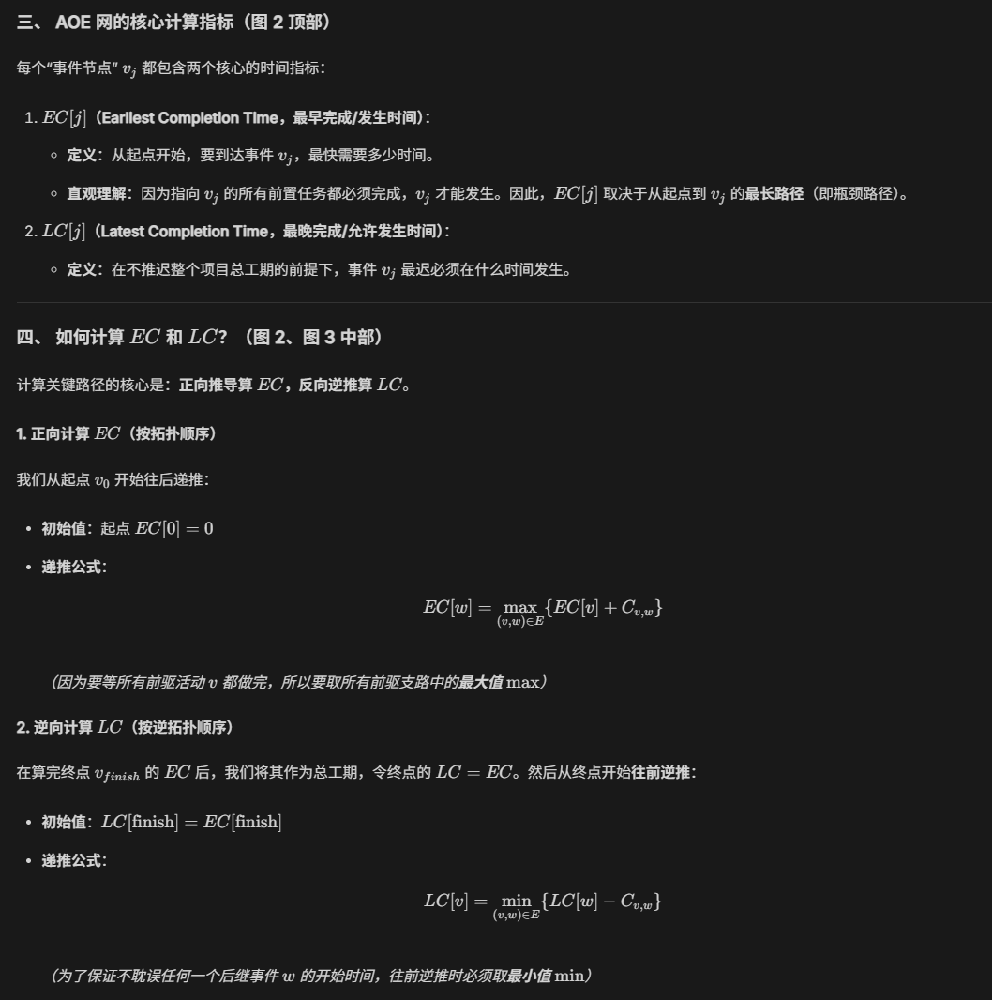

- 空闲时间：$LC[w]-EC[v]-C_{v,w}$
- 关键活动：空闲时间为 0 的活动
- 关键路径: 所有关键活动连成的路径，是整个工程中耗时最长的路径
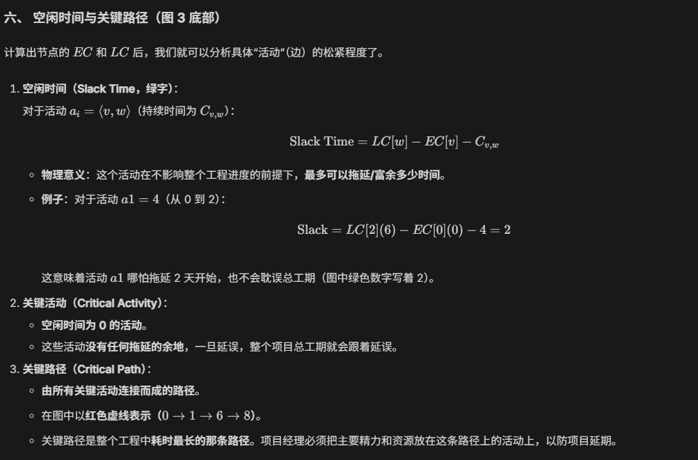


## 所有对最短路算法（All-pairs Shortest Path）
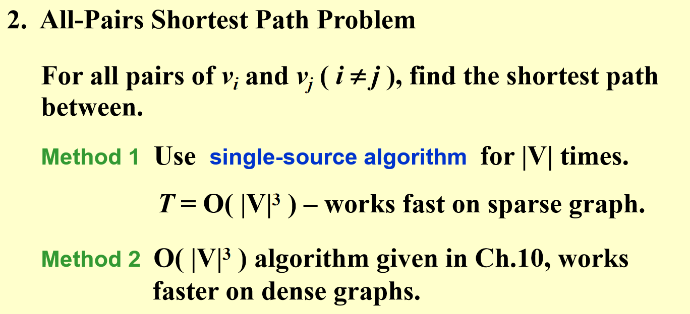

## 知识点总结
### 算法总结
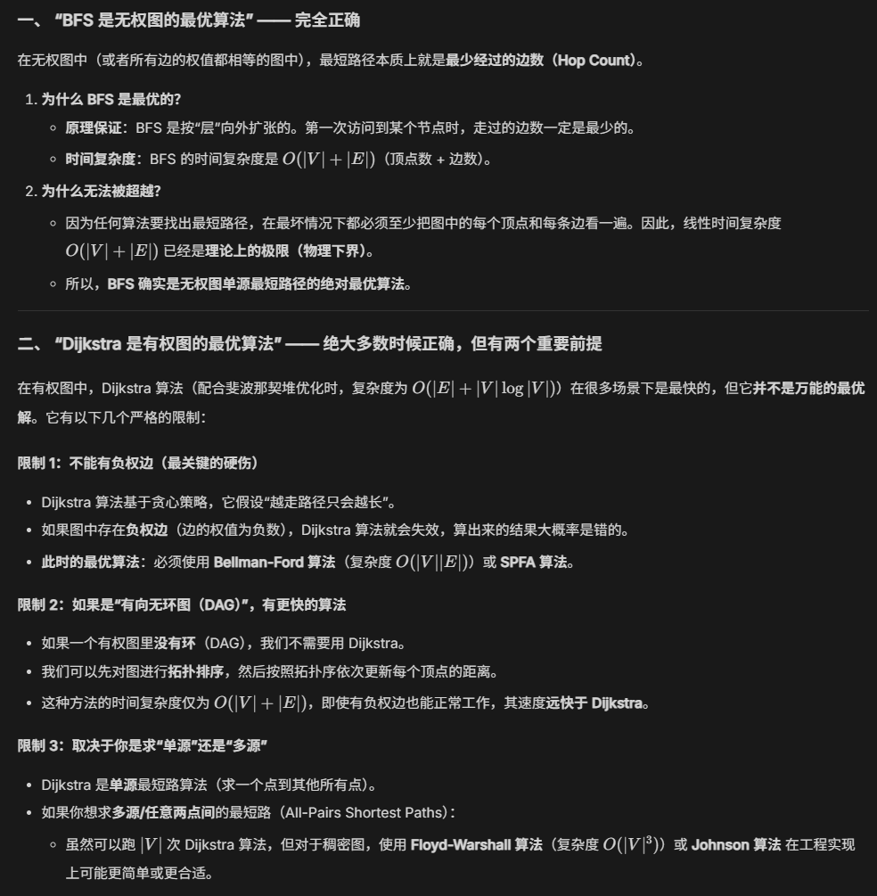
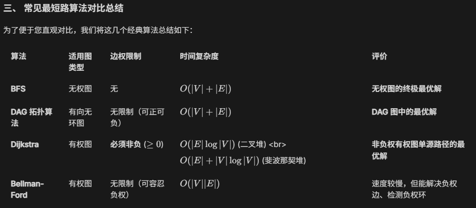
### 理论题
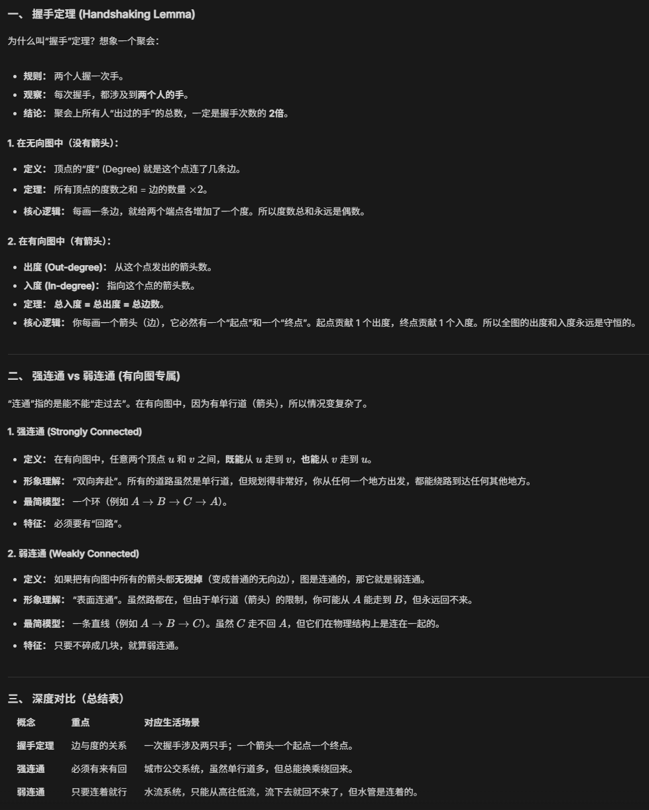

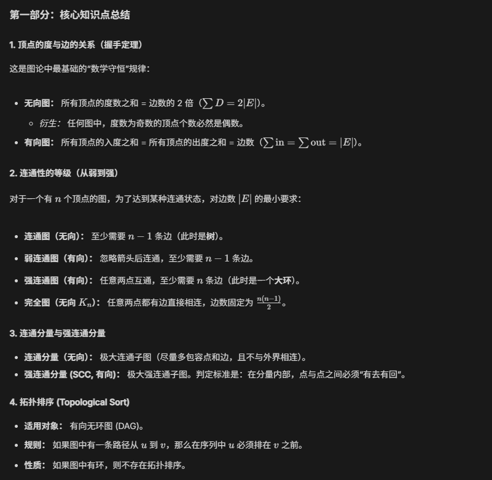

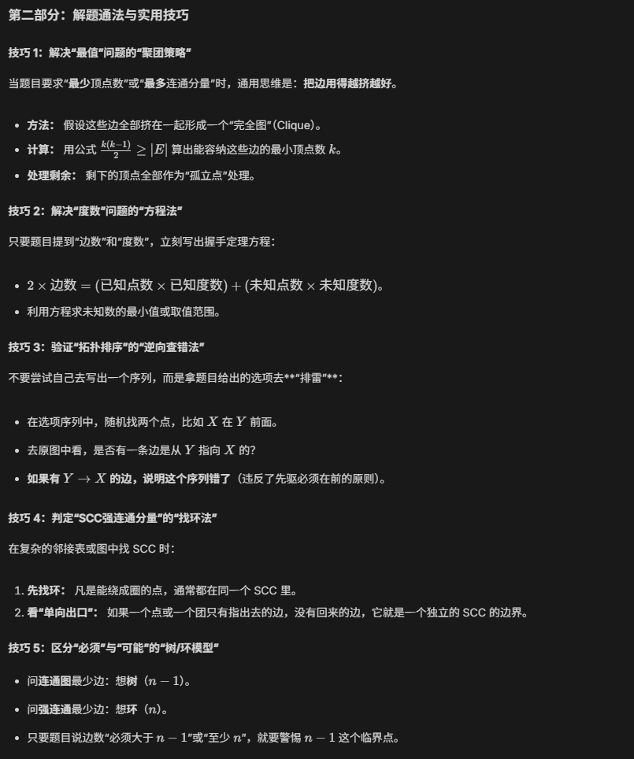

