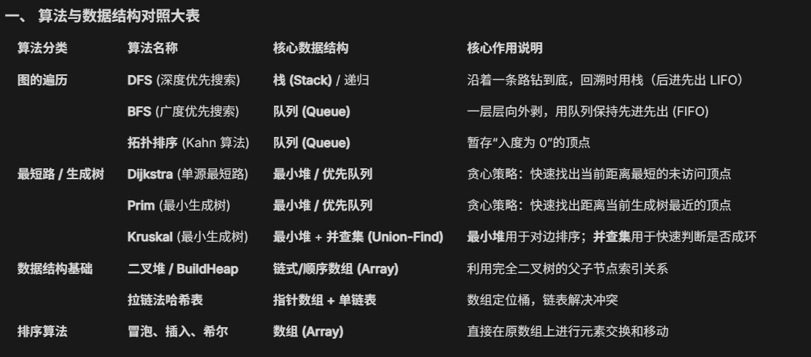
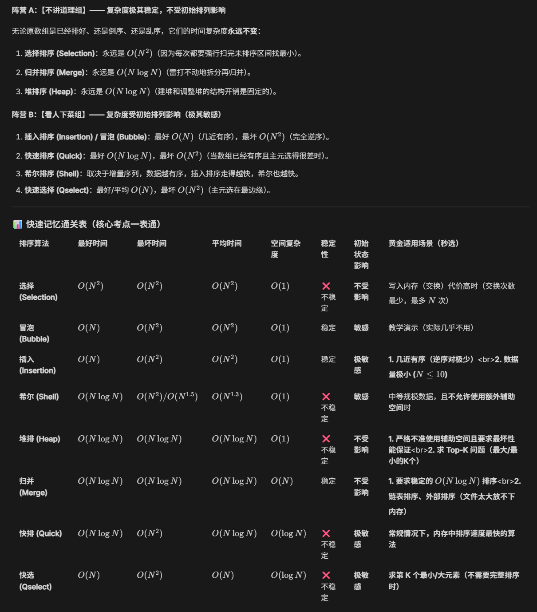

本学期新增考点：SegmentTree, RobinHood Hashing

## Chapter 2 Algorithm Analysis
算法的 5 大特点

算法和程序的区别

4 大渐进符号的含义和运算性质
- 大 O 表示法 (Upper Bound)
- 大 **`Ω` 表示法 (Lower Bound)
- 大 `Θ` 表示法 (Tight Bound)
- 小 o 表示法（严格的 O）

常见复杂度排序：
$O (1)<O (loglogN)<O (logN)<O (\sqrt(N)​)<O (N)<O (NlogN)<O (N^2)<O (N^3)<O (a^N)<O (N!)<O (N^N)$

计算算法的时间复杂度：
- 连续语句：相加
- 条件语句：运行时间不会超过“测试条件 + S1 和 S2 中运行时间的最长者”
- 迭代：嵌套 for 循环=“该语句 ×× 所有的 for 循环规模的乘积”
- 递归：以斐波那契数列为例
	- 线性齐次递归关系：解特征方程，得特征根和系数
	- 主定理
- 复杂算法的时间复杂度计算：写出 $T(N)$ 的递归表达式和初值，反复迭代代入化简
- 如果程序过于复杂，无法直接看出时间复杂度，可以用相除的极限得常数

计算算法的空间复杂度：
- 固定变量与常数：$O(1)$
- 线性结构：数组 $O(N)$, 矩阵 $O(N^2)$

对比算法：如何求解最大连续子列和 Maximum Subarray Sum
1. 迭代：3 个 for 嵌套
2. 迭代：2 个 for 嵌套
3. 分治 Divide and Conquer：$O(NlogN)$ 
	- Base case
	- 递归分别算左右两边的最大子列
	- 从 center 开始往两边找，算跨中心的最大子列
4. 在线 on-line：$O(N)$
	- 在任意时间阶段内计算当前情况下的解

3 种时间复杂度为 $O(logN)$ 的算法
> 以下几种算法的代码要能完整写出
> 本质上这三种算法都用了 $T(N)=T(N/2)+...$
1. 二分查找 Binary Search 
	- 使用前提：列表已排好序
2. 辗转相除法 Euclid's Algorithm：用于求解两数的最大公约数(greatest common divisor, gcd)
	- 定理：$If\quad M>N\,, then\: M\;mod\ N<N/2\qquad$
3. 求幂 Exponentation

## Chapter 3 Lists, Stacks, and Queues
> 这三种数据结构的基本操作要熟练掌握快速写出，应用的思路要掌握

栈往往用数组实现更好，队列的数组和链表形式各有优点按需选择
### 线性表 Linear List
- 查找 $O(1)$
- 插入/删除 $O(N)$

- 删除节点时不要忘记释放内存！！！

### 顺序表 Sequnetial List

### 链表 Linked List
#### 基本操作
- 单链表插入必须先接后继，再让前驱指向新节点
#### 应用
- 多项式：数组存储太稀疏了，用链表好
- Multilist：40000 个学生与 2500 门课
- 游标：预置空数组，不用管理系统内存，运行更快
### 栈 Stack（LIFO）
#### 基本操作
- `IsEmpty` 
- `CreateStack`
- `DisposeStack`
- `MakeEmpty`
- `Push`
- `Top`
- `Pop`
#### 注意事项
- 对空栈 `Pop/Top`：ADT 错误
- 对满栈 `Push` : 实现错误 (implementation error)
#### 应用
- 符号匹配：用于检查括号 `( ) [ ] { }` 是否成对出现且顺序正确，$O(N)$ 的在线算法
- 后缀 postfix /前缀 prefix 表达式求值
- 中缀 infix 转后缀：**in-stack precedence** (栈内优先级) 和 **incoming precedence** (栈外/入栈优先级)，左括号栈内优先级最低，栈外优先级最高
- 函数调用：帧 Frame 存储返回地址+局部变量+旧指针
### 队列 Queue (FIFO)
#### 基本操作
- `IsEmpty`
- `CreateQueue`
- `DisposeQueue`
- `MakeEmpty` 
- `Enqueue` 
- `Front`
- `Dequeue` 

#### 注意事项
- 用 `TopOfStack = -1` 表示空栈
- 封装 `Encapsulation` ，外部代码不能直接改 `top` 指针
#### 循环队列 Circular Queue
- **出队（Dequeue）：** front = (front + 1) % Size
- **入队（Enqueue）：** rear = (rear + 1) % Size
- 判空条件：`Front == Rear`
- 判满条件：不能和空条件相同，有两个解决方法
	- `(Rear + 1) % Capacity == Front` 
	-  多定义一个变量 `Size`，入队 `Size++` 出队 `Size--` ，`Size==0` 为空 `Size==Capacity` 为满

## Chapter 4 Tree and Binary Tree
> 要熟练掌握基本概念，各种树的遍历和基本操作，各种树的性质
### 基本概念
- degree of a node（分支孩子个数）/tree (最大的节点度数)
- parent/children/siblings
- root/leaf (terminal node)
- path/length of path
- ancestors of a node
- descendants of a node
- depth of node：节点向上到根
- height of node：节点向下到叶子
- height of tree = depth of tree

- Every node in the tree is the root of some subtree.
- 叶子节点和自身构成平凡子树
### 一般树的表示
- List Representation 双亲表示法
- FirstChild-NextSibling Representation：不唯一
	- 用这种方法将树转化为二叉树时，树的后序遍历=对应二叉树的中序遍历
### 表达式树 Expression Tree (syntax tree)
- 先序遍历：前缀表达式
- 中序遍历：中缀表达式（可能需要手动补括号）
- 后序遍历：后缀表达式

1. **中缀转后缀：** 从左向右扫描，操作数直接输出，运算符遵循“优先级高则入栈，低或等则弹出输出”的原则入栈，括号内单独结算
	- 左括号栈外优先级最高栈内优先级最低，右括号栈外优先级最低不入栈。遇到右括号一直输出直到遇到栈内的左括号
	- 栈内外都是乘除优先级大于加减。比如栈内有 `[+,*,/]` ，现在栈外来了一个 `+`
	- 只有外面优先级比里面高才能入栈，否则出栈（优先级相等也是出栈）
	- 运算符在栈内
2. **后缀计算：** 从左向右扫描，操作数依次入栈，遇到运算符则弹出栈顶两个数计算并回压，最后栈中剩余的唯一元素即为结果。
	- 弹出的第一个是右操作数，第二个左操作数 
	- 不需要优先级
	- 操作数在栈内
3. 后缀表达式转表达式树：见到操作数就入栈；见到运算符就从栈里弹出两个数，当左右孩子，然后把这棵新树压回栈。
	- 操作数在栈内
	- 同后缀计算
### 一般树的遍历
- 前序遍历
- 后序遍历：用于计算文件夹的总大小
- 层序遍历
### 二叉树的遍历
#### 三种遍历 
- 前序遍历 preorder
- 中序遍历 inorder
- 后序遍历 postorder
- 层序遍历 levelorder
注：
- 知道前序或者后序遍历 + 中序遍历，可以确定唯一的一棵树
- 知道前序遍历 + 后序遍历，一般情况下无法确定树的形状
- 虽然只有 10 个节点，但是系统会按照满二叉树的状态开辟存储空间。
#### 题型
- 给二叉树，求三种遍历
- 根据遍历结果推导二叉树
	- 中序遍历：最中间的是根节点（A），两边分别属于左子树和右子树
	- 前序遍历：排在前面的节点，先考虑是在上面，再考虑是在左边
	- 后序遍历：排在前面的节点，先考虑是在左边，再考虑是在右边
### 一般树的性质
- 总节点数=所有节点度数和（总出度）+1=各种度数的节点数之和
- 总节点数=总边数+1
- 总边数=所有节点度数和（总出度）
- 对于度为 m 的树，第 i 层上最多有 $m^{i-1}$ 个节点
- 对于高度为 h, 度为 m 的树，最多有 $(m^h-1)/(m-1)$ 个节点
### 二叉树的性质
- **空指针数**：N 个节点的树有 N+1 个空指针
- **节点数与边数**：节点数=所有节点度数和+1=各种度数的节点数之和，即 $N=n_0+n_1+n_2$
- **叶子与双支节点**：$n_0=n_2+1$。无论树长多歪，这个公式都成立
- **高度与节点数**：
    - N个节点的二叉树，最大高度是 N（长成一条线）
    - 最小高度是 $⌈log⁡_2(n+1)⌉$ 或者 $⌊log2​N⌋+1$（长得尽量茂密，即完全二叉树）
### 特殊二叉树
- 歪斜二叉树 skewed binary tree
- 完全二叉树 complete binary tree：
	- 没有左子树，不能有右子树；上一层没有铺满，不能有下一层；
	- 叶子节点（度为 1 的节点）只存在于最下面两层，且只能有一个
	- 在从索引 1 开始存储的完全二叉树中，最后一个非叶子节点的索引是  $⌊n/2⌋$
	- 对于排满的层，下一层节点数为上一层节点数的 2倍
- 满二叉树 full：深度为 k 且有 $2^k-1$ 个节点。**每个节点要么有 0 个孩子（叶子），要么有 2 个孩子**。它不要求所有的叶子都在同一层。
- 完美二叉树 perfect（完全且满）：完美的等边三角形，所有的叶子节点都在同一层，$N=2^h-1$
### 线索二叉树 Threaded Binary Tree
> 要会建树，代码了解

针对中序遍历设计，充分利用了二叉树中空出来的指针，使得一个 while 就能实现遍历
- 左代表前驱，右代表后继
-  `int ltag/rtag`：0 代表孩子，1 代表线索
#### 如何建树
- 画出二叉树
- 整体线索化
	- 头节点的 lchild 指向二叉树的根，头节点的 rchild 指向遍历的最后一个节点
	- 第一个节点的 lchild 指向头节点
	- 最后一个节点的 rchild 指向头节点
- 具体线索化：按照你想要的遍历顺序（前序，中序，还是后序），给没有左（右）孩子的空指针加上线索（前驱和后继）

## Chapter 5 Binary Search Tree
### 定义性质
**左边比我小，右边比我大** , 中序遍历一定是升序
BST 的形状与插入节点的顺序 insertion sequences 有关
默认二叉搜索树中的所有键值（Keys）都是互不相同的（Unique）

注：
- 对二叉搜索树的**同一层**从左往右遍历，得到的键的序列不一定是**有序**的
- 通过对二叉搜索树的**中序遍历**得到的元素序列是**有序**的
- 给出一棵二叉搜索树的**前序**_或者_**后序**遍历，根据二叉搜索树的定义，我们应当可以还原出这棵树
> 通常对于普通二叉树，我们需要“前序+中序”或“后序+中序”才能唯一确定一棵树。但 BST 有个**隐藏信息**：它的中序遍历就是所有节点值的**升序排序**。
- 对于一棵完全的二叉搜索树，它**最小**的节点一定是**叶子节点**（左下角），最大的就不一定了（完全二叉树可能没填满）
### 基本操作
- 预处理+ `MakeEmpty`
- `Find` ：迭代和递归两种方法
- `FindMax`
- `FindMin`
- `Insert`
- `Delete`
### 时间复杂度
- $O(h)$
- **最好/平均情况**：如果这棵树是平衡的（例如 AVL 树或红黑树），高度 $h≈logN$，此时查找的时间复杂度为 $O(logN)$
- **最坏情况（退化）**：如果插入的数据是有序的（例如依次插入 1, 2, 3, 4, 5），二叉搜索树会退化成一个单支树（类似于**单链表**），此时查找的时间复杂度为 $O(N)$
> 二分查找平均和最坏情况都是 $O(logN)$ ,对有序数组
## Chapter 6 Priority Queue & Heap
> 要会写两大基本操作的代码

### 优先队列
- 插入
- 删除最大最小

### 二叉堆
> 二叉堆就是完全二叉树+堆属性（父节点的值≤子节点的值，根节点最小）
- 插入 `Insert`：逐个插入时严格按照完全二叉树的索引顺序先挂上去，然后进行上过滤，$O(logN)$
- 删除最大最小 `DeleteMin`：$O(logN)$
- `DecreaseKey`：$O(logN)$
- `Delete`：$O(logN)$
- `BuildHeap`:将一个无序数组调整为二叉堆。如果采用逐个插入的方法，复杂度为$O(NlogN)$；但标准的 BuildHeap 采用自底向上的下过滤方法（Floyd 建堆算法）。由于堆中大部分节点都分布在底层（高度较矮），需要下过滤的层数很少，数学求和证明其总的时间复杂度收敛于 $O(N)$

- 上/下滤时间复杂度：$O(logN)$
- 上滤：插入 Insert（插到末尾，只对这个节点做上滤），一个个插入空堆中来建堆
- 下滤：删除堆顶 DeleteMin/DeleteMax（末尾移到根部，只对这个节点做下滤），线性算法把最小堆转最大堆/建堆 (**自底向上，逐个下滤**) 
	- 转为最大（小）堆：从最后一个非叶节点开始往上逐个考察，对每个节点做下滤，目标是最大（小）堆则与最大（小）的孩子交换
- 注意❗：一定要滤到底（顶）
## Chapter 7 SegmentTree
> 要会写三大基本操作的代码

- `Build`
- `Query`
- `Update`
- 维护区间信息，从 sum 到 max, min, average 都要会写
- 能够处理有结合律的操作，如 GCD 最大公约数，LCM 最小公倍数
## Chapter 8 Disjoint Set ADT
> 解决**不相交集合（Disjoint Sets）的合并及查询**问题，即“在一堆元素中，哪些元素属于同一个团体？” 以及 “如何把两个团体合并成一个？”

- 等价关系、等价类：
	- 等价类=树
	- 等价=在同一棵树上
- 森林：
	- 指针从子节点指向父节点
	- 若 i 为子节点，则 `parent[i]` =父节点的索引
	- 若 i 为根节点，则 `parent[i]` =-（这个树的 size, 算上根节点）
- 核心操作
    - `Union`：Smart Union
        - Union by Size
        - Union by Height
    - `Find`
        - Path Compression 路径压缩

时间复杂度=树的最大高度 x 操作次数 M
- 无优化：$O(N)$
- 仅 Smart Union: $O(logN)$
- 仅 Path Compression ：$O(logN)$
- Smart Union+Path Compression ：总时间复杂度接近常数
## Chapter 9 Graph & Topological Sort
### Graph
**完全图（Complete Graph）$K_n$** :任意两个不同的顶点之间都有一条边相连的简单图
- 每个顶点的度数都是 n-1
- 总边数 = $\frac{n(n-1)}{2}$

**顶点 V、边 E、度数 D以及连通性**
- V 个顶点的图如果连通，最少需要 V-1 条边，此时这个图没有环，被称为树
- E 条边的图如果不连通，求最少有多少个顶点：
	- 先求出完全图有 E 条边需要多少顶点 $\frac{V(V-1)}{2}$
	- 然后再加一个孤立顶点
- V 个顶点 E 条边的图，求有多少个连通分量：（消除思想）
	- 最初有 V 个孤立顶点 V 个连通分量，每加一条边，连通分量最多减少一个
	- 最多连通分量数：尽量成环，$\frac{x(x-1)}{2}>=E$ 得到最小顶点数 x，最多连通分量数=1+（V-x）
	- 最少连通分量数= 初始顶点数 V- 边数 E，尽量成森林
- 有向图中，所有顶点的入度之和必须等于所有顶点的出度之和
- 握手定理：
	- 无向图：所有顶点的度数之和=2 x 边数
	- 有向图：所有顶点的**入度之和** = 所有顶点的**出度之和** = **边数**，所有顶点的度数之和=2 x 边数

**图的表示**
- 邻接矩阵：适合稠密图 $O(|V|^2)$
- 邻接表：适合稀疏图 $O(|V|+|E|)$
- 稠密图 $|E|接近|V|^2$，稀疏图 $|E|接近|V|$

如何计算某个顶点的度 
- 无向图：`Degree(i) = graph[i]` 中节点的个数
- 有向图：
	- 入度：`in-degree(i)` （邻接表默认只记录指出去的边）
	- 出度 ：“逆转”邻接链表
### Topological Sort
**偏序：** 反自反性+反对称性+传递性

将所有**未赋予拓扑序的、度为 0 的顶点**放入特殊的盒子（比如**队列**或栈）里
- 此处我们用的是队列
- 每一个顶点入队和出队各一次，总共执行 V 次，总时间为 $O(|V|)$
- 只有当顶点出队时，才会遍历其发出的边，在整个算法运行期间，图中的每条有向边只会被检查一次，总时间为 $O(|E|)$
- 总时间复杂度为 $O(|V|+|E|)$

DAG 的特性
- 能拓扑排序。如果图中有环，则无法进行拓扑排序。
- 一个有限的 DAG 至少存在一个**入度为 0** 的节点（没有箭头指向它，称为源点/起点）和至少一个**出度为 0** 的节点（它不指向任何其他节点，称为汇点/终点）。
## Chapter 10 Shortest Path Algorithm
> 图论中最重要的算法 Dijisktra

最短路的三角不等式：$dist (b, a)≤dist (b, c)+dist (c, a)$

### BFS ：无权最短路的最优算法
- 时间复杂度：
	- **顶点处理：** $O(|V|)$
	- **边处理：** 在整个算法运行期间，图中的每条有向边只会被扫过一次（无向图为两次, 因为一条无向边相当于两条有向边），时间复杂度为 $O(|E|)$
	- 总时间复杂度为 $O(|V|+|E|)$ ，适合处理大规模稀疏图
- 与拓扑排序的对比：
	- 拓扑排序：队列里存的是“入度为 0 且准备好被处理”的顶点，每次出队一个，就减少其邻接点的入度。
	- 无权最短路： 队列里存的是“距离已被确定且准备好向外扩展”的顶点，每次出队一个，就更新其邻接点的距离。

### Dijisktra ：有权图，不适用于负权图
- 在未标记节点集合中贪心选一个距离出发点最近的，然后松弛操作更新邻居的距离
- 时间复杂度：
	- 朴素算法：适用于稠密图，用普通数组，找最小值 $O(|V|^2)$，更新邻居 $O(|E|)$ 
	- 优先队列(复杂度同 MST 的 Prim 算法)：适用于稀疏图，用最小堆，找最小值 $O(|V|log|V|)$，更新邻居有以下两种方法
		- `DecreaseKey`，$O(|E|log|V|)$ 
		- `Lazy Insertion` ，$O(|E|log|V|)$ ，需要额外空间 $O(E)$
	- 极限时间复杂度 $O(|E|+|V|log|V|)$

### 带负权值的最短路 ：松弛操作距离被更新的顶点要重新入队
- 时间复杂度：$O(|E||V|)$
- 如果出现负值环，该算法将会陷入无限循环。因此，记录每个顶点的出队次数，发现有顶点出队次数多于 ∣V∣ 次时，就终止程序，这样可以避免这一问题

### 无环图 Acyclic Graphs &关键路径分析：AOE 网
- EC 最早完成时间：从起点开始，按拓扑序计算，加前驱支路的最大值
- LC 最晚完成时间：从终点开始，按逆拓扑序计算，减后继支路的最小值
- 空闲时间：$LC[w]-EC[v]-C_{v,w}$
- 关键活动：空闲时间为 0 的活动	
- 关键路径: 所有关键活动连成的路径，是整个工程中耗时最长的路径

### 所有对最短路算法 All-pairs Shortest Path
- 时间复杂度 $O(|V|^3)$ ，用 V 次单源最短路算法
## Chapter 11 NFP+MST
### 网络流问题 NFP
增广路径的两种边
- 正向残留容量 $cr (V 1, V 2)=c (V 1, V 2)−f (V 1, V 2)+f (V 2, V 1)$
- 反向残留容量 $cr(V2,V1)=c(V2,V1)−f(V2,V1)+f(V1,V2)$

如何找增广路径
 - 总是挑选**对流量提升最大**的路径：修改 Dijkstra，$​​O(∣E∣log cap_{max}​)⋅O(∣E∣log∣V∣)=O(∣E∣^2log∣V∣)(if\ cap_{max}​ \ is\  a \ small\  integer)​$ 
 - 总是挑选**边最少**的增广路径：BFS无权图最短路算法 $​O(∣E∣)⋅O(∣E∣⋅∣V∣)(unweighted \ shortest\  path\  algorithm)=O(∣E∣^2∣V∣)​$
 - 草稿手算用第一种更好
### 最小生成树 MST
- “最小”：保证生成树的所有边的权重和最小
- “生成”：覆盖所有的顶点
- “树”：**无环且边的数量为 |V| - 1**，因此当图的边数 < |V| - 1 时，该图不存在最小生成树
- 图是连通的，边数 ∣E∣≥∣V∣−1
- 最小生成树存在的**充要条件**是图是**连通的**
- 如果在生成树中添加一条边，就会形成一个环
- 最小生成树并不一定是唯一的，但最小生成树的**总权重是唯一的**

Prim 算法（找点）：类似 Dijkstra，适用于稠密图
- Prim 只看增量最小，每次选择与当前已构建树相连的、权重最小的边，而Dijkstra 则要维护整条路径总长的最小
- 时间复杂度：
	- 不用堆（适用于稠密图）：$O(∣V∣^2)$
	- 二叉堆（适用于稀疏图）：`DeleteMin()+DecreaseKey()` $O(|E|log⁡∣V∣)$

Kruskal 算法（排边）：维持一片森林（一组树），适用于稀疏图中
- 用最小堆 `DeleteMin` 全局选权重最小的边，$O(|E|log|E|)$
- 用并查集保证新加入的边不生成环, $O(1)$
- 时间复杂度：$O(|E|log|E|)=O(|E|log|V|)$
## Chapter 12 DFS
- 树：$O(|E|)$
- 图：要避免环，对访问过的顶点标记
- 如果无向图不连通，或者有向图不是强连通的，那么用一次 DFS 无法访问所有顶点，需要对未标记的顶点再用一次 DFS，直至所有顶点都被标记。时间复杂度为 $O(|E|+|V|)$

### Undirected Graphs 无向图的 DFS 遍历
- 连通性判断：当且仅当 1 次 DFS 能够遍历所有顶点时，无向图是连通的。如果图是不连通的，单次 DFS 只能访问到起点所在的连通分量。
- 深度优先生成树（连通图） ：树边，回边
- 深度优先生成森林（非连通图）
### Biconnectivity 双连通性（只针对无向图）
- 关节点 (articulation point)/割点 (cut vertex)：当 `G' = DeleteVertex(G, v)` 至少有 2 个连通分量时。关节点的移除能够破坏图的连通性。
- 双连通图 (biconnected graph)：没有关节点的连通图 G。至少需要移除两个及以上的顶点，才能形成有多个连通分量的子图
- 双连通分量 (biconnected component)：极大双连通子图
- 没有一条边会同时出现在多个双连通分量中
- 寻找无向连通图 G 中的双连通分量的个数 = 关节点的个数 + 1（仅当图的结构呈简单的“树状单线拉长”时成立）
- 任何含有 ∣V∣≥2个节点的连通图，都至少包含两个不是割点的节点（树至少有两个叶子节点）

寻找无向图中所有关节点+划分双连通分量—— Tarjan 算法
- 两个辅助数组： $Num(v)$ 和 $Low(v)$ 
	- 算 Low 的时候看三个：1. 自己 2. 子节点的 Low 3. 自己的回边
	- 如果 u 是 v 的祖先，则 `Num(u) < Num(v)`；反之 `Num(u) > Num(v)`, Num 相当于节点扩展顺序
- 两个判定规则：是割点的充要条件
	- 非根节点：$u$ 至少有一个子节点 $w$，满足：$Low(w) \ge Num(u)$，也就是子节点 $w$ 及其后代，没有任何一条路能连回 $u$ 的祖先节点
	- 根节点：在 DFS 生成树中至少有两个子节点
- 算法步骤：
	- 建 DFS 生成树，加上回边
	- 列表格 `vertex  Num  Low`（看生成树的图不要看原图），找割点
	- 根据割点划分双连通分量
### Euler Circuits
- 欧拉路 (Euler tour)：一笔画
- 欧拉环 (Euler circuit)：一笔画回到起点

判断方法：
- 无向图：
	- 当且仅当图是连通的，且**每个顶点的度为偶数**时，存在**欧拉环
	- 当且仅当图是连通的，且**仅有两个顶点的度为奇数**（一个起点，一个终点）时，存在**欧拉路**
- 有向图：
    - 当且仅当图是连通的，且每个顶点的**出度 = 入度**时，存在**欧拉环**
	    - 必须是强连通 
    - 当且仅当图是连通的，且有且仅有**一个**顶点的出度 = 入度 + 1（这个点是起点），有且仅有**一个**顶点的入度 = 出度 + 1（这个点是终点），其余顶点的出度 = 入度时，存在**欧拉路**
	    - 必须是弱连通 
- Hierholzer 算法时间复杂度 $T=O (∣E∣+∣V∣)$ 

> [!note] 图论算法总结 ：
- 最短路：适用于有向图和无向图，两个都要掌握还要注意区分
- 网络流：一般用于有向图
- MST：只需掌握经典定义（有权）无向图
- DFS：适用于有向图和无向图，我们只需掌握无向图

## Chapter 13 Sorting
> 以下每种算法的代码都要熟练掌握快速写出
### 简单排序
Selection Sort 选择排序
- 双层循环，每次遍历查找未排序区间中的最小元素，并与未排序区间的首个元素交换位置
- 时间复杂度：最好、最坏、平均情况均为 $O(N^2)$
- 空间复杂度：$O(1)$，原地排序
- 不稳定

Bubble Sort 冒泡排序
- 双层循环，比较相邻元素并交换（ `arr[j] > arr[j + 1]` 交换则为升序）
- 如果在某一趟遍历中没有发生任何交换，说明序列已经整体有序，可提前结束算法
- 时间复杂度：最好 $O(N)$, 最坏/平均 $O(N^2)$
- 空间复杂度：$O(1)$，原地排序
- 稳定

Insertion Sort 插入排序
- 排序前已知 0~P-1 位置上的元素是有序的，对于第 P 趟排序，将位置 P 上的元素向前 P 个元素移动，直到发现正确的位置
- 用 `Tmp = A[P] `， `for (j = P; j > 0 && A[j - 1] > Tmp; j--)` 前移为升序
- 时间复杂度：最好 $O(N)$, 最坏 $O(N^2)$，平均 $\Theta(N^2) = \sum_{i=2}^{N} i = 2 + 3 + 4 + \cdots + N$
- 空间复杂度：$O(1)$，原地排序
- 稳定

简单排序的下界
- 对于包含 $N$ 个不同数字的数组，它的**平均逆序对个数**为 $\frac{N(N - 1)}{4}$
- 任何通过**交换相邻元素**实现的排序算法，平均时间复杂度为 $\Omega(N^2)$
### 比较排序（以上的简单排序也属于比较排序）
Shellsort 希尔排序
- 比较相隔一定距离的元素，每轮 $h_k-sort$ 比较间隔不断减小（间隔 $h_k$ 由增量序列 increment sequence决定），每轮 $h_k-sort$ 包含 $h_k$ 次独立的插入排序
- **希尔增量序列 (Shell's increment sequence)**： 最坏 $\Theta(N^2)$
	- $$h_t = \left\lfloor \frac{N}{2} \right\rfloor, \, h_k = \left\lfloor \frac{h_{k+1}}{2} \right\rfloor$$
- **希巴德增量序列 (Hibbard's increment sequence)** ：最坏$\Theta(N^1.5)$
	- $$h_k = 2^k - 1(即1,3,7,15,31)$$

HeapSort 堆排序
- 朴素堆排序：每次取最小值放入辅助数组
	- 时间复杂度$O(NlogN)$
	 - 空间复杂度 $O(N)$
- 原地堆排序：用最大堆，弹出的最大值会先放在最后一个位置, 最终得到升序
	- 注意❗此处索引的下标从 0 开始！不同于 Ch 6!
	- 时间复杂度$O(NlogN)$
	- 空间复杂度 $O(1)$
	- 不稳定
	- 由于堆的节点跳转不连续，相比之下希尔排序和快速排序对缓存更友好
	- 更适合用于求前 K 个最大/最小值 (Top K 问题)

Mergesort 归并排序
- 分治思想，自下而上（迭代）/自上而下（递归），将两个已经排好的序列合并
- `Merge` 时间复杂度 $O(N)$ ，总时间复杂度 $O(NlogN)$ 
- 空间复杂度
- 稳定

QuickSort 快速排序
- 选取一个枢轴 x，双指针，左边小于 x 右边大于 x，左右递归
- 步骤：
	- 三数中值分割法，左中右排序，确定中为枢轴元 x
	- 将枢轴元与 `Right-1` 交换，隐藏起来
	- 以上是预处理
	- i 从 `Left` 开始，先自增再比较，找到 ≥x 停止
	- j 从 `Right-1` 开始，先自减再比较，找到 ≤x 停止
	- 如果停止时 i<j，就交换两者，并继续扫描
	- 如果停止时 i≥j，不交换, 并停止扫描
	- 将隐藏的枢轴元 x 与停止时 i 位置的值交换（若有交换则是交换后 i 位置的值）
	- 以上是一趟划分
	- 这趟划分结束后枢轴元 x 会停在最终位置
	- 接下来分别对 x 左边和右边的序列递归进行预处理+划分，直到子序列长度达到设定的阈值（比如子序列只剩下三个元素的时候就直接调用插入排序）
- 如何选取 `pivot`：随机数，三数中值分割法：`pivot = median(left, center, right)` 
- 时间复杂度：最坏 $O(N^2)$，最好 $O(NlogN)$，平均 $O(NlogN)$
- 不稳定

Qselect 快速选择排序
- 单边递归
- 时间复杂度：最坏 $O(N^2)$，平均 $O(N)$
- 不稳定
- 用于 Top K 问题
- 目标元素的索引是 `K-1`，每趟划分后，`K-1` 位置在枢轴元右侧就只对右边序列递归；在左侧就只对左侧序列递归

比较排序的下界
- 对 N 个不同的数一共有 N! 种不同的排序，二分决策树
- 最坏情况的时间复杂度为 `Ω(Nlog⁡N)`
### 表排序：Sorting Large Structures 
阶段一：间接排序
- 只排指针不移数据， `table[]` 中存放原数组 `list[]` 的元素排序后的索引
- 时间复杂度$O(NlogN)$
阶段二：物理排序（数据归位）
- `list[i]` 的位置应该放置原索引为 `table[i]` 的元素
- 任何置换（Permutation）都可以分解为若干个互不相交的“环”（Disjoint Cycles）
- In the worst case there are $⌊N/2⌋$ cycles and requires $⌊3 N/2⌋$ record moves
- 时间复杂度 $O( m N )$ where m is the size of a structure
### 非比较排序
Bucket Sort 桶排序
- N 个学生，M 种可能的分数，在线性时间内排序
- 建立 M 个桶，遍历学生名单把学生放到对应的桶中，然后遍历所有桶
- 时间复杂度 $O(M+N)$

Radix Sort 基数排序 (默认用LSD)
- 遇到个位数相同的情况，保持原来的相对先后顺序
- 每一趟排序后的顺序按照从左往右、从上往下的方向读取
- 时间复杂度：$T=O(P(N+B))$
	- P 为排序多少遍，取决于被排序的数有几位
	- N 为被排序的元素个数
	- B 为数制，即桶的个数
- 本质是多轮桶排序，解决了桶排序中数据范围过大导致桶太多的问题

多键值（多关键字）排序——字典序
- 主/次关键字, 按优先级排好几轮

两种排序策略
- LSD 最低位优先策略（自底向上）
- MSD 最高位优先策略（自顶向下分治）

## Chapter 14 Hashing
### 概念
插值排序 interpolation sort：本质为基于公式的搜索

简单表 symbol table（如顺序表，链表）
- name+attribute
- objects+operations
散列表 hash tables
- Key 经过函数转换等于数组下标
- **标识符密度 (identifier density)** = $\frac{n}{T}$ ​
- **加载密度 (loading density)** $λ=\frac{n}{s⋅b}​$
- 常见问题：冲突+溢出
- 若没有溢出，散列表的主要操作的时间复杂度均为常数级 $O(1)$

散列函数 hash function: f (x)
- 性质
	- 容易计算
	- 不能有 " 偏见 ": 统一散列函数 (uniform hash function)
- 三种构造方法
	- 除留余数法
	- 数字分析法
	- 平方取中法
### 算法
处理冲突的两种方法
- Separate Chaining 单独链表法(链地址法)/ Open Hashing 开散列法——就地排队
	- `Iniital` 
	- `Find`
	- `Insert
	- 开散列法采用物理删除 `
- Open Addressing 开放地址法 / Close Hashing 闭散列法——另寻空位
	- 线性探测法 Linear Probing
	- 二次探测法 Quadratic Probing
	- 双哈希法 / 双重散列 Double Hashing:使用第二个哈希函数来决定探测的步长
	- 伪随机探测法
	- 闭散列法采用逻辑删除（墓碑标记），不能真的删掉否则探测链断开
- RobinHood Hashing: 开放地址法的一种改良版
	- PSL（Probe Sequence Length，探测步长）=当前所在数组下标−原本哈希函数算出来的下标
	- PSL 越大越穷，优先挤占位置

再散列 Rehashing 
- 当哈希表的装填因子（Load Factor）过高，表快要装满时，为了防止性能急剧下降，系统会自动创建一个**更大（通常是原来两倍）的新数组**。然后，把旧数组里的所有数据，重新计算哈希值并填入新数组中。
- 以上两大类方法在表满的时候都要进行哈希表扩容
## Summary
找父节点：
- BST：无法直接找爸爸
- 二叉堆： 算一下 `i / 2`
- 并查集： 查一下 `parent[i]`

插入新节点
- BST ：按照左小于右大于，插在最树的末尾——BST 的形状取决于插入节点的顺序
- 二叉堆：按照完全二叉树的索引先后，索引从 1 开始，值就是值与索引无关——形状与插入顺序无关
- 并差集：按照完全二叉树的索引先后，索引从 1 开始，根节点为负值，值为父节点索引（除了根节点）
- 线段树：按照完全二叉树的索引，维护 `tree[]` 和 `A[]` 两个数组

删除节点
- BST：用左子树最大值/右子树最小值替换
- 二叉堆 ：用最后一个节点覆盖，堆大小减 1 ，然后上/下过滤（以最小堆为例）
	- 若小于父节点值，一直上滤
	- 若大于子节点最大值，一直下滤
- 并查集
