## 重点
### 相对熵 （KL 散度）
当你用一个错误的概率分布 q 去编码/吗，描述一个真实的分布 p 时，平均每个符号会浪费多少信息量。
> 模型建立得不好（模型q 离实际分布 p 太远），你会损失效率（多花比特数）
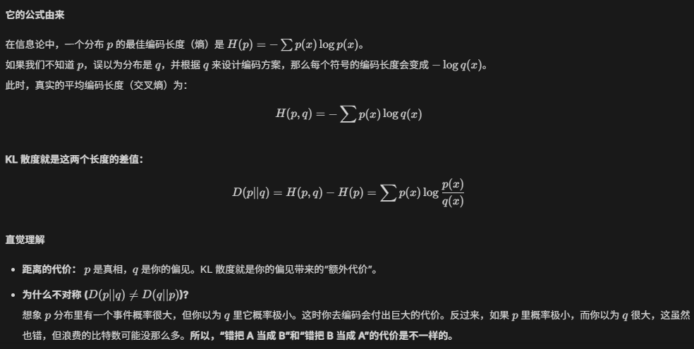

### Fano 不等式
连接信息量（熵）和工程准确率（错误率）的桥梁。它回答了一个核心问题：如果你对某个信号 X 的剩余不确定性（条件熵 $H(X|\hat{X})$）还很大，那么你猜错 X 的概率 $P_e$ 最小是多少？
> 信息丢失太多（剩余熵太大），你会损失准确度（错误率有下限降不下来）
$$
H(X|\hat{X})\leq H_2(P_e)+P_e\log(K-1)
$$
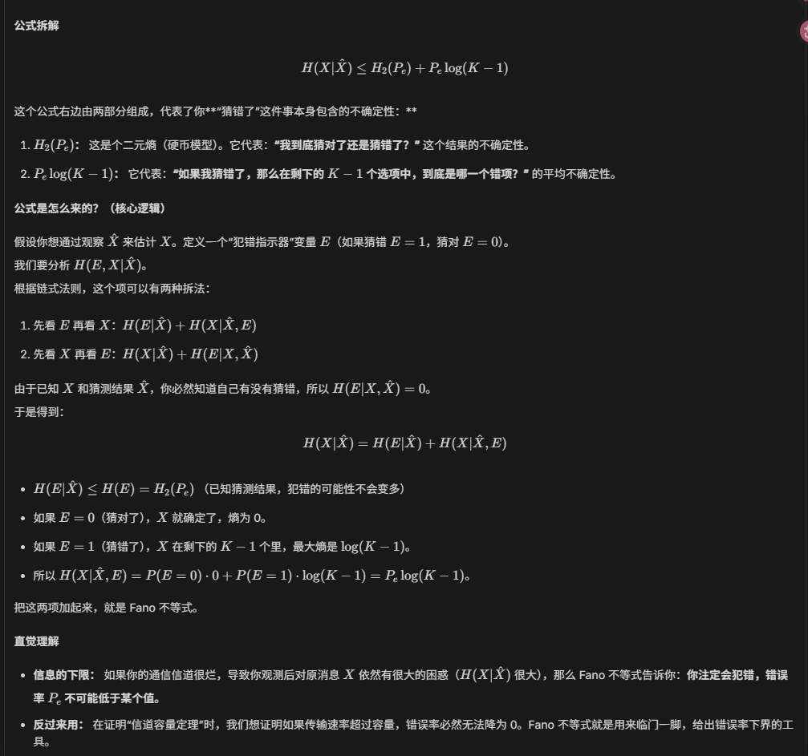

### 马尔科夫链与数据处理定理
马尔科夫链的核心就是，在给定 Y 的情况下，X 与 Z 相互独立。Z 是通过 Y 产生的，不直接接触 X。
数据处理定理的核心就是，由于马尔科夫链的中转特性，下游的后处理不能创造信息。
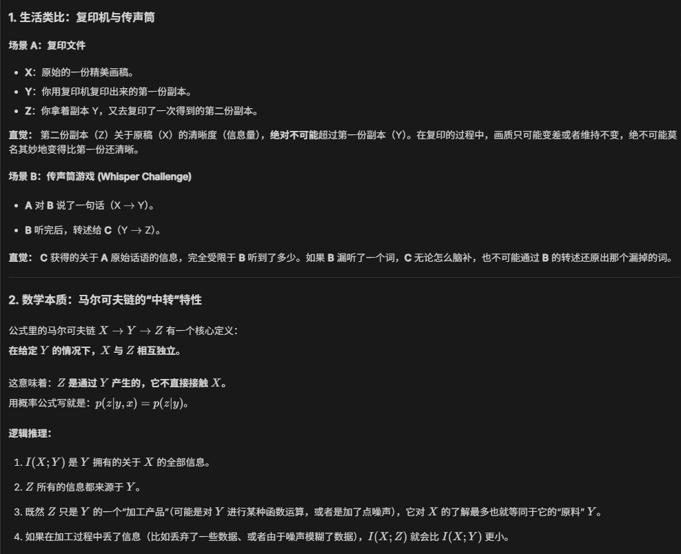

## 易错点
### 非负性
#### 离散变量的自信息和熵
- 自信息：非负。因为你不可能通过观察一个事件的发生而变得比原来更无知。
- 熵/联合熵/条件熵：非负。本质上是自信息的加权平均，无论多少系统放在一起，无论已知多少信息，对结果的猜度最准也就是完全确定熵为 0，不可能把不确定性变成负值。
- 相对熵：非负。
#### 离散变量的互信息和熵
- （点）互信息：可以为负数。为负数时意味着 x 和 y 发生的概率比它们彼此独立时还要小，观测到 y 发生反而降低了 x 发生的可能性，这种“相互抵消”的作用在个体事件层面表现为负值。
- 平均（随机变量）互信息：非负。意味着从统计平均上看，了解一个变量 Y 绝不会增加对变量 X 的不确定性。
> 从平均上看，信息总是消除不确定性的；但对于某个具体的场景，新信息的出现反而可能让你变得更糊涂。

#### 连续变量的微分熵+互信息+熵功率
- 微分熵：可以为负数，仅限连续变量+概率密度大于 1 时。
- 连续互信息：非负。
- 高斯分布(正态分布)：在所有方差固定的连续分布中，高斯分布的微分熵最大；方差代表功率（能量），在给定能量限制下，高斯分布是最混乱、最随机（也就是熵最大）的分布。
	- 高斯熵公式：$h(X)_{max}=\frac{1}{2}log(2 \pi e \sigma^2)$
	- 这就是为什么在通信中，我们假设噪声是 **加性高斯白噪声（AWGN）**。因为在功率限制下，高斯噪声是最能破坏信息的（最乱的）。
- 熵功率：作用就是把熵（比特）换算成功率（方差）。若一个随机变量 X 的微分熵是 $h(x)$，那么它的熵功率就是拥有同样微分熵的高斯分布所具有的方差。
	- 把 $h(X)$ 代入高斯熵公式，就可以反解出：$N(X)=\frac{1}{2 \pi e}e^{2h(X)}$
#### 平稳信源+马尔科夫信源+熵率
- 熵率 $H_\infty$ ：一个信源平均每个符号带给你的新信息
	- $H_infty=$ 
	- 对于平稳信源，由于规则不随时间改变，上式也写成
- 记忆会降低熵率
	- 根据条件熵小于等于熵，记忆越多，剩下的不确定性越少
	- 信源分为无记忆和有记忆
	- 马尔科夫信源
- 熵率越低，说明这本书的规律越强，后文可预测性越强，冗余信息越多，文件可压缩性越强
## 本质理解
### 熵=编码长度
1. 熵解决了不确定性的量化问题，就如同温度这个指标之于冷热程度。
2. 而信息是消除不确定性的东西，所以信息增量等价于熵减（即不确定性的减少量）。
	- 还没观察时：熵 = 存在的不确定性。  
	- 观察之后：熵减 = 获得的信息量。
3. 而信息量本身可以用编码长度衡量。
4. 又因为熵是一个事件自信息的加权平均。
5. 所以熵在物理意义上就等价于：在最优编码方案下，表示该事件所需的平均最短编码长度（比特数）

- **熵**是系统内在的**不确定性**（需要多少信息才能消除这种不确定）。
- **编码长度**是消除这种不确定性所需的**物理代价**（需要多少比特）。
    
**香农第一定理（无失真信源编码定理）** 证明了：  
任何压缩算法，其平均每个符号的编码长度 L 不可能小于该信源的熵 $H(X)$。
所以：**熵 = 极限压缩后的单位长度。** 
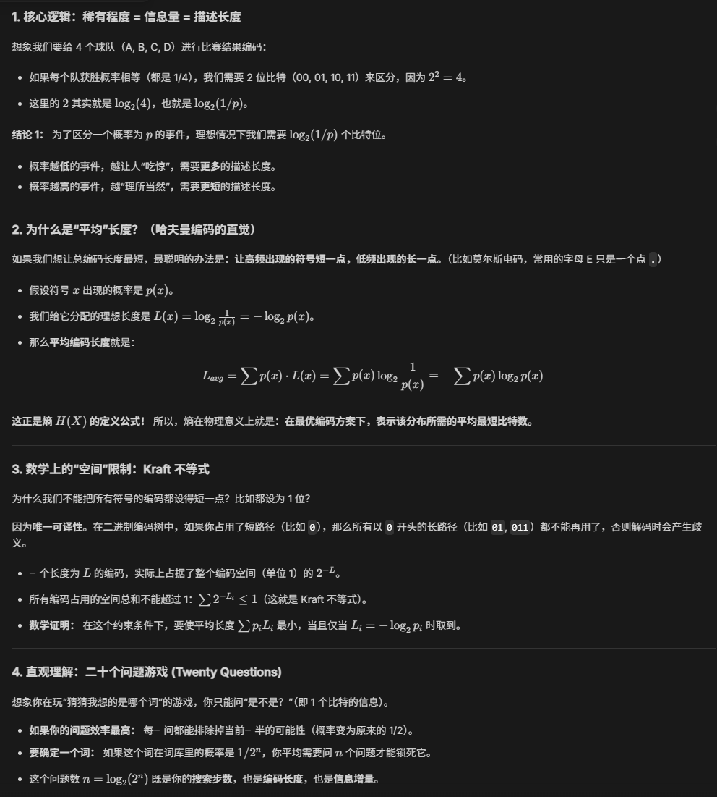

### 从离散到连续
微分熵其实不是绝对的信息量，$-logf(x)$ 表示相对单位密度 $f(x)=1$ 的惊喜程度，微分熵为负代表它比标准参考系更确定。
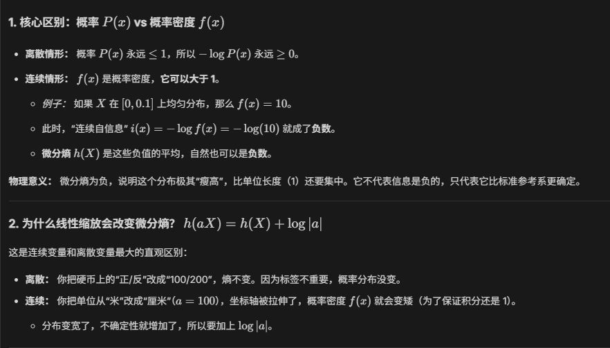
不存在连续自信息和连续（点）互信息这个概念，因为连续变量观测到某一个精确点的概率为 0，信息量会是无穷大，这没有意义。
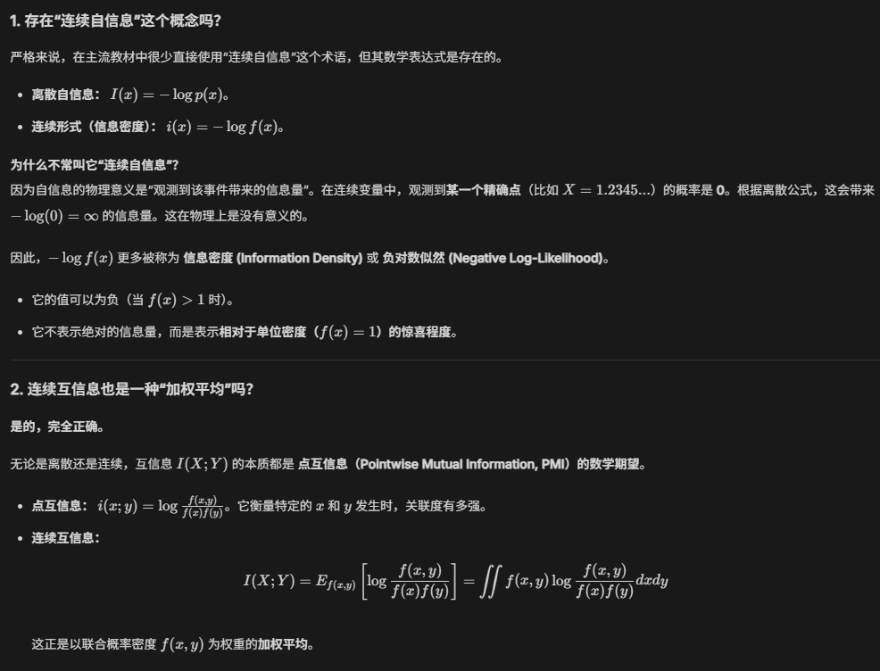

### 事件的自信息 $\neq$ 事件的不确定性
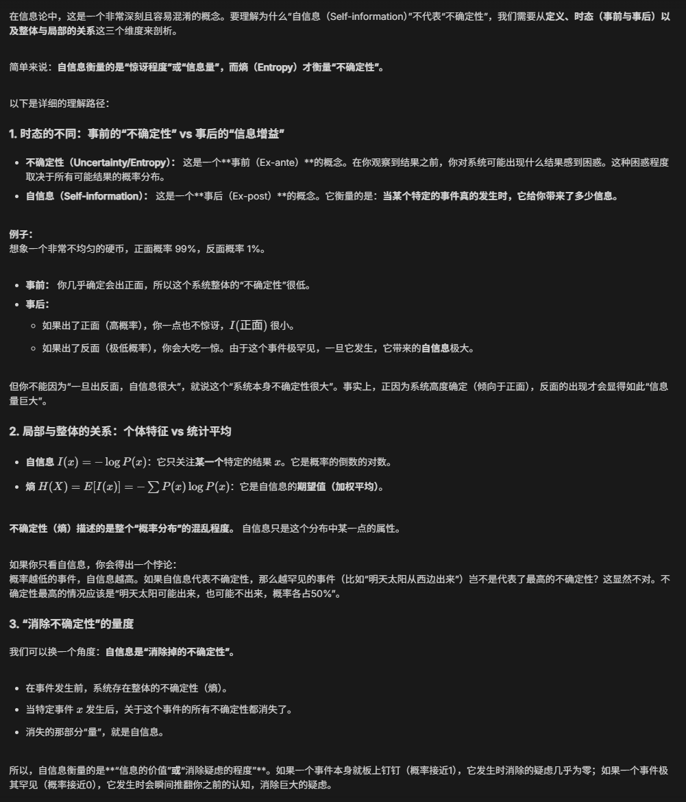
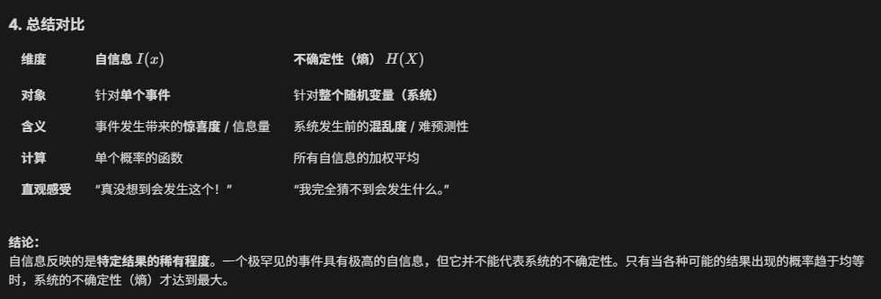

## 数学证明
### 证明离散和连续互信息非负（詹森不等式+对数的凸性）
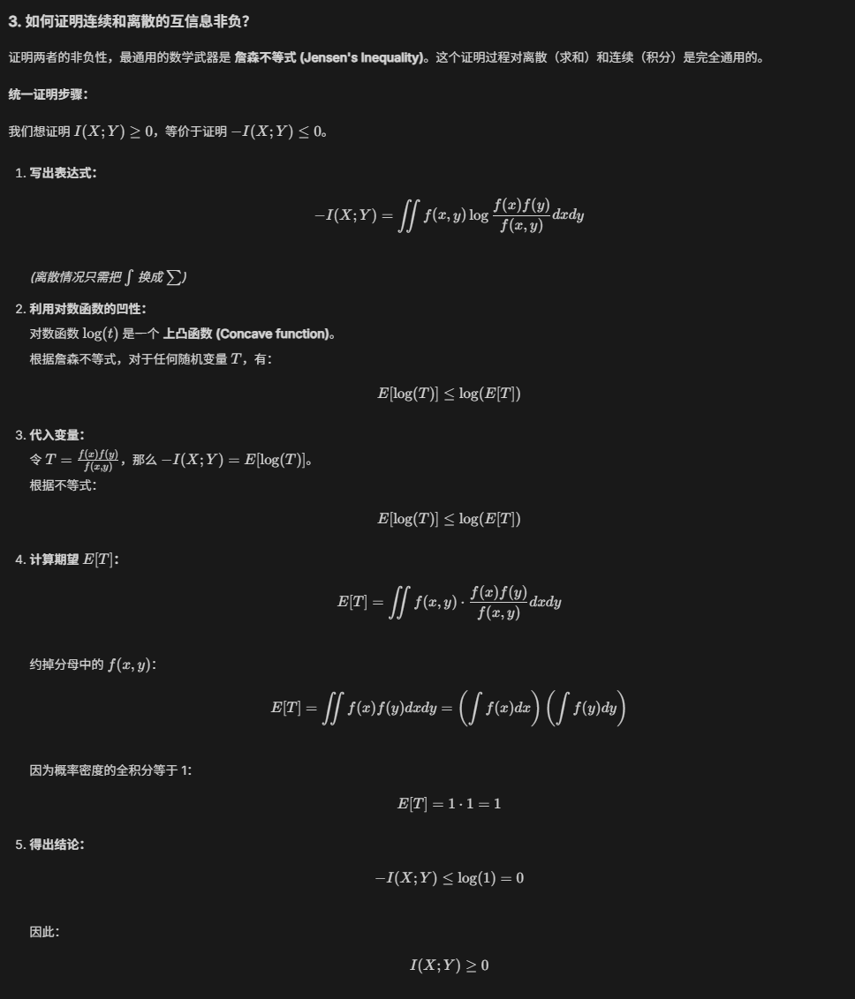
相对熵也可以同理证明非负
实际上，相对熵非负可以推导出平均互信息非负，因为有公式：
$$
I(X;Y)=D(p(x,y)||p(x)p(y))
$$
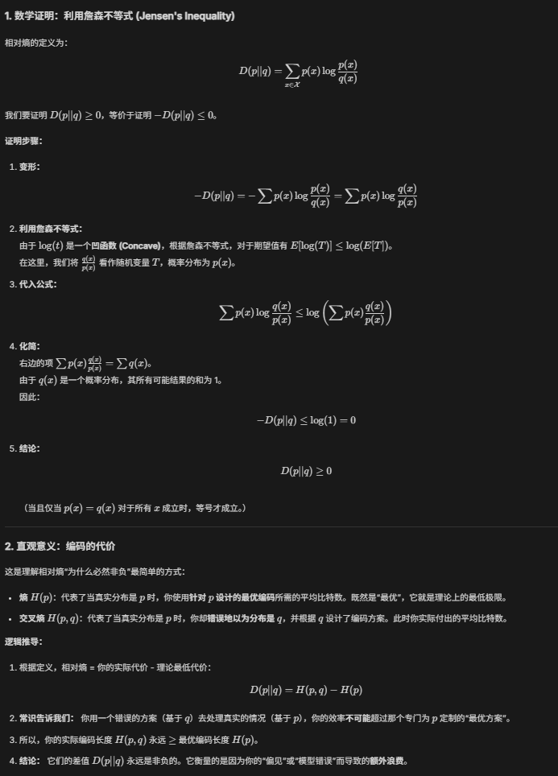

## 解题方法
### 2.1 求互信息最大值
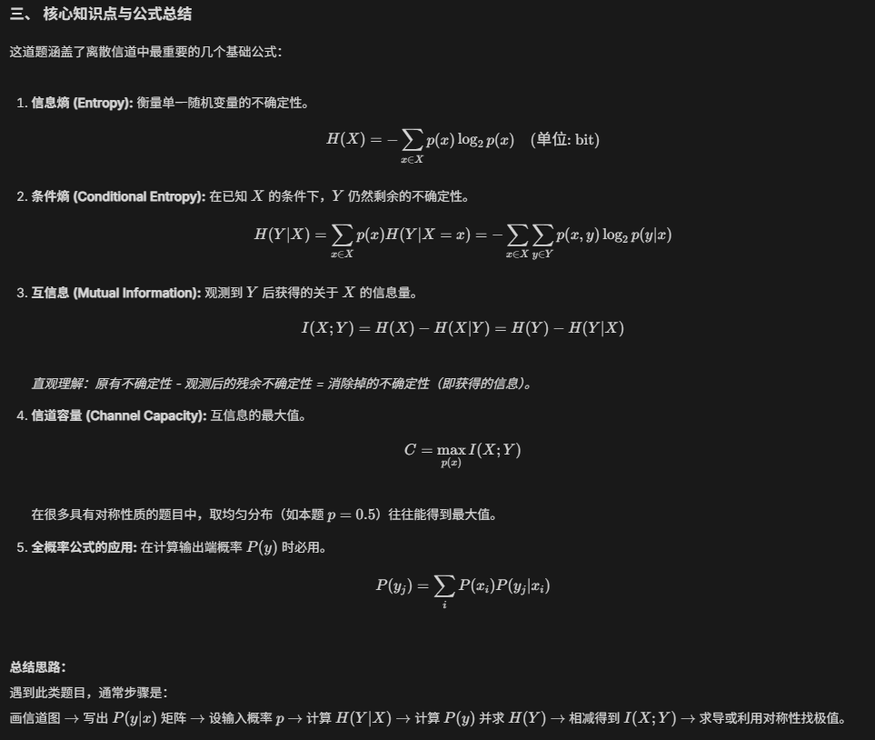
### 2.3 求条件熵
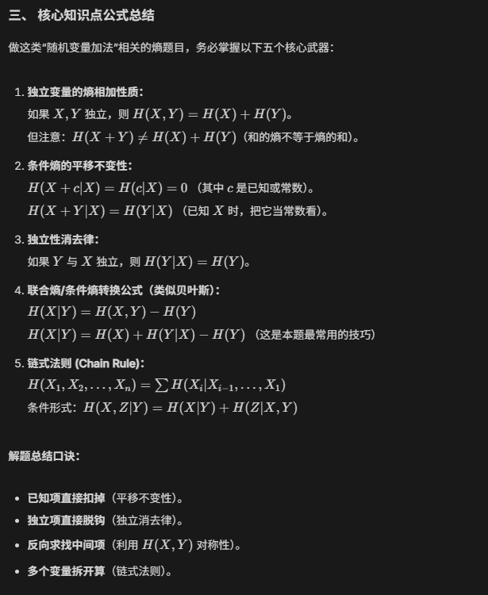
### 2.5 求平均互信息
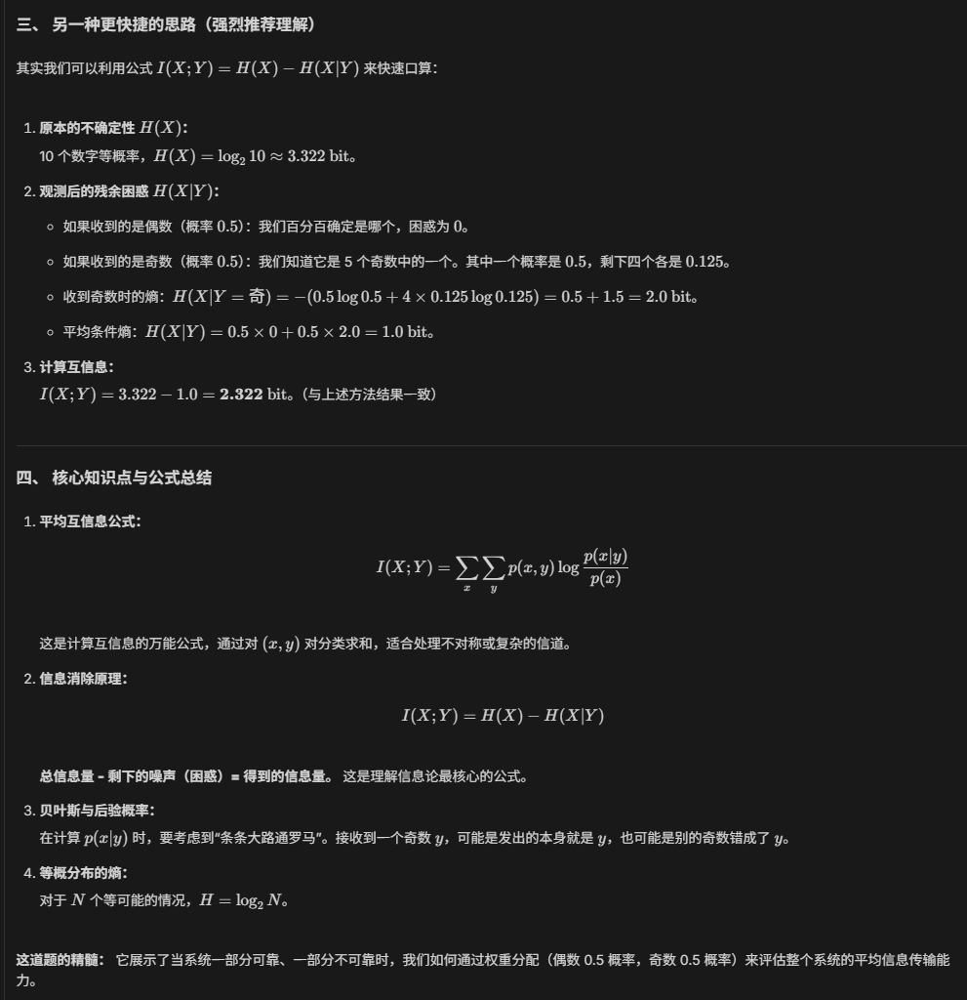
### 2.6 利用熵的性质证明不等式
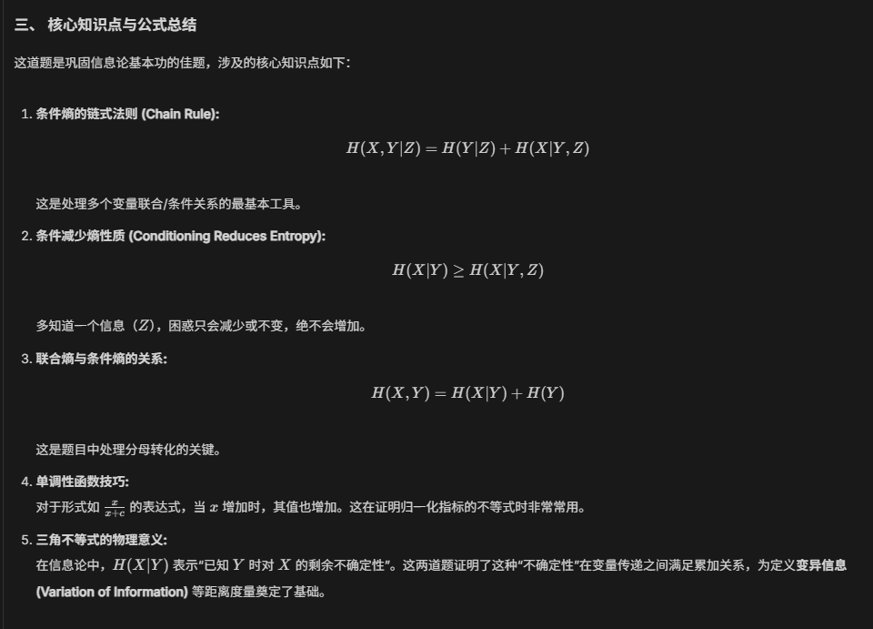 

### 2.9 Z=X+Y 公式推导
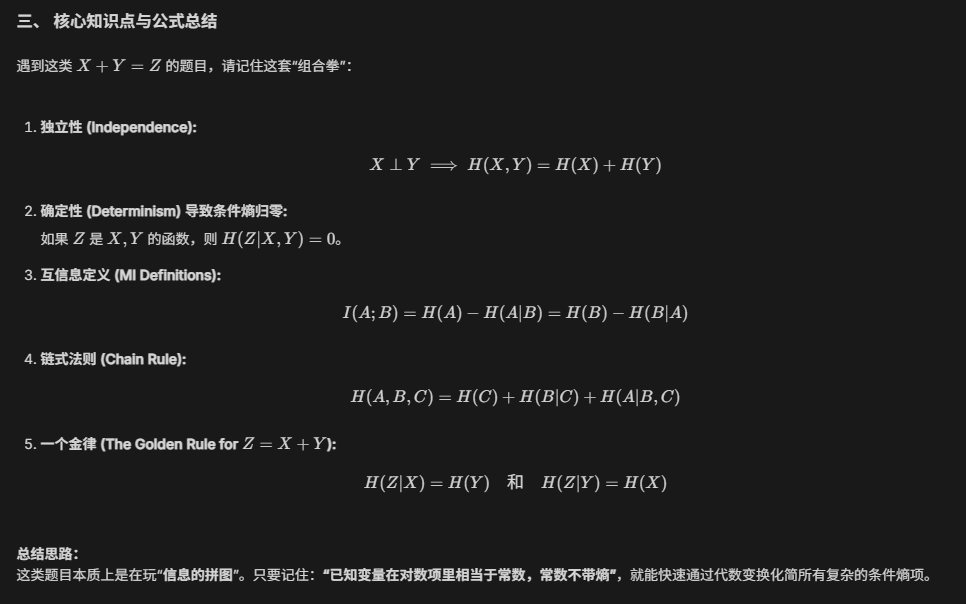

### 2.12 条件熵
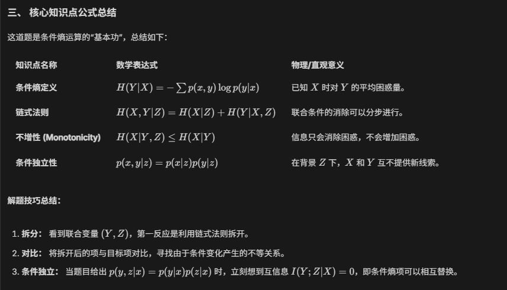
### 2.13 混合熵
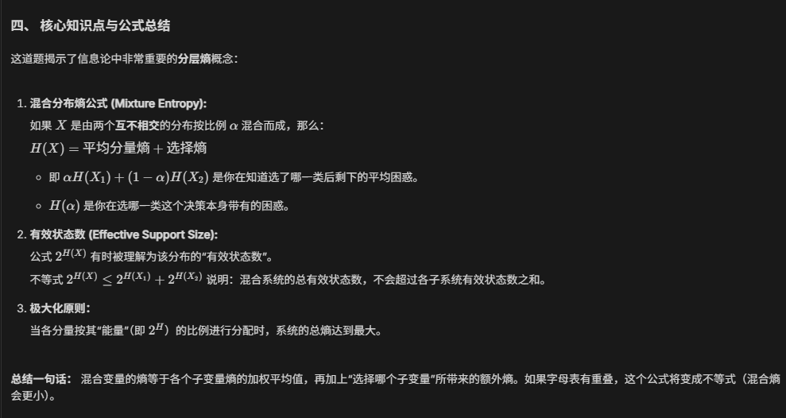