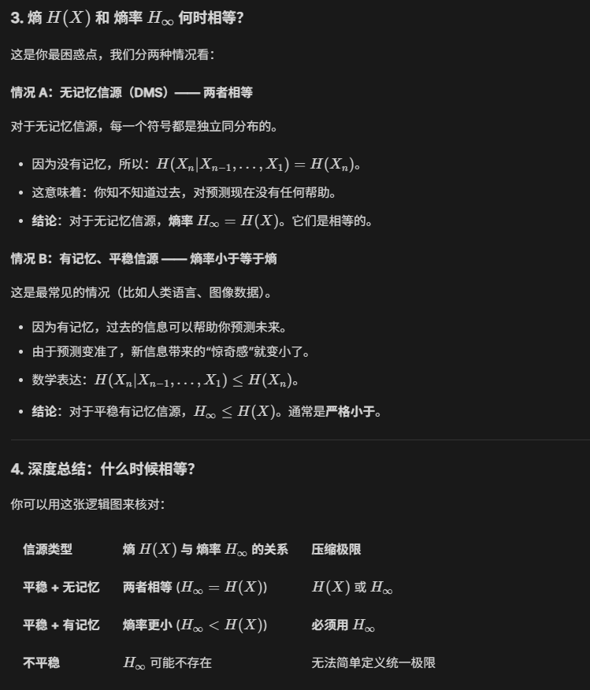
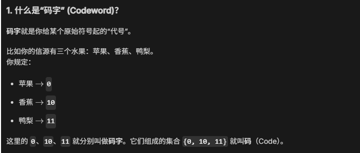
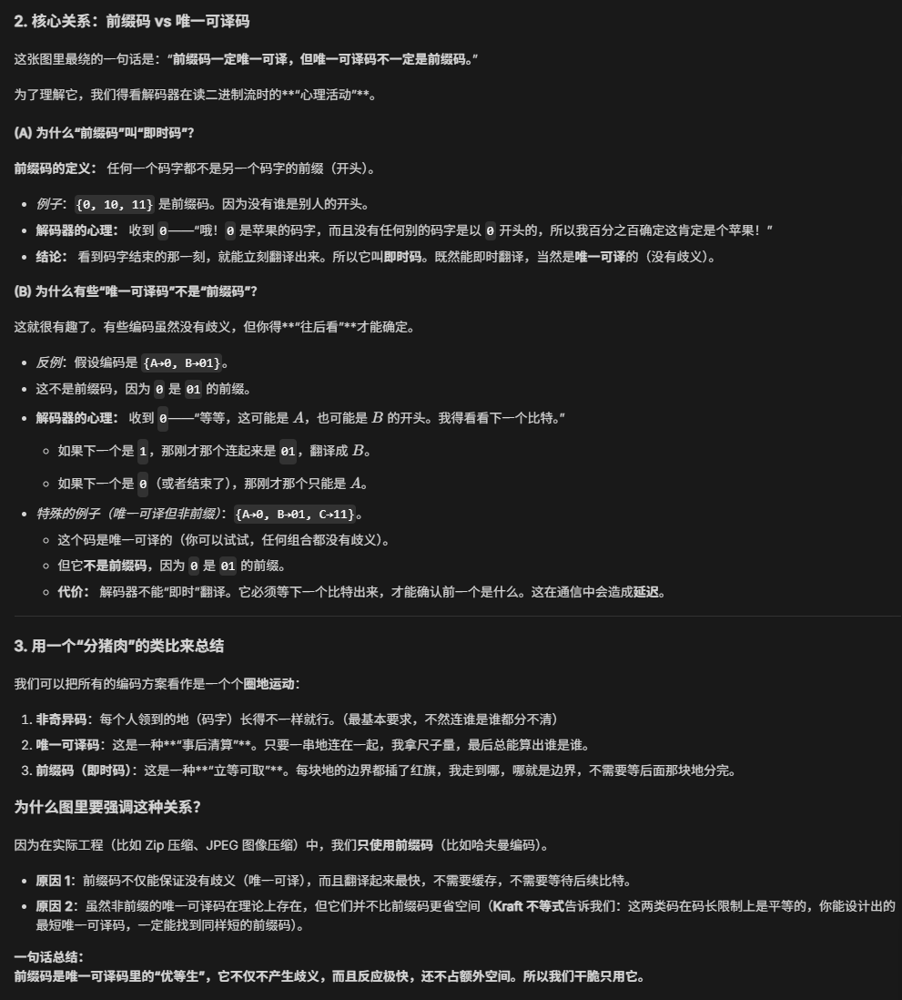
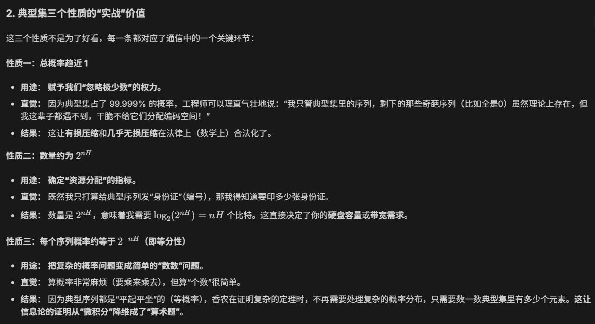
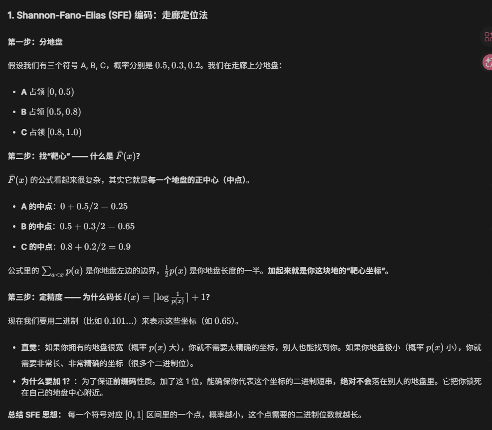
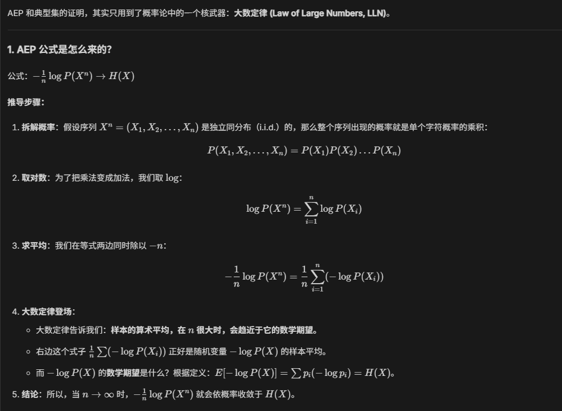
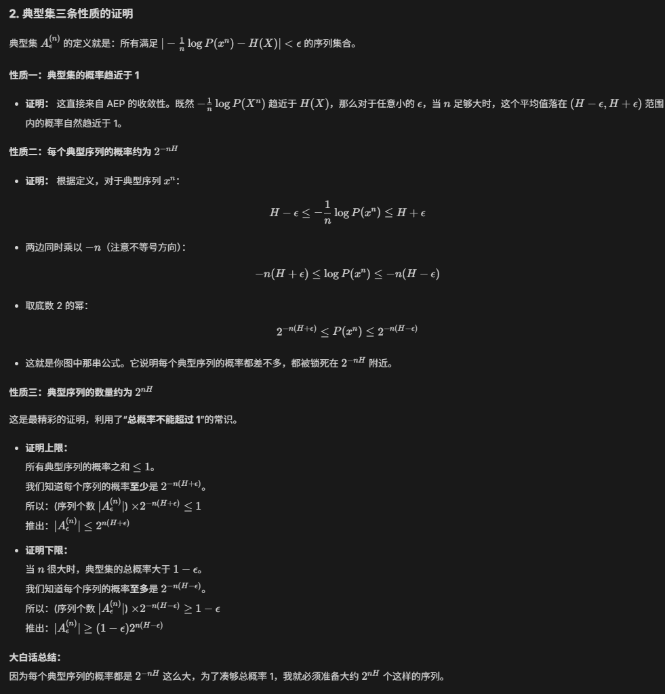
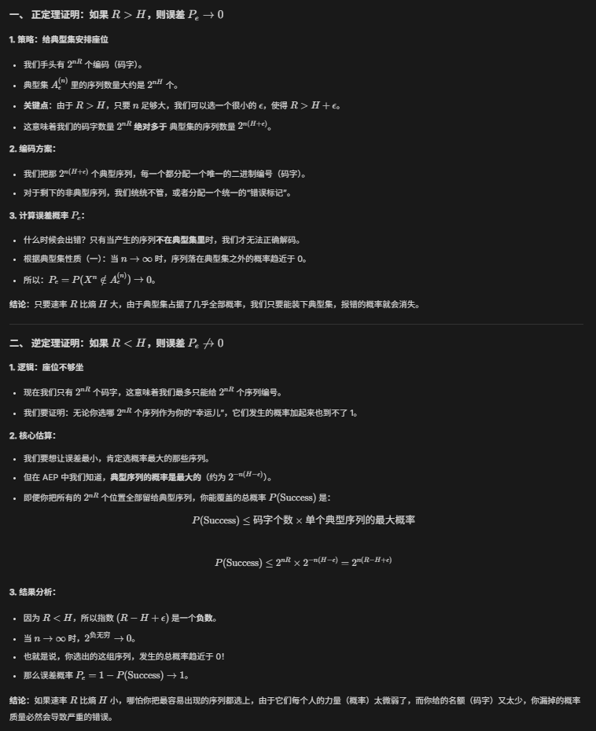

> 从一个随机变量到一串随机变量（信源）的跨越
> 如果信源有概率规律，最少用多少比特可以无损表示
## 重点
### 理论极限
- 离散无记忆信源 DMS：独立重复实验
- 渐进等分性 AEP
- 典型集：所有满足 $|-\frac{1}{n}\log P(x^{n})-H(X)|<\epsilon$ 的序列集合
	- 典型集概率趋近于 1
	- 每个典型序列概率约为 $2^{-nH}$
	- 典型序列数量约为 $2^{nH}$
### 具体实现
- 等长信源编码定理（香农第一定理）：R > $H(U)$ 时，犯错概率接近 0，否则一定会犯错
- 不等长编码：求平均码长
	- 非奇异码
	- 唯一可译码：前缀码一定唯一可译，唯一可译不一定是前缀码
	- 即时可译码/异字头码/前缀码：一般都用前缀码不用唯一可译码，因为码长一样但不用存储即时可译
- Sardinas-Patterson 判据（查重算法）：不断构造后缀集合看看有没有和原码字重了的
- Kraft 不等式：
	- 对于唯一可译码及其子集都成立
- 不等长编码定理：
	- 下限：H
	- 上限: H+1
	- 分块编码：把 L 个信源符号捆在一起编码，那个多出来的 1 bit 就被 L 平摊了，因此分块编码永远比单符号编码更接近熵 H。
- Huffman 编码：单符号最优编码，给定概率分布下平均码长最短的前缀码（画树，自底而上）
	- 对于有记忆信源，单纯用 Huffman 压缩不到极限 
- 概率区间占位法编码：概率区间越小，需要越多二进制位定位
	- Shannon 编码（直觉，存在性证明）：码长为自信息向下取整
	- Shannon-Fano 编码（自顶而下）：通过按概率划分集合构造前缀树，即，把所有符号按概率排好，尽量从中间劈开，让两边的概率和相等。左边给 0，右边给 1。递归下去。
	- Shannon-Fano-Elias 编码（打靶，二维几何坐标）：把 `[0,1)` 的区间看作总概率，每个区间中心作为这个符号的特征坐标，用二进制小数去表示这个坐标。是算术编码的前身亲爸爸。
- 有记忆信源编码
	- 无记忆平稳信源：H
	- 有记忆平稳信源：$H_\infty$
	- 马尔科夫平稳信源：$H_\infty$，用状态信息编码（马尔科夫信源是一种有记忆信源，是短时记忆，但不一定平稳）
	- 上下文越能预测下一个符号，平均新信息越少，压缩空间越大
## 易错点
### 压缩极限与熵
-  $H(X)$ 边缘熵：指你孤立地看一个字母时的不确定性。
-  $H_\infty$ 熵率：指在你知道了前面所有历史信息的情况下，下一个字母带给你的平均新惊奇感。

- 无记忆信源：压缩极限是 $H(X)$ 
- 有记忆信源：压缩极限是 $H_\infty$
> 这两句话成立需要一个前提，就是信源必须是平稳的。
> 在信息论讨论压缩极限时，我们默认讨论的是**平稳信源**。只有平稳，规律才恒定，压缩才有意义。

熵率与熵什么时候相等？

## 本质理解
### 如何理解编码率（速率）
编码率 coding rate：平均每个信源符号分到多少个比特。（单位：bits/symbol）
想象成一群人 (信源) 排着队在走红毯，而这个红毯也在以一定的速率（信道容量 C）铺开。信源是步数，编码率 R 是每步走多远，“步数 × 步幅”就是你前进的真实速度。
- 若 R>H，你给的“流量配额”够了，信息能流过去；若 R<H, 有人走得太慢了，信息流就会堵塞
- 若 R>C，想要流出的速度大于水管能承受的速度，就必定会有信息丢失，走到红毯外面来了；若 R<C，就能保证一直在红毯上走，传输是可靠的
### 信源符号+码字+码
码是信源符号对应的码字的集合

### 前缀码和唯一可译码

### AEP 和典型集有什么用
#### AEP 重要在它确立了压缩的极限
AEP 实际上就是说：对于一个原始概率不均匀分布的序列，在 n 非常非常大的时候，真正会发生的那些序列（典型列）的概率是等分的，所以叫做渐进等分。这个性质揭示了：任何平稳遍历信源，只要长度足够长，其表现都像是一个“均匀分布”。
AEP 建立和熵和编码长度（比特位）的不等关系。AEP 证明了：只要 n 足够大，你就可以

#### 典型集 3 大性质的意义

### 等长编码
等长编码就是所有信源符号码长都是编码率 R 。
在实际情况中，我们通常是对一组长度为 L 的序列（$U^L$）进行整体编码。编码率 R 是平均每个信源符号分到的比特数。
有时候 R 不是整数，这也是为什么等长编码通常是对 L 个符号组成的块进行编码的原因。码字长度一般指整个块的长度，n=LR。

### Shannon-Fano-Elias (SFE) 编码

## 数学证明
### AEP 和典型集的证明
关键利用了大数定理：在 n 很大时，样本的算术平均会趋近于随机变量的数学期望

从典型集的定义出发

### 证明等长信源编码定理

## 解题方法