> 有噪声时，每次使用信道最多能可靠传多少 bit？
> 答：信道容量
> 发出去的是 X，接收到的是 Y
> 信源编码是压缩，信道编码是纠错

> $H(Y|X)$ ：已知 X 后 Y 还剩下多少不确定性
> $I(X;Y)=I(Y;X)$：已知 X 后，Y 减少的不确定性；Y 中包含的关于 X 的信息

## 重点
### 信道容量
- 信道模型
	- 信道的表示：$p(y|x)$ 为信道噪声
	- 信道容量
		- 对一般信道：算数平均
		- 对离散无记忆信道 DMC：$max_{p(x)}I(X;Y)$
		- X 带给 Y 的互信息 $I(X;Y)$ = $H(Y)$ - $H(Y|X)$ 信道噪声（已知 X 后 Y 还剩多少信息量） 
		- 由于信道噪声是固定的，我们只能通过调整发信号的概率 $p(x)$ 来最大化收发双方的互信息
- 常见信道模型
	- 无损信道：$C=log(输入符号数)$
	- 确定性信道：$C=log(输出符号数)$
	- 无用信道：C=0
	- 二元对称信道 BSC：$C=1-H_2(p)$
	- K 元对称信道
	- 模 K 加性噪声信道：$C=logK-H(Z)$
- 容量优化直觉
	- 只使用能带来满额通信容量的符号，否则就不用这个符号 
### 信道编码
- 传输速率 $R=\frac{logM}{N}$，用码长 n 传输 M 个消息
- 可靠传输：当码长 n 趋近于 $\infty$ 时，报错概率 $P_e$ 可以变成 0
- 香农第二定理：分为正反两定理
	- R<C 时 R可达：证明的关键在于随机编码
	- R>C 时 R 不可达：Fano 不等式
- 反馈不能提高信道容量
	- 理想反馈
	- 香农第二定理已经证明了，即便没有反馈，只要你用的码字 n 足够长，就能达到物理极限 C。反馈只是让你更容易达到这个极限，而不是把这个极限抬高。
- 信源信道分离定理：不用针对不同的图片/视频设计不同的通信网络
	- 若信源的熵率 H<C，能可靠传输，做法如下：
		- 信源编码（只管压缩）：把信源压缩到略大于 H 的编率 R
		- 信道编码（只管抗噪）：用低于 C 的最高编码速率 R 可靠传输被压缩的比特
		- 保证满足关系：H<R< C
	- 若信源的熵率 H> C，不能可靠传输，因为找不到满足上述关系的 R
### AWGN 加性高斯白噪声信道
> 在有限功率 P 和固定噪声 N 的条件下，最大可靠传输速率是多少？
> 研究**连续的电压值**在**连续的噪声**下，最高能支撑出多少个**离散的等级**而不出错。

- 离散时间 AWGN 容量
	- 为什么高斯输入最优：噪声熵固定，想最大化互信息，就要让输出熵尽量大。功率固定时，高斯分布最 “散”。若 Y 为高斯分布，则 X 也为高斯分布。所以高斯输入最优。
	- 几何直觉：球填充
- AWGN 编码定理与逆定理
- 高斯平行信道与注水法则：噪声底 Ni 低的子信道先被填水，噪声太高、超过水位的子信道不分配功率
- 带限模拟高斯信道：加带宽 W 比加功率 P 更有效
- 功率、带宽和能量效率
	- 频谱效率：每 Hz 每秒能传多少 bit
	- 能量效率（每比特能量）：传每 bit 要花多少功率
	- 香农极限：即使带宽趋于 $\infty$, 要想通信，每比特能量与噪声功率谱密度的比值不能低于 ln 2
	- 香农容量定理中的 “错误概率可趋近 0” 依赖无限长码和理想编码。实际系统有限码长、有限复杂度、调制方式受限，所以不会真的达到零误码。
## 易错点
### 熵&编码率
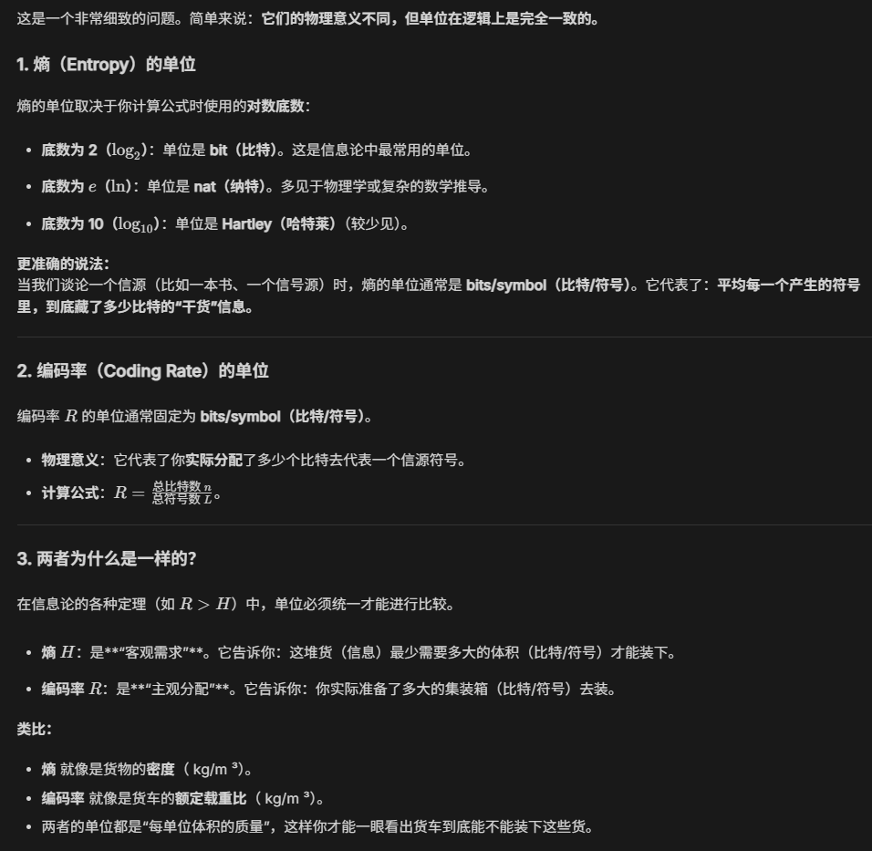

### 信源编码与信道编码中编码率 R 的概念区别
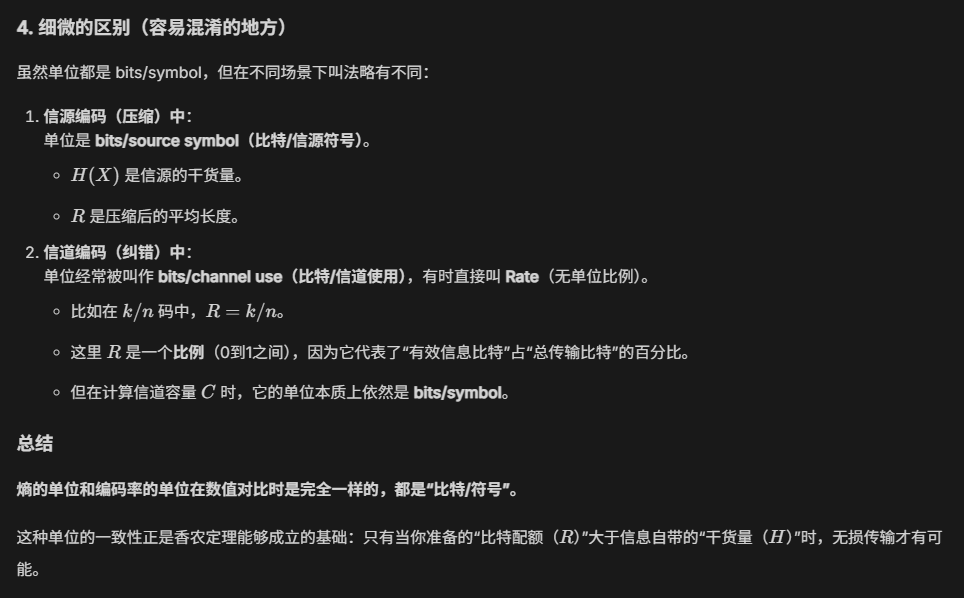
## 本质理解
### 香农第二定理的物理直观理解
总空间：$H(Y)$
每朵云占空间: $H(Y|X)$
最多允许多少个云：$I(X;Y)$
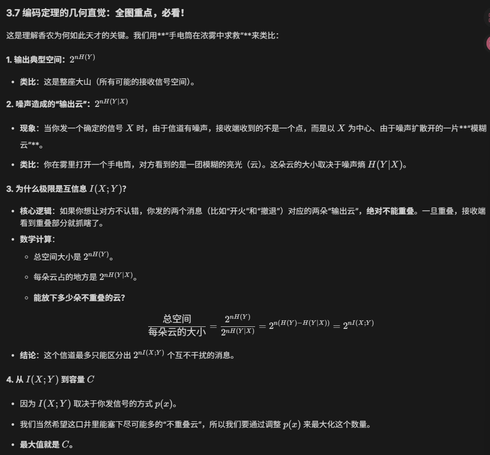

### AWGN 讨论的是离散 or 连续
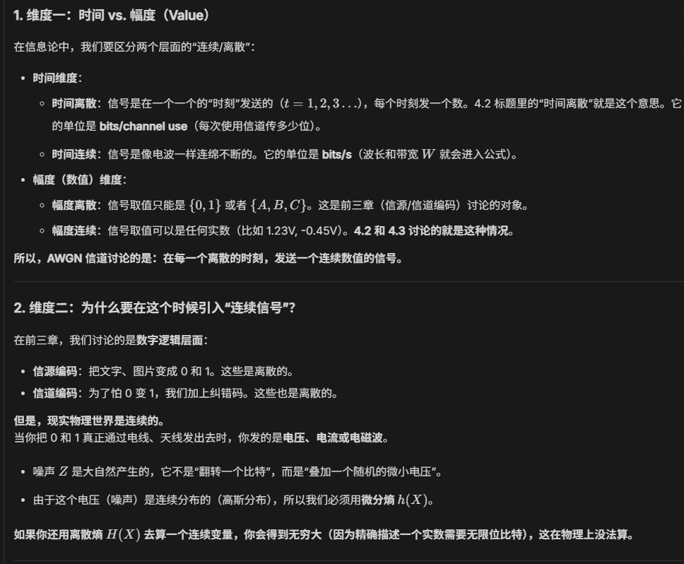
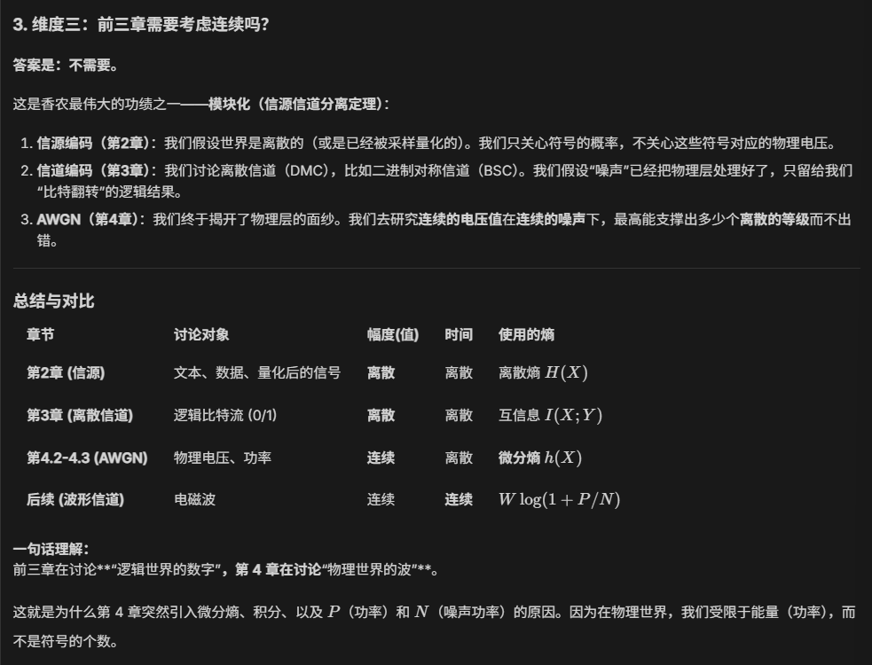
## 数学证明
### 常见信道模型
这几个证明其实都在用同一个套路：
- 计算噪声带来的困惑度 $H(Y|X)$
- 发现这些信道都有**对称性**，使得噪声困惑度是一个跟输入无关的常数。
- 于是，最大化互信息就变成了简单的“让输出尽可能杂乱（最大熵）**”。
- 对于这些对称信道，只要**均匀地发送**所有输入符号，就能达到这个最大能力。
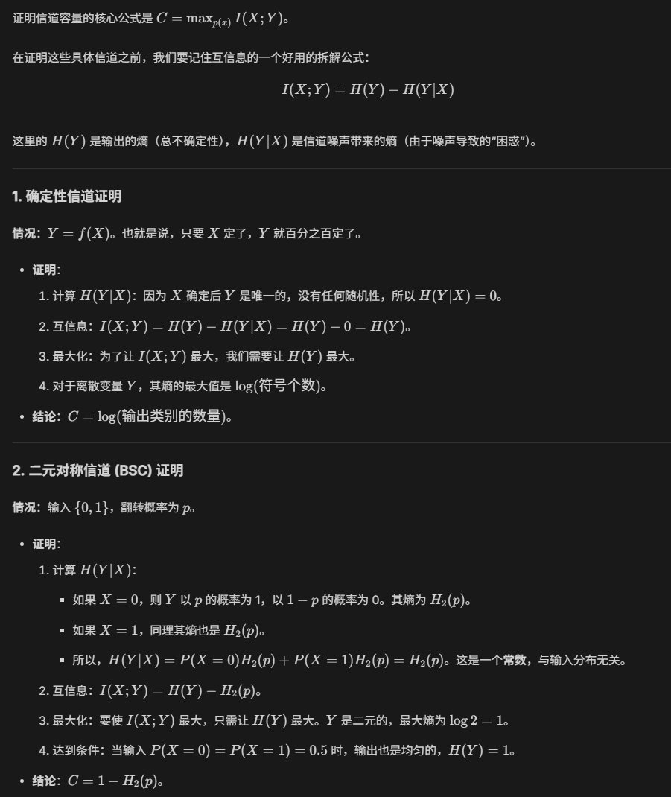
关于熵的平移不变性：已知 $X=x$ 时，Y 的不确定性完全来自于 X 的抖动，不论你把中心选在 x=0 还是 x=100，Y 的抖动方式始终与 Z一模一样。
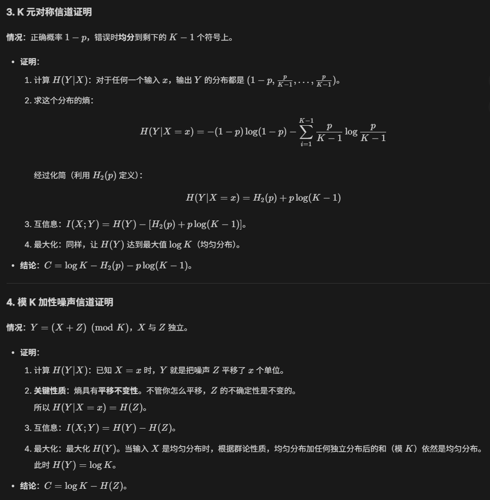
### 香农第二定理的证明
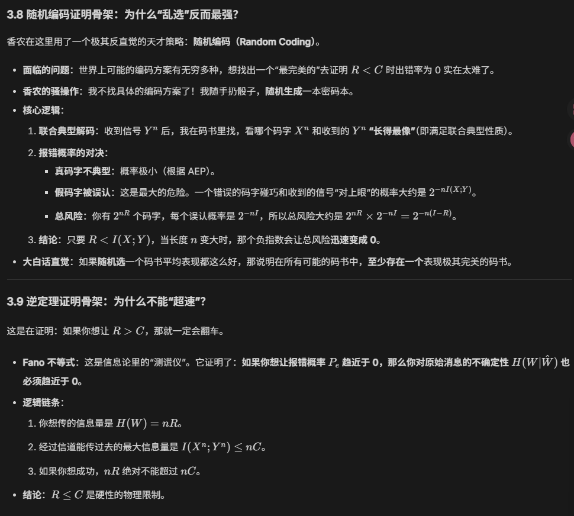
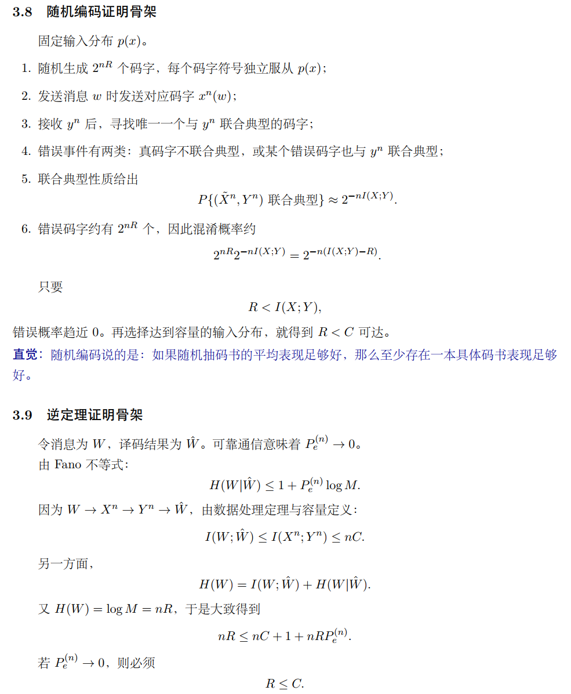

### 注水法则
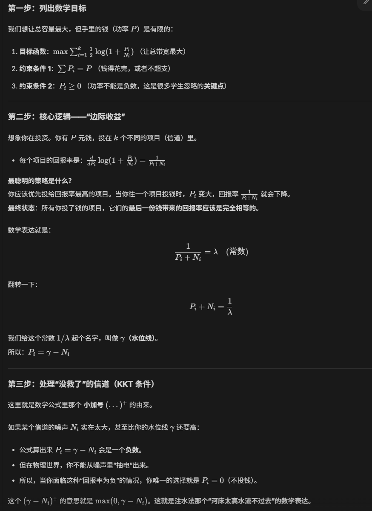
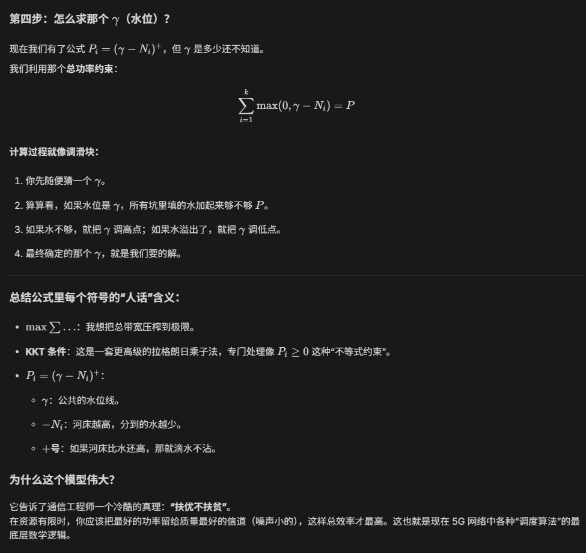

## 解题方法
