# 前言
这学期最最重要的目标，就是：
## 绩点
因此，我要求你，现在对所有课（这学期只有一门通识课）
- 课上：
- 课下：
- 备考：多多与信电和同专业的人交流，互帮互助；要真的会做而不是只在脑子里想想
- 心态：要完全应试导向，杜绝知识学懂了但是考不出高分的现象
## 竞赛
这学期主要有这些项目：
- 无人机：
- 英特尔杯：
- 电赛：
- 创赛：
## 科研
SRTP 要做，主要目的有：

# 前人经验
## 信号与系统-4 学分
信号反正到后面就是公式大赛，中文版就硬背，但是英文不用背开卷
### 课程体验（双语）
成绩构成：作业10%，Project20%，期中考试30%，期末考试40%

这门课程由龚小谨讲授前半学期有关离散/连续时间系统、拉普拉斯变换、Z变化、卷积、频率响应、反馈的知识，张婷老师则负责后半学期离散/连续傅里叶级数/变换、采样、调制的内容，陈晓明老师负责实验课的教学，前半学期一共四次习题课，后半学期一共两次习题课，都是由助教讲解作业题。

据张婷老师说，这门课是由我们学院的徐文老师从MIT博士回来之后开设的，这学期的最后两次理论课也是由他来上的，课件、作业、考试都很大程度上参考了MIT6.003这门课程，MIT OpenCourseWare有这门课程的所有资料，可以自行参考。

作业不算多，**一共八次作业，基本上一半来自MIT的作业，一半来自课后习题**。一共五次Lab，除了最后一次Lab不需要上交报告以外，其他四次Lab在上课会讲授一些核心问题的解决方案以及代码，课后需要把上课讲的以及没讲的题目都做好写成报告上交。

今年**期中和期末考试的难度都不算大，有不少来自6.003或者课后习题，想取得高分的同学可以重点看一下6.003的作业以及考试题目**。张婷老师还在考**前提醒我们看历年卷和MIT**的题。

三位老师对待上课还是比较认真的，尤其是后两位老师，但是课程安排不太合理，总有一种这东西明明上不了很久的感觉，好几次理论课都是课件已经讲完了但是下课时间远远还没到，6.003花了25$\times$50min的时间，而我们理论课花了47$\times$45min的时间，是人家的1.7倍，上课的内容却是大致相同的，希望在课时安排以及内容上有所改变。

**这门课光听课和看PPT是不完全够的，可以看书、看例题、刷题等等，有条件的可以全程跟着6.003自学。** 相对信电的另外两个专业来说，这门课程对于后续课程的学习没那么重要，因为信工和电科大三还有数字信号处理等课程，这门课程对于信号处理方向还是十分重要且基础的一门课。

相对于中文班，英文班没有大作业(就连一向没有大作业的郑斌老师这个学期也布置起了大作业)，并且期中考试之前的内容在期末考试不会涉及，而且考试全是大题，题型相对固定，没有很多的套路，内容也相应的少一些，期中考试一纸开卷，期末考试两纸开卷，可以省下记公式的时间，还可以抄一些例题上去。~~虽然分还没出，但我个人还是比较推荐的。~~出分了，给分不错

2025.1.11补充：双语/英文班可以看6.003的视频(注意是上课的录播，而不是老爷子专门录的类似mooc一样的视频，老爷子的视频是按照书的顺序上的，而录播课不完全按照书的顺序上而且和校内教的顺序更符合) 中文班可以看胡浩基老师的网课注意英文班和中文班的上课内容以及考试内容也不同最好是对应着看

[关于信号与系统大作业的一点心得 - CC98论坛](https://www.cc98.org/topic/5646989)
### 课程体验（中文）
成绩构成：平时70%（具体忘了，有两次小测，一份大作业）+期末30% 
（1）签到+作业：不签到，平时作业会看正确度 
（2）小测：两次，每次都是15min，不难，可以看老师github的课程仓库。我的找不到了回去翻翻看还在不在 [VipaiLab/Signals-and-Systems-course: 浙江大学信电学院2022信号与系统课程资料](https://github.com/VipaiLab/Signals-and-Systems-course) 
（3）大作业：善良的hhj把截止时间放在了考完试后5天，哭晕，认真写即可，给分都不错 （4）期末：题目都不算难，但是我错了很多细节，一定好好学采样定理部分，这个部分讲的不深，但是不认真理解就会和我一样最后一题几乎全错，因为是闭卷，公式越早背越好（暑假写过一份回忆卷但是疑似落在zjg了。。我回去再找找） 
【信电ISEE】2024信号与系统中文班回忆卷+解题思路参考|课程经验 [https://www.cc98.org/topic/5926100](https://www.cc98.org/topic/5926100) 复制本链接到浏览器或者打开【CC98】微信小程序查看~ 
【信电ISEE】若干《信号与系统》历年卷及参考答案（拖了一整个暑假才搞完） [https://www.cc98.org/topic/5980366](https://www.cc98.org/topic/5980366) 复制本链接到浏览器或者打开【CC98】微信小程序查看~ 
【信电ISEE】信号与系统中文班期末复习资料 [https://www.cc98.org/topic/5622668](https://www.cc98.org/topic/5622668) 复制本链接到浏览器或者打开【CC98】微信小程序查看~

### 参考资料
第一本是课本，可以看中文版也可以看英文版；第二本是实验课教材，不会全讲，只会涉及一部分，陈晓明老师会在学期初上传电子版，可用可不用。

Oppenheim, Alan, and Alan Willsky. Signals and Systems. 2nd ed. Prentice Hall, 1996.

Buck, Daniel, and Singer, Computer Explorations in Signals and Systems Using Matlab, Second Edition, Prentice Hall, 200 (BDS)

6.003网址：https://ocw.mit.edu/courses/6-003-signals-and-systems-fall-2011/

我自己写的回忆卷：期中https://www.cc98.org/topic/5874467 ;期末https://www.cc98.org/topic/5926059

## 数字系统设计-4 学分
### 课程体验
成绩构成：平时40%（含期中考10%，小测＋作业30%）+期末60% 
（1）签到+作业：会用小测点名！！！后半学期经常早八小测，作业会根据正确度打分，一般错的不多都是满的 
（2）小测+期中：前期的小测历年卷重合度比较高，期中也是，后半学期小测全新的题目，不过从结果来看助教期末算分的时候这部分重新捞了 
（3）期末：历年卷做完基本差不多，判断题很随缘了，补充部分会考2-3题，大题补充讲义部分一定一定要看PPT上的例题（考前还说不考结果最后一题就考了。。） 
建议：从最开始就去b站看王红的视频，这学期活下来全靠王红和老师最后给分的慷慨 
历年卷：老师会在xzzd放的（更老的还可以去lp教师主页扒，有2014-2017的，今年好像考了一道原题 [Peng Liu's Homepage-浙江大学个人主页](https://mypage.zju.edu.cn/liupeng#592253)），参考答案不一定对，建议做完找同学对一下 liupeng@zju.edu.cn

和电基一样，内容实在有点太多了，而且**补充讲义**上的东西老师可能来不及讲，要是没看过历年卷就会在试卷上看到闻所未闻的题型，考的就是补充讲义的知识点，根本不会做。
**一定要看历年卷**，**老师没讲的东西也可能考，要重视补充讲义**，还有那些设计题一定要自己画一下，你的脑子感觉自己看懂了，你的手：这条线到底连在哪里？ lz也不是很擅长这种硬件相关的课程，平时还是学了一点点的，毕竟有期中考和小测，最后手忙脚乱地复习预习了一下后半学期的内容喜提最低绩点。

数电这门课作业和往年小测比较重要
### 参考资料
[数字电子技术基础 1.1 常用数制及数制的转换_哔哩哔哩_bilibili](https://www.bilibili.com/video/BV18Z4y1Q7iq/?spm_id_from=333.337.search-card.all.click&vd_source=a18b4e2a531bfb64d1c42547f9fe1ad7)

### 历年卷
期中
[2022-2023数字系统设计（数电）期中考试回忆卷 - CC98论坛](https://www.cc98.org/topic/5603783)
[2020-2021 数字系统设计期中考 回忆卷 - CC98论坛](https://www.cc98.org/topic/5070091)
期末
## 半导体物理-3 学分
### 课程体验
成绩构成：出勤10%，作业40%，期中考试20%，期末考试30%

出勤？老师好像这学期都没点过名。作业的确是比较难，我经常翻遍PPT的例题和书，绞尽脑汁才能完成一份比较完美的作业，确实是花了很多的时间。**期中考试以作业题为主，可能稍有改编数据，难度不大。期末考试中作业题相对较少，比较考察综合运用，计算量比较大。** 期中期末考试都是在课上花两个小时考的，**考试主要以PPT和作业为主，参考书中的很多内容都不上也不考，考试都是开卷，可带计算器**。

这个班是全英文班，程然老师是NUS的本博，所以英语口语没有任何问题，英文班的好处就是讲的比较细致，把你当作什么都不会的开始教。课程内容的话涉及到晶体、能带、量子力学(前三个部分在固体物理中均有涉及)、平衡半导体、载流子运输、非平衡过剩载流子以及后半学期的器件部分知识，更像是半导体物理与器件(参考书的名字就是这个)。

中文班更“物理”一些，而英文班则讲授一些器件的知识，但是毕竟课程是全英文，想要完全听懂还是有些困难，也容易走神，需要课后花一些时间过一遍PPT，有不懂的可以看书。

~~虽然分也还没出~~出了，听说助教最后平时分都捞了一把，成绩大家应该都挺不错的，但总体来说比较推荐程然老师的课，如果对自己的英语水平非常不自信的话也可以选择中文班，老师也说不希望语言成为大家听不懂本就枯燥的一门课的一个因素。

2024.10.17注：经同学提醒，程然老师班的半导体物理在选课前并没有显示国际化，但是结课之后本科生院的国际化课程中将这门课列了进去，所以这门课程最后被算作了国际化。该情况经供参考，具体以当前学年情况为准。链接：https://bksy.zju.edu.cn/2024/0624/c76423a2938701/page.htm

---
因为课件和授课都是英文，且含有很多英语的专业词汇，上课就会有一些门槛，这里我的方法是**利用提前上传到学在浙大上的课件与许多ai工具（chatgpt、deepl）等，实时跟进老师的节奏**，当然很多时候可能还是听不懂，这时候也不要有太大压力，摸会鱼也是合理的，可以翻阅一下**尼曼的半导体物理与器件**这本书,中文版还是能很详细阐述相关知识的，当然如果还是没听懂还是很正常，这时候就引出到如何课后巩固＋写作业了。

cr老师总共会布置8个作业（有时候会将几个作业合为一份发布），**作业越到后面越难，而且各种原因网上很难找到相关题目，这时候就要回归课堂的知识了**。我选择的方式是整理老师上课的课件，从ppt截图总结到word里，一是可以重新梳理知识点，二也是为开卷考试做资料准备（如果打印全部的ppt也不太现实）。整理完之后，作业应该会好写很多，因为**作业和ppt里面的例题相关度还是很大的，当然不会的题目也可以去尼曼的书上找找，很可能和尼曼的一些例题相似**，如果还是不会的话，也可以找助教哥哥解答。
- 成绩构成：
    - 考勤：10%
    - 作业：40%（会看正确率，8个作业，越到后面越难；但是和PPT上或书上例题相关度大）
    - 期中考试：20%
    - 期末考试：30%
- 全英文：授课、课件、作业以及考试全部英文
- 期中考试：这阶段学习的内容主要为**晶体的一些知识、一些基础的量子力学和基础的能带理论**
- 期末考试：后半部分学习则是**利用能带知识分析具体器件（二极管、三极管、mos管等等），基本不会再考察期中考试的内容（能带除外，毕竟这个太基础了）**
---
老师整个学期点了三次名，第一次课大概率是会点名的，毕竟认识一下新同学。期中考试和期末考试都是在课堂上完成的，开卷（PPT和作业答案都可以带进去），**考试很大一部分都是作业原题**。老师建议使用英文作答，但是用中文也可以。

平时作业一共有8个Tutorials，但是3、4和7、8是一起出的，所以实际上是6次作业。作业全部是英文，刚开始还比较轻松，但是到后面PN结和MOS那一块，作业难度会比较大，综合性也挺强，几乎每道题都有6、7个小问，把书上的大大小小的知识点都考查了一遍。**因为考试大部分都是原题，所以作业一定要认真做，拿到答案之后就仔细和自己的解题思路对照。**

由于老师是用英文讲课的，所以有些概念和定义可以讲的更加清晰明了（老师的原话）。其实我个人这一整个学期听下来，感觉确实如此，只要上课跟着老师的节奏走，其实就能大概掌握大部分的内容。而且虽说是全英文，但是老师每次课课前都会花将近一节课的时间，用中文回顾一下上一次课的要点。

当然，课上听远远不够，还得课下好好复习和总结。**资料的话，老师的PPT就已经非常全面了（所以一定要认真过一遍PPT），教材的话只是用来进一步加深理解的，也不用花时间去专门读教材。**
### 参考资料
Semiconductor Physics and Devices: Basic Principles (Fourth Edition), Donald A. Neamen, McGraw-Hill Education, 2011.

[信电半导体物理英文班复习资料（程然老师班） - CC98论坛](https://webvpn.zju.edu.cn/https/77726476706e69737468656265737421e7e056d22433310830079bab/topic/6205253)

[半导体物理期中/期末总结【cr】【英文班】 - CC98论坛](https://webvpn.zju.edu.cn/https/77726476706e69737468656265737421e7e056d22433310830079bab/topic/6161312)
### 历年卷
[2022春夏 半导体物理 回忆卷 - CC98论坛](https://www.cc98.org/topic/5354918)
[2020春夏 半导体物理 信电 期末考试 回忆 - CC98论坛](https://www.cc98.org/topic/4939315)
## 人工智能-3 学分

## 电设 II-1 学分
这门课是电设一的延续，前半学期做一个示例项目的板子，后半学期自己挑题目完成板子，也是两人一组。

## 数字系统设计实验-1 学分
这门课前半个学期主要是熟悉ModelSim和Vivado的使用，以及完成组合电路的实验，后半学期做一个大项目的实验，最后一次课是期末考试，**占比30%，主要的分数差就在这里**，平时报告好好写。刚开始上课时由于理论课进度比较慢，可以先看相应理论部分的知识，更易于理解。

这门课对于熟悉Verilog还是很有帮助的，虽然当中遇到了许多的困难，但是做完大实验之后还是挺有成就感的。

github上有非常多参考（善用搜索），课程设计讲义也有基本代码，我选的倒计时，其实功能也没法写太多新的了，想拿高分的话建议就是硬件电路上加点东西来增加功能，实验报告好好写就行。 给分相对来说会有点迷，不过如果大家觉得明显低于自己的工作量一定要问老师，可能是漏看了某些部分（真人真事

跟着做就行，这里放一下前辈的经验分享，很有用！一定要多看几遍xzzd的演示视频，然后不要紧张就好~
期末复习重点：
看数电实验课本第二章，第56，57页控制器（就是给流程图写代码那个）
部分学在浙大的modelsim调试演示视频都多看几遍，理解掉，这门课的考试就不难了
关于考试方式靠近着的两列是不一样的题目，好像就只有第二题不一样，一个是给了状态机，一个是给了流程图，让写control模块的代码，仿真，然后vivado综合
### 参考资料
- [Chipverify](https://www.chipverify.com/)：里面有一些Verilog的基础教程
- [HDLBits](https://hdlbits.01xz.net/wiki/Main_Page)：大名鼎鼎的Verilog刷题网站
- [HDLBits中文导学 - 知乎](https://zhuanlan.zhihu.com/c_1131528588117385216)

## 数据结构基础FDS-2.5 学分
### 参考资料
- 此外，得益于计院一直以来的优良传统和开源精神，许多前辈都搭建了高质量的个人笔记网站。这些笔记内容详尽、条理清晰，比~~部分不知道用了多久的~~PPT更加实用。个人强烈推荐无论你是自学还是听课，都可以将课程内容与这些笔记结合使用，复习时也能更高效地回顾。
- 如果你熟悉 Markdown 语法，而且时间允许，也建议尝试自己整理笔记。这不仅有助于加深理解，也有利于后期复习。我这学期整理了离散和FDS的笔记，至于数逻，一方面本人也没怎么学明白，另一方面前人笔记已经非常详细了，于是没有再单独整理。
    
以下是几位学长的笔记，下面就不再一一列举每门课的笔记对应的链接了。 （如果无法正常访问请使用魔法）
- [NoughtQ](https://webvpn.zju.edu.cn/https/77726476706e69737468656265737421fef85599693e674579009dbdd6412c25)
- [TonyCrane](https://webvpn.zju.edu.cn/https/77726476706e69737468656265737421fef855996924675e670b9bad96506d3695/)
- [修佬](https://webvpn.zju.edu.cn/https/77726476706e69737468656265737421fef8559969397b43760182a5901b373ae0/)

[OI Wiki - OI Wiki](https://webvpn.zju.edu.cn/https/77726476706e69737468656265737421fffe0c8b2e3b611e711a8e/)
[简介 - CTF Wiki](https://webvpn.zju.edu.cn/https/77726476706e69737468656265737421f3e347d13039635930079bab/)

### 课程体验
作业题我都是看 zju-icicles 的
- 成绩构成：
    - 平时(作业，小测，三个大作业，bonus)：60%
    - 期末机考：40%

诚信守则答案[如何看待浙江大学数据结构课上工高班串通舞弊的行为？ - 知乎](https://webvpn.zju.edu.cn/https/77726476706e69737468656265737421e7e056d23d3861586b468aa395/question/68235594/answer/261395370?share_code=1kCwNAaiWzwAc&utm_psn=2012161681741070807)
【真实案例】学生A有一个函数不会写，找学生B教他。B教A怎样写这个函数，并且把自己的代码给A看。A和B都应被判作弊。
【真实案例】学生A有一个函数不会写，找学生B教他。B给A口头讲解了这个函数的思路，没有给A看自己的代码。A和B都不应被判作弊。
【真实案例】学生A和B提交了极为相似的作业。学生A表示自己是原创，并不知道被抄袭。学生B表示自己是从网上抄的。A和B都应被判作弊。
#### Project
- 分hard/和normal，开学会有一次测试，我们班是70分以上可以自选难度，hard平时分会有五分的溢出，相应的工作量和难度会大一些（点名表扬自动微分器）
- 采取互评机制
- 大家不要拖ddl
    
关于报告，这里强力推荐[mem佬的模板](https://www.cc98.org/topic/5840106)，比起一次就要编译很久的Latex，Typst更加轻量化，语法类似markdown，如果熟悉前者语法的话上手起来很快

#### Bonus
- 一共2道编程题构成，难度没有特别大，不过每次都会考察算法的时间复杂度（~~比如我每次都有一个点运行超时~~）
#### 期中
正常复习，每个班貌似都不太一样，也不会安排统一的考试，因为有bonus政策，所以能考80分左右平时分基本就能满了
#### 期末
**题型**：10 道判断 + 20 道单选 + 2 道程序填空 + 1 道函数题
历年卷在98和Github很多，就不一一列举了。
个人复习策略：主要策略是先过一遍知识点，然后面向历年卷复习（善用搜索），又不懂的地方就看笔记。

---
- **分数构成：** 期末上机考40% 平时成绩60%（作业10%+两次?好像是两次小测10%+期中15%+三个Project25%+两道Bonus4%）期中考成绩可以被期末考覆盖，Project做Hard分数上限变为30分，平时分不溢出
- **课程修读：** normal 也可以拿满平时分。上课使用中国大学慕课上 cy/hqm 老师的《数据结构》完全能 cover 所有内容，AVL 树可以先不听，ads 才讲。我个人是感觉慕课时间短，学习效率高，做 HW 之前看一遍对应的章节就可以。Project 的完成请善用搜索和 AI，但一定不要抄袭或者完全使用 AI 生成代码，包括 HW 的编程题，虽然有些时候老师说的查重只是吓唬你的手段，但是诚信很重要。期中考没有那么重要因为可以用期末覆盖，但是也是一个复习的契机。作业客观题答案期末历年卷等资源见另一个楼。[Bonus 的小贴士](https://webvpn.zju.edu.cn/https/77726476706e69737468656265737421e7e056d22433310830079bab/topic/6189936) 感谢 [@悔教](https://webvpn.zju.edu.cn/https/77726476706e69737468656265737421e7e056d22433310830079bab/user/id/778464) gg！期末复习完全面向 PPT （或者前辈们的笔记）和历年卷即可，做历年卷时间不够的可以只看几个大佬笔记最后贴的错题（链接太多了不贴了 orz）。我感觉客观题可以通过刷题掌握一些常见的坑以及计算方法，并对一些数据结构的特点进行记忆。我的复习轨迹是先找了一份前辈的错题整理，一题题看过去，不懂的地方翻 ppt 或者笔记，还不理解就慕课对应的章节看一下，搞懂为止。这样过完两三个学长的错题之后，再做一两套历年卷的客观题，函数题试着自己写一下，然后可以给 AI 测试或者让 AI 写一版跟自己的对照一下。函数题感觉没什么好的复习策略，主要看平时的代码量和考场发挥吧。实在写不出来也一定要多混几个得分点。今年期末函数题因为直接在题干里给出了算法，所以难度不大，最后应该有四百多个 AC。放一下[我自己理的一些客观题](https://webvpn.zju.edu.cn/https/77726476706e69737468656265737421f6fe4d9969336b09264686be9f/v4-upload/d/2025/0629/1xy4lsdr.pdf)，题目比较少，仅供参考。
- **关于老师：** 很年轻的新老师！从不点名，水平很高，现在在计院网安学院做博导。上课会有一些拓展内容，~~虽然上课手搓代码经常翻车~~。两次小测，老师说不能再少了，没在群里说，需要课友提醒你下节课小测。每次 5 道选择题，作业原题，甚至你直接打开 PTA 看答案也没关系。助教 jmgg 人很好，Project 的 final 忘交了私发也补上了，pr 的时候找他 argue 也能给我们把分加回去，而且 Project 的给分也很好！还有可以看[这个帖子](https://webvpn.zju.edu.cn/https/77726476706e69737468656265737421e7e056d22433310830079bab/topic/6222870) 
---
**分数构成：** Project 25%+作业5%+期中20%+期末50%+bonus 4.5%（不可溢出平时分） 
**课程总结：** 数据结构基础同样也是回到了三条主线（笑）：算法分析基础、基础数据结构、排序与哈希。
#### 算法分析基础
其中算法分析基础是后续两条线的前置要求，分析复杂度之类的东西都需要用到算法分析基础的内容。算法分析基础先给出了算法需要具有的特征（重点是有限性），引入了复杂度符号，四个时间复杂度符号都需要牢记并掌握（坑点有 n^2=O(n^5)，大O符号比较的是阶），最后最好可以做到看代码来判断复杂度。
#### 基础数据结构
基础数据结构的知识点非常多且杂。
- 树部分要求掌握树的表示、FirstChild-NextSibling 表示法（树转二叉树）；
- 二叉树部分要求掌握完全二叉树、完美二叉树、满二叉树的定义，三种遍历+层序遍历，线索二叉树（一定要会画，期末必考）；
- 二叉搜索树的性质与基本操作（性质：二叉搜索树的中序遍历是有序的，也就是二叉搜索树的中序遍历前驱是他在序列的前驱，后继是他在序列的后继），插入与删除建议对着代码理解一下，可能会考程序填空题；
- 二叉堆的每一个操作都得熟悉（主要逻辑是 PercolateUp 和 PercolateDown），线性建堆也是一大重点，另外需要学会手模堆操作；
- 并查集知道 S 数组的含义，并知道什么是路径压缩、按秩合并、按 size 合并即可（如果是根 S 的值为负数，代表 size，如果不是根 S 指向父亲）；
- 图的重点有：邻接矩阵、邻接表、有向无环图（DAG）、强联通分量、双联通分量（注意：极大点双联通分量是允许点重复的）、割点与桥、拓扑排序（AOE 网络的最早完成时间与最晚完成时间会考计算）、最短路算法（Dijkstra）、Tarjan 算法（求双联通分量）、最小生成树（Prim 和 Kruskal 算法）、欧拉回路。
#### 排序与哈希
排序部分叙述了几种排序的代码实现与复杂度。
插入排序复杂度是 O(逆序对数)，希尔排序不同序列的复杂度不同，堆排序最好、最坏、平均都是 O(nlogn)，归并排序最好、最坏、平均都是 O(nlogn)，快速排序最坏情况 O(n^2)，桶排序、基数排序的复杂度取决于选择的基数。
稳定排序有：冒泡、归并、插入、基数；不稳定排序有：希尔、快排、堆排、选择。分析排序题的时候可以手动模拟，也可以判断定量（比如快速排序经过一轮之后，必然有一个数的位置在他的最终位置） 

**复盘与学习建议：** 楼主是有一定的算法基础的，因此在这门课上花的时间并不算太多。主要的复习策略就是优秀学长的笔记 ＆ cx 老师的 ppt，然后去 pta 给 cyll 爆了点米买了几套历年卷刷，并做了归纳总结。无疑，想在这门课取得好的成绩必须要明晰每个概念，理解 ppt 上的每一段代码。关于作业，千万不要 copy 代码，对着 AI 的思路写代码是可以的，但是千万不要复制代码。学术诚信是至关重要的。关于 Project，我认为是这个课程设置的最不合理的地方，代码一定要自己写，报告可以适当的 AI 辅助，一般来说互评是不会打低分的。关于 bonus，我之前写过一个注意事项：[https://www.cc98.org/topic/6189936](https://webvpn.zju.edu.cn/https/77726476706e69737468656265737421e7e056d22433310830079bab/topic/6189936) 

可能用到的资料： 鹤翔万里学长的笔记：[https://note.tonycrane.cc/cs/algorithm/ds/summary1/](https://webvpn.zju.edu.cn/https/77726476706e69737468656265737421fef855996924675e670b9bad96506d3695/cs/algorithm/ds/summary1/) 
cx 老师的 ppt：[https://www.cc98.org/topic/5382180](https://webvpn.zju.edu.cn/https/77726476706e69737468656265737421e7e056d22433310830079bab/topic/5382180)

---
FDS 是一门上机期末考课程，当场出成绩还是很刺激的。

**Project**：一定要删个人信息（陈翔老师为了避免个人信息泄露，加了一个提交方式，直接在 PTA 里的 Markdown 写） 我对 Hard 的题目比较熟悉，这里就不提 Normal 的题目了，怕说错啥的。题目似乎基本不会改变，第一个和第三个还是常规程序，不过第二个程序自动微分还是工作量比较大，如果要把所有功能实现的话，还是很有挑战的，我当时想试着把冗余括号都去除，最终失败了，所以也没有找到更好的办法了。然后关于 Project 报告的编写，我想跟大家分享一下 mem 学姐的 Typst 模板，真的非常漂亮且好用，Typst 上手起来也比较快，学一些基本的排版语法，就可以绰绰有余的应对实验报告等报告的编写了。([适用于我校实验报告的 Typst 模板（如 FDS/ADS 大作业、数逻/计组实验报告等） - CC98论坛](https://webvpn.zju.edu.cn/https/77726476706e69737468656265737421e7e056d22433310830079bab/topic/5840106))

**期中**：每个老师的期中考试卷不同，建议面向历年卷复习，函数题似乎是祖传的不会有很大的改变。

**小测**：陈翔老师的小测题可以在往年智云里找到，基本不会有变化，上课前会提醒，难度不会很大。

**作业**：可以参考这个网站资源共享，里面有很多前辈对作业的解析。[浙江大学课程攻略共享计划](https://webvpn.zju.edu.cn/https/77726476706e69737468656265737421e1e442882233601e79019da48d576d3c7a/zju-icicles/)

**期末**：期末的理论题目会有一定的难度，需要对每一个模块的知识点足够熟悉，重点考察感觉在树，图，排序，哈希。今年的函数题我感觉还蛮有意思的，要按照他的要求写一个函数，相当于把你的思路固定了，难度也就降低了，所以前面的题目要做得好一些。FDS 的笔记主要还是参考 NoughtQ 的笔记，毕竟做的太详细完善了。([算法相关 - NoughtQ的笔记本](https://webvpn.zju.edu.cn/https/77726476706e69737468656265737421fef85599693e674579009dbdd6412c25/algorithms/))但我发现自己做笔记有点割裂感，有时候心血来潮全英文写笔记，后面复习的时候就想骂死当时的自己。

---
由于 lz 有一定的算法基础，这门课除了考前那天我就没翻开看过。有别于其他的计院课程，FDS / ADS 课程的复习重点完全在于历年卷和课件，lz 觉得只要能把历年卷和课件吃透，拿捏期末考试不是问题。

对课程笔记的记录就比较简略了，以整理课件中一些概念为主（举例：probing / union-by-rank / Medium3），适合有一定算法基础或者平时好好听课的同学查漏补缺：[FDS Note](https://webvpn.zju.edu.cn/https/77726476706e69737468656265737421fdf24cd22633/course/fds/note/)。

我在考前做了 5 张历年卷，也把所有的作业过了一遍，其中的错题整理在了 [FDS Correction](https://webvpn.zju.edu.cn/https/77726476706e69737468656265737421fdf24cd22633/course/fds/correction/)，每题都有答案和解析，如果时间来不及的话看这个或许比较方便。
### 历年卷
[25-26秋冬数据结构和算法回忆卷（tags：数据结构，why，dsa，fds） - CC98论坛](https://webvpn.zju.edu.cn/https/77726476706e69737468656265737421e7e056d22433310830079bab/topic/6407107)
## 控制的哲学与方法-1 学分
## 信息理论-2 学分
- 成绩构成：
    - 平时（作业+课程报告）：40%
    - 期末闭卷考试：60%
- [JiePeng's Notes](https://note.jiepeng.tech/Fundemental/Information-Theory/)

这门课是一门数学课，可以理解成概率统计和随机过程的高级版。主要介绍上世纪40年代末香农所创立的信息理论(Information Theory)，内容主要是关于信息理论最基础的部分，包括信息的定义和度量、无损和有损压缩的数学基础、通信的数学基础三大部分。我们使用的教材是信息论与编码（第2版，仇佩亮等著），授课内容是这本书的前四章以及第五章的一部分。

最重要的就是第一章，重视一下数学推导、不等式证明一类的。熟悉一下熵、自信息、互信息的性质吧，感觉基本就都能做了。信源编码最重要的是霍夫曼编码。香农编码、fano 编码这些可能不会考，老师会说的。信道那边，信道容量的计算注意一下吧
真要说的话，看看书大部分应该就会了。香农几个定理都可以不用管，应该不会考
## 人工智能前沿-2 学分
### 参考资料
- [Jiepeng's Notes](https://note.jiepeng.tech/CS/AI/)
- [图灵班学习指南——人工智能引论](https://zju-turing.github.io/TuringCourses/major_basic/ai_basic/)
- [xg的复习笔记（都是概念抄书）](https://note.tonycrane.cc/cs/ai/basic/)
- [人工智能：模型与算法——MOOC测试题全套答案](https://blog.csdn.net/a66666_/article/details/105123032)
## 马克思主义基本原理-3 学分
### 课程体验
由于是闭卷考试，所以我提前两周就开始复习了。先是根据 psz 老师给出的思维导图（但是旧教材）再将书本上的重点知识圈圈画画（注意：重点复习**马哲**，包括唯物辩证法、认识论和唯物史观，政经和社科考得比较少）。之后本来想再刷点题目的，但是 lz 还要复习其他科目所以做到一半就放弃了（其实是懒病犯了）。后来我在刷 98 的时候看到有人自己将教材的重点知识以手抄的形式整理下来，于是我在背完课本一遍后也这么干了，最后赶在开考前一小时抄完了。由于前面的高强度复习，所以考试的时候就比较自信，考到的知识点基本都背过了，大题就写的比较流畅。就我个人感受，题目难度不大（感觉和高中学考政治难度相当），选择有很多材料题，可能需要稍微花点时间理解一下；大题的话还是采取“**知识点 + 材料，分点作答，尽可能写满**”的策略，这样比较好拿分。

资源：
- psz 老师的思维导图
- [刷题网站](https://webvpn.zju.edu.cn/https/77726476706e69737468656265737421f8f0468f2f397f5f300f80b89040217b9b82/exchelper/index.html#/)（我是不太建议做的，因为里面的题目太老太偏了）
### 复习方法
- **重要背诵思维导图.pdf**
    
    - 这个基本是大题我有的没的全往上靠了，大题全靠这个
- **[马原.md](http://xn--8mrp16n.md/) &马原基础班梳理.pdf**
    
    - 这个是徐涛串讲，主要目的是==能对马原是啥有个大概的感知，建议n倍速完整过一遍==
    - 链接[【考研政治】徐涛马克思主义基本原理串讲（更新中）哔哩哔哩_bilibili](https://www.bilibili.com/video/BV1CE411o7x3/?spm_id_from=333.337.search-card.all.click&vd_source=a18b4e2a531bfb64d1c42547f9fe1ad7)
- 马原最后挣扎.pdf 这个就是考前最后看的了
    
- jkgg整理的这个 **马原期末复习(2025.1.3).pdf**我考前也看了的
    
- **徐涛的强化班：** 这个实在是太细太多了，匆匆看了一眼就没看好像（完蛋我不记得了）

### 参考资料
[【考研政治】徐涛马克思主义基本原理串讲（更新中）_哔哩哔哩_bilibili](https://www.bilibili.com/video/BV1CE411o7x3/?spm_id_from=333.788.videopod.episodes&vd_source=4bf1953b0a6ee0abff2d699f545186cb)
[https://www.bilibili.com/video/BV1QA7HzrE3o?vd_source=2844505985a9b7db07c3ed552553da0c](https://webvpn.zju.edu.cn/https/77726476706e69737468656265737421e7e056d2253964597c0185a5d6562c38/video/BV1QA7HzrE3o?vd_source=2844505985a9b7db07c3ed552553da0c)

[在游戏中学习：一口气学完马克思主义哲学_植物大战僵尸](https://www.bilibili.com/video/BV1gnkYYoE8n/?spm_id_from=333.999.0.0&vd_source=4bf1953b0a6ee0abff2d699f545186cb)

[思政刷题器](https://study.zjueva.net/)

笔记
[https://skyeye-2025.github.io/Home/](https://webvpn.zju.edu.cn/https/77726476706e69737468656265737421e3fc58993e3525022e5adce29f5c373d40479b43a3/Home/)
### 历年卷
[24-25秋冬 马克思主义基本原理期末选择题回忆（马原）&历年卷汇总 - CC98论坛](https://www.cc98.org/topic/6084453)
## 双脑与心理健康-2 学分
我感觉期末答案挺好找的！大概有十个PPT文件，按照PPT名字作为大索引基本能翻得很快。填空题有些会考PPT上犄角旮旯的点，不过我当时也翻到了。平时不听完全没问题的哈哈，我考的卷子就是几道填空题，选择题，还有几道大题，时间会很充裕的考场里基本所有人都提前交卷了，不用担心做不完
## 体育舞蹈-1 学分

# 我的策略
## 信号与系统-4 学分
### 课程安排
张婷夏学期，金日成春学期，这两个老师负责理论课，陈晓明负责实验。
期中考可以带一张 A 4 纸张

点名有可能会点，随机
大作业在实验课上，需提交实验报告
没有小测

这门课光听课和看PPT是不完全够的，可以看书、看例题、刷题等等
作业和考试都是很大一部分来源于课后习题和 MIT 作业

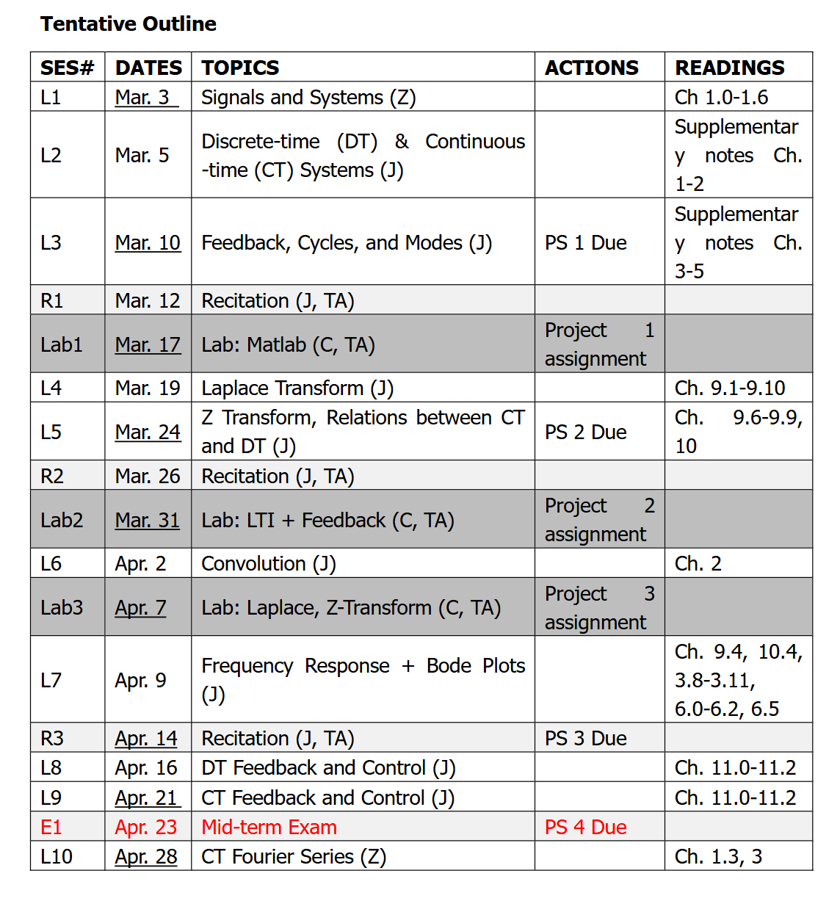

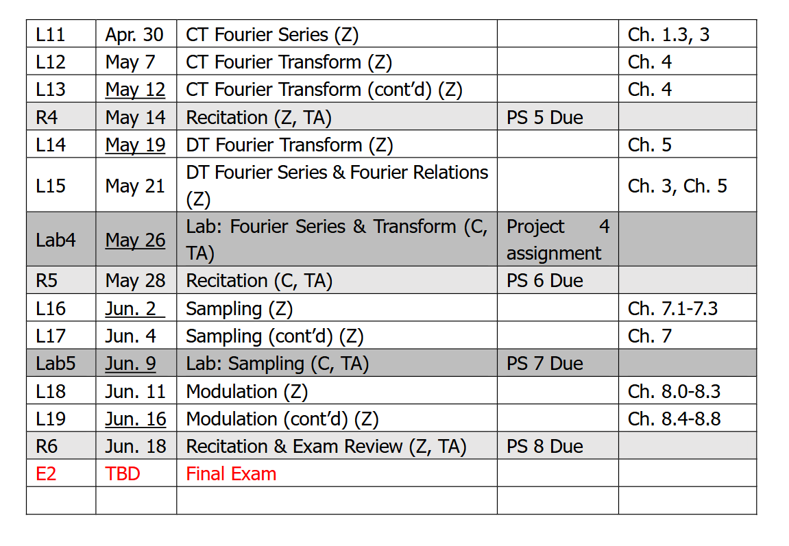
## 人工智能-3 学分 
### 课程安排
期末考全是大题，会出题的考点有：
- 强化学习
- $\alpha-\beta$ 剪枝
- 回溯搜索
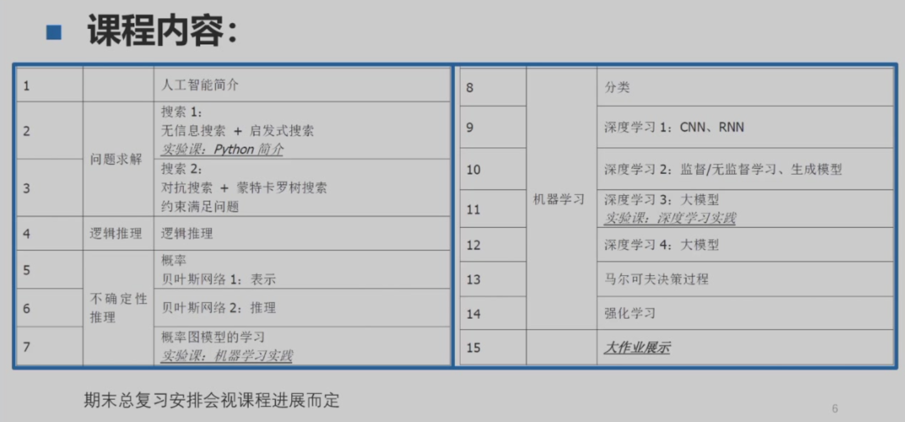

课堂考勤 5%
理论作业（手写不能打印）+实验作业 (6 次左右) 35%
课程综合大作业（分组进行） 10%
期末考试 50%（为防 AI 占比提高）
- 平时分数设置附加 5%，基于 AI实际项目、参加相关的 AI 比赛、**课堂踊跃提问题（zl 非常看重）**，视情况可获额外平时分（平时分上限 50%) 
- 期末考试，所有平行班班统一进行，大概率会有斩杀线！

综合大作业可以拿老师的科研项目做拓展
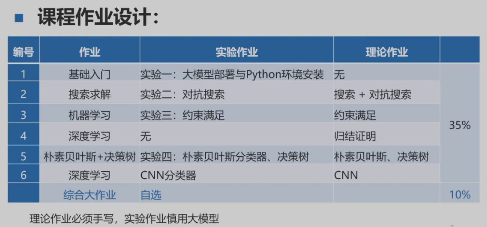

## 数字系统设计-4 学分
### 课程安排
周五下午答疑
3-4次小测，提前一周通知
期中比期末难很多，及格率小于 50%，随堂检测
期末可带计算器
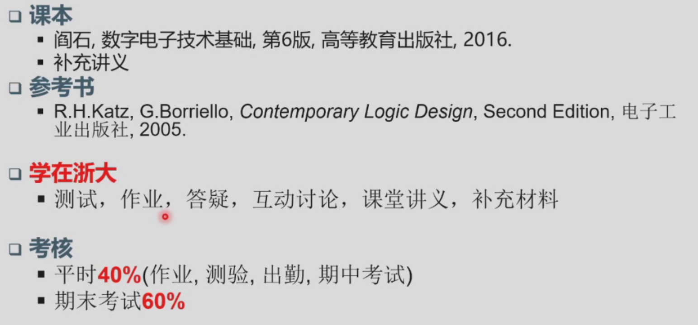

控制器和微码是重点
计组的前置课程
本科会学中央处理单元的设计
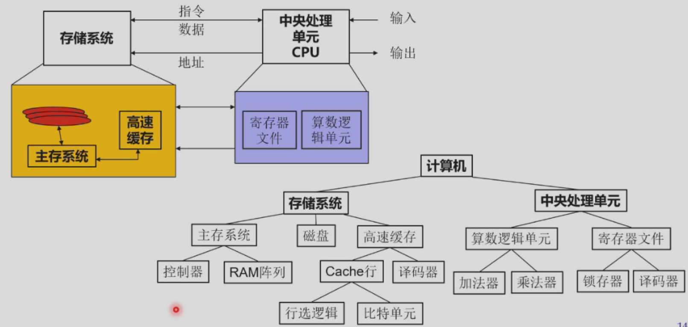

目标：
- 数字电路设计的基础理论
- 数字系统分析方法
- 数字系统设计方法
- 数字系统实现和测试方法
- 数字系统设计和解决问题的基本技能
	- 电路图
	- 硬件描述语言
	- 语言描述问题

## 半导体物理-3 学分
### 课程安排
cr 没有按照书本的顺序讲，顺序是乱的，主要参考 ppt 来学
有点名签到

春学期材料，夏学期应用

Tutorials: 8 tutorials (Every other week)
Tests: 2 tests during lecture
Grading: Attendance (10%)+Homework (40%)+2 In-class Tests (20%+30%)

期中春 7/8，期末夏 8

PART 1 (24 slots)
1. Structure of Solids (3 L)
2. Crystal Structures and Band Theory (6 L)
3. The Semiconductor in Equilibrium (6 L)
4. Basic Quantum Mechanics (3 L)
5. Carrier Transport Phenomena (3 L)
6. Nonequilibrium Excess Carriers in Semiconductors (1 L) + Test 1
PART 2 (24 slots)
7. P-N Junction Diode (6 L)
8. Bipolar Junction Transistor (6 L)
9. Interfaces (3 L)
10. Fundamentals of the MOS Field Effect Transistor (3 L)
11. Review (3 L) 
12. Advanced MOSFETs (1 L) + Test 2

Be warned! – the course gets much more difficult towards the end.

## 数字系统设计实验-1 学分
ftp://fpga@10.78.22.223/
### 实验内容及安排
《数字系统设计实验》原则上要求学生独立完成实验项目。我们共设置了二组实验供同学选择，同学们可根据自己兴趣、时间和能力任选一组。
每组实验的最后一个实验为综合性系统实验，前面的部分实验为该实验的子实验。因此，综合性系统实验报告只需完成最后一个系统实验的实验报告即可，但需融合前面子实验的相关知识。
同学还需自学数字系统设计实验教材的第1~3章，另外，实验课程对Verilog HDL要求比理论课程高，因此， Verilog HDL这部分知识需加强。

> 夏学期实验越早做完越好

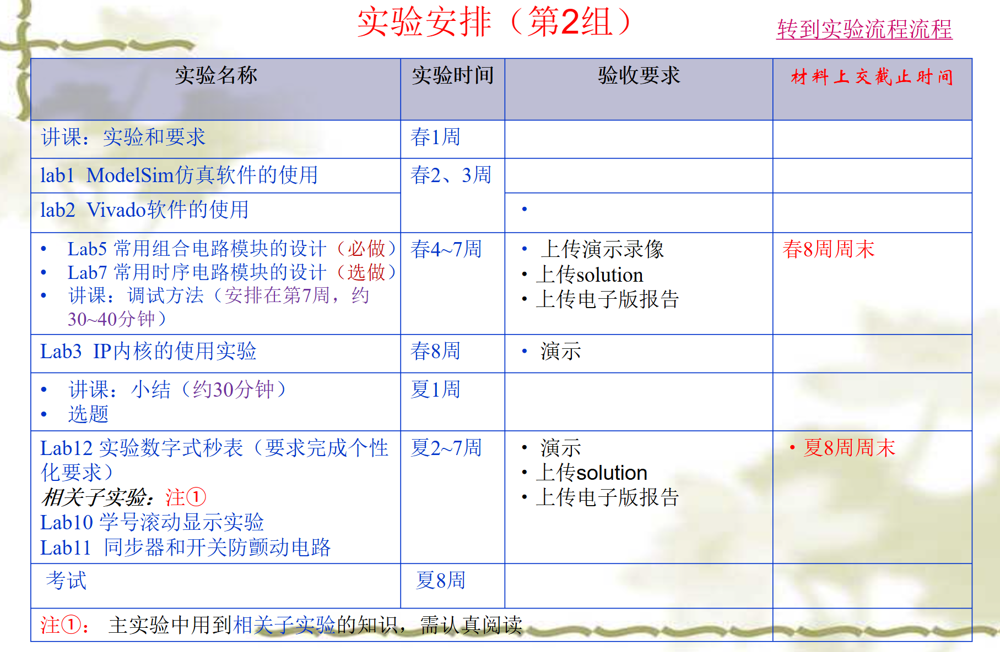
### 实验报告
进实验室必须签到，不准迟到；独立完成实验。

共两份 （1）常用组合模块：电子版报告 （2）综合实验的报告需融合前面相关子实验的内容。

可以打印

你的报告应包括下列部分：
- 实验目的和要求（必填） …… 
- 实验内容和原理（必填） 
- 设计过程或设计说明、核心模块的HDL代码……
- 主要仪器设备（必填） …… 
- 操作方法和实验步骤 …… 
- 实验数据记录和处理（必填） 
	- 仿真图（要求有说明、结论）、*时延分析、运行结果等； 
- 实验结果分析。总结、心得，回答问题……

报告中仿真图不是简单的截图、粘贴，而是：
- 处理：显示关键部分，其它部分可省略。
- 注释：老师是很笨的，没有注释说明的仿真图是看不懂。
### 实验验收
Lab2、lab3：只需演示结果 
lab5：上传演示录像、Solution及一份电子版报告。 
Lab12或Lab19：演示实验结果、上传Solution、电子版报告、上交电子版报告。

1）除你认为关键的代码外，报告不需粘贴代码。 
2）报告中必须有“总结、心得”。 
3）Solution上传至： ftp://10.78.22.223/upload/数字系统设计实验/学号/ (用户名：fpga，密码：fpga)。
### 成绩构成
实验由平时成绩和实验考试两项组成。平时成绩占70%，由实验完成情况、代码质量、文件管理、实验报告和平时到课情况组成；实验考试占30%。

### 考试要求
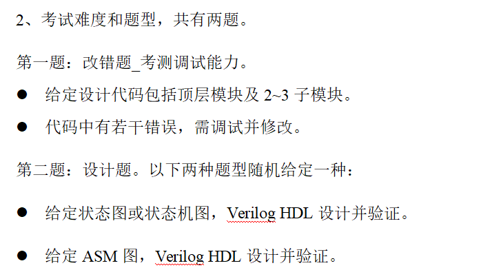
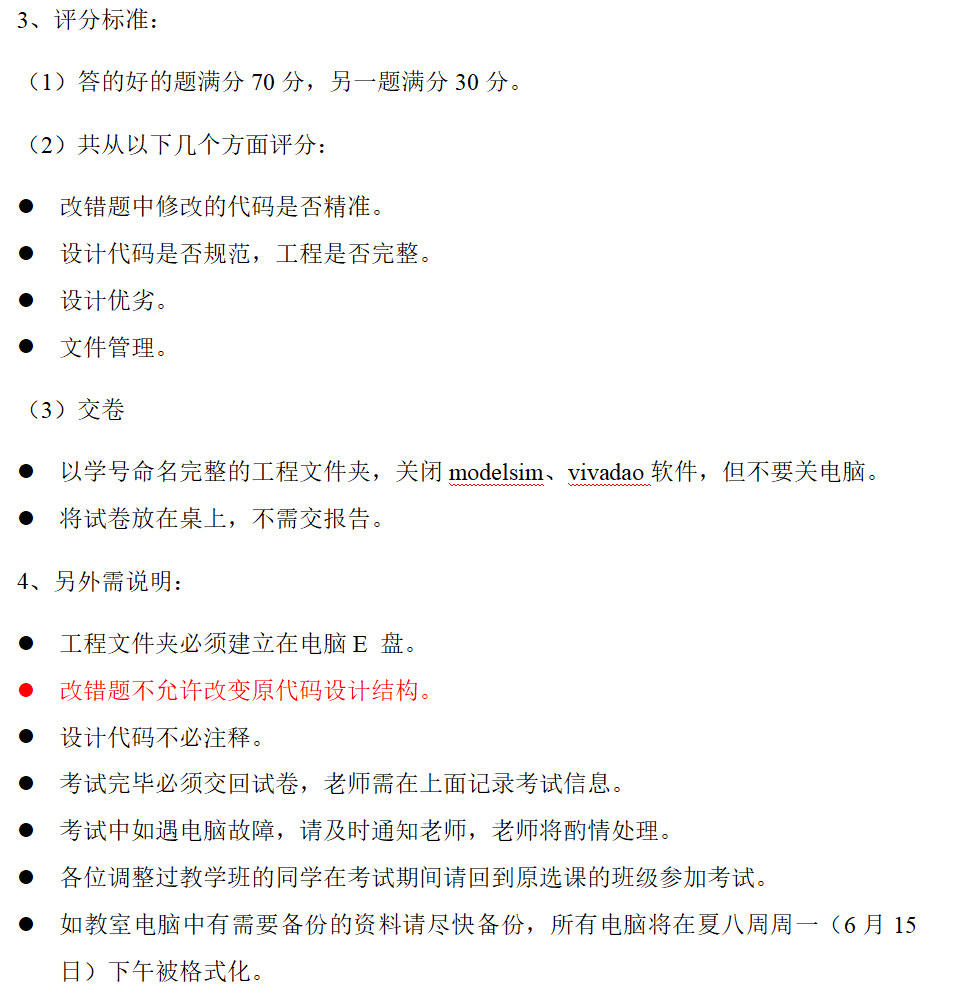
## 电子电路设计实验 II -1 学分
### 课程安排
每个人都要做 B 6，我们做 A 6
ftp://10.71.72.109
课程总成绩 = 实验报告（60%）+电路制作（15%）+电路验收（15%）+课程思政及表现（10%）
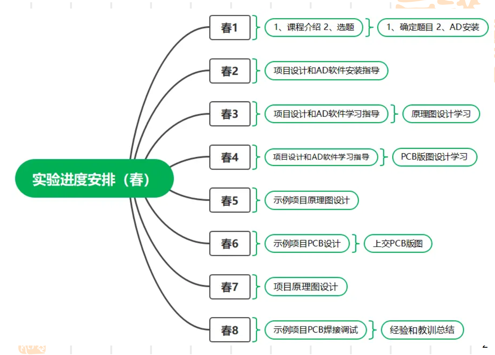

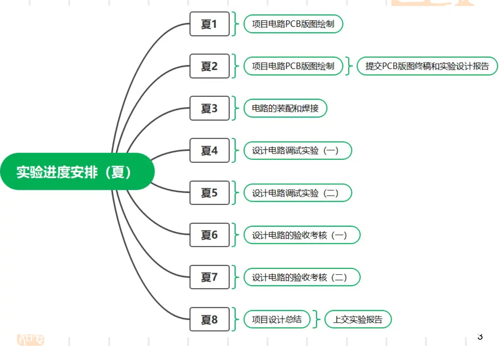
### 实验安排
1、选择一般项目中的实验“6.电流-电压转换电路实验研究（示例项目）”，作为示例练习项目，每人必做； 
2、从一般项目或Arduino项目中，选一个题目，合作完成。每人分别提出方案，设计电路，择优选择一块PCB加工，安装测试时合作，独立完成各自的**实验报告**。 
夏 8 的实验报告是整个学期的实验报告
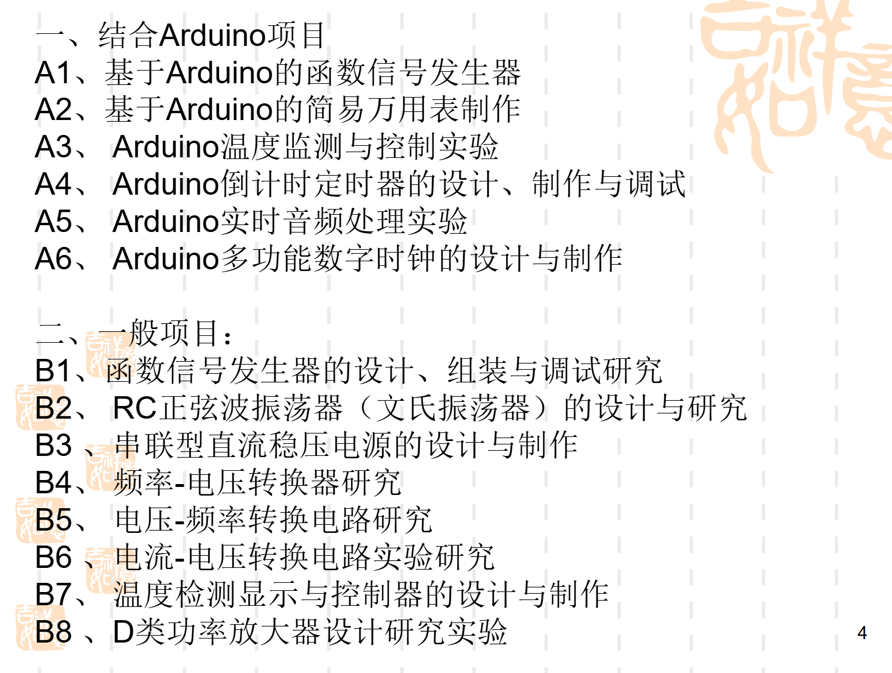
### 实验报告
1、实验目的和任务；
2、实验原理、设计与仿真等；
3、主要仪器设备；
4、实验过程与数据记录及处理，包括： 各项实验内容、操作方法、实验步骤、实验数据的记录与分析处理、实验结果与分析；
5、讨论总结、体会（含课程思政内容，1000字以上）。

### 其他经验
验收一定要先验收，会按照验收顺序给分
验收的时候使劲忽悠 djj，让他觉得你很吊，才能拿满分
一定要有扩展，做个游戏烧进去

我刚刚问，说是：
1. 可以自己用嘉立创，但是不是 ad 的格式的话要自己去打板子
2. 用其他软件的话，制作过程中有些问题要自己负责，他们只教 ad
主要是制作过程，报告什么的应该是都认的

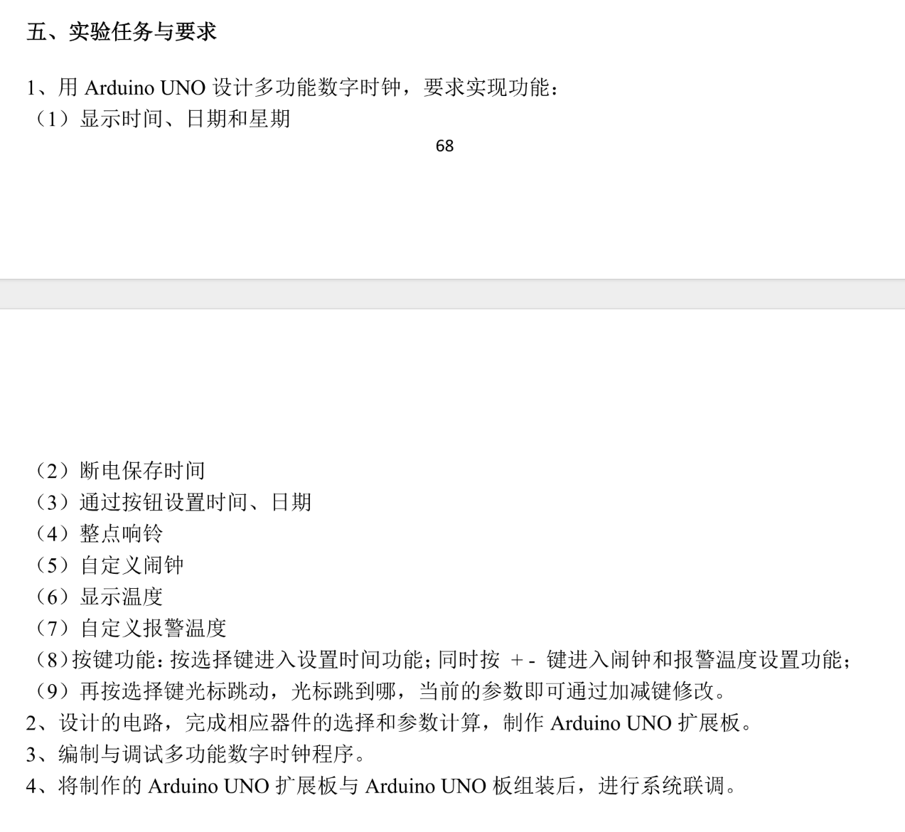
## 马克思主义基本原理-3 学分
### 课程安排
完全不卷发言，如果都不发言也对成绩没有任何影响
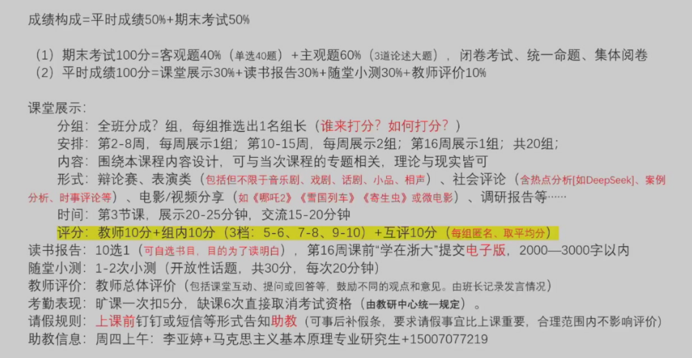

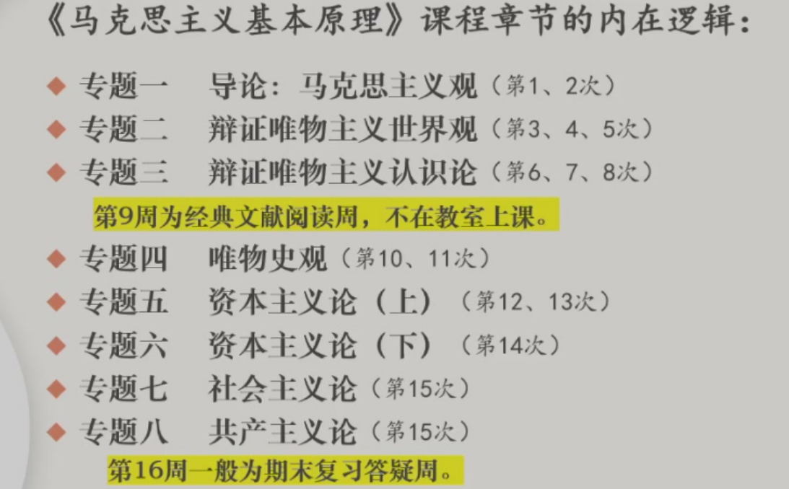
## 数据结构基础-2.5 学分
### 课程安排
成绩构成=平时分 60%+期末40%
平时分不会溢出，期末分数可以覆盖期中
lab 成绩=50%TA+50%互评
整个 FDS 课程组会查重，只有诚信守则 get full mark 才能参加期末考

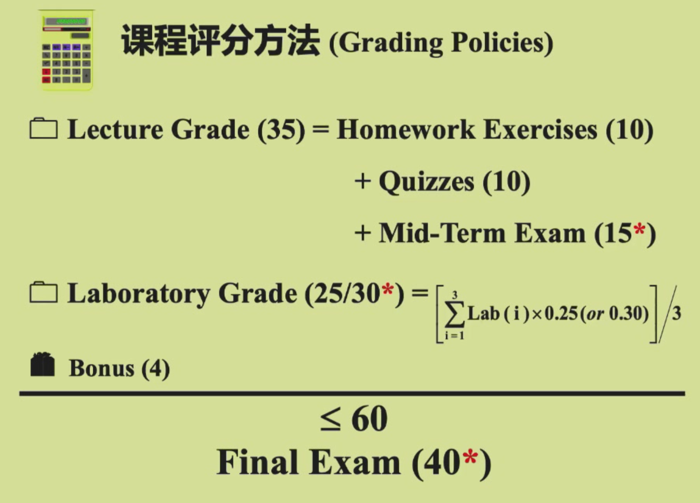
小测：
- Random Quizzes 
- 10 minutes and 10 points each 
- Problems may be chosen from HW
lab 评分：
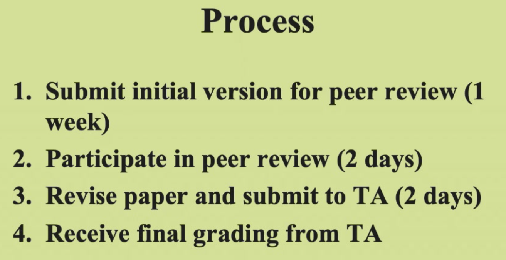

## 信息理论-2 学分
### 课程安排
平时分 50%（课程论文+作业）+期末 50%
最后一节课随堂考
这门课相当于高级概率论

## 双脑与心理健康-2 学分
### 课程安排
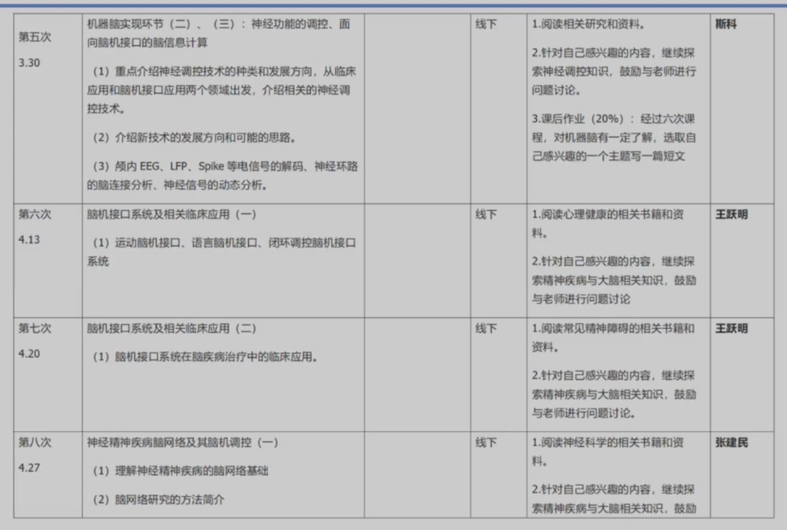
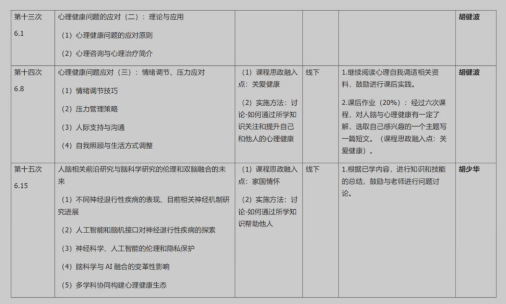

成绩构成比例：
- 线上参与 10%，观看视频及完成线上测试或讨论
- 课堂参与 10%，考勤、课堂互动讨论提问
- 课后作业 40%，与教学内容相关的作业
- 期末考试 40%。
## 人工智能前沿-2 学分
- 绪论：范鹤鹤
- 强化学习：吴飞
- LLM & Agent：王永威、张圣宇、刘泽民（35%）
- Al for Science: 魏颖（30%）
- 具身智能：況琨、王则可（30%）
- 出勤：5%

## 体育舞蹈-1 学分
体育舞蹈期末考夏学期
40% 专项 30% 身体素质
体测
夏一周 800
理论 5 分，智慧树

